# OpenArm VR IK 仿真研究简报

日期：2026-07-31  
代码基线：`openarm_control` revision `d006ece506f2` 加本轮已记录的默认参数差异  
完整条件与原始索引：[detailed_report.md](detailed_report.md) · [experiment_index.md](experiment_index.md)

## 结论

当前 PR 的主要收益不是让每个 tracking 指标都最小，而是在关节速度有限、目标误差较大或机械臂接近弱构型时，减少肩肘分支跳变、实际关节加速度和动作结束后的残余运动。它会有意允许快速手腕旋转时出现有限姿态滞后，以优先维持末端位置和可解释的肘部分支。

本轮复验使用当前实机正在采用的 **Current deployment profile**。它不是仿真搜索出的全局最优，只是统一代码默认、实机 dataflow 和报告基准后的当前部署值。

| 参数 | Current deployment |
|---|---:|
| Cartesian position / orientation cost | `12 / 1.5` |
| Global / LM damping | `0.1 / 0.01` |
| Full-home posture cost | `0` |
| Outer period / QP substeps | `4 ms / 5` |
| Position / orientation total error budget | `0.020 m / 0.25 rad` |
| Position schedule / latch | `0.6 -> 0.9 m/s / 0.006 m` |
| Exact-nullspace cost / return / max speed | `8.5 / 1.6 s^-1 / 1.0 rad/s` |
| Nullspace activation ratio | `0.02 -> 0.05` |
| Singularity stop / slow / max approach rate | `0.02 / 0.08 / 0.25 s^-1` |
| Joint braking distance / exponent | `0.20 rad / 2` |
| Kinetic-energy cost | `2e-5` |
| IK velocity caps J1-J7 | `[2, 2, 3.14, 3.14, 6.3, 6.3, 6.3] rad/s` |
| Driver velocity caps J1-J7 | `[2, 2, 3.14, 3.14, 12.6, 12.6, 12.6] rad/s` |

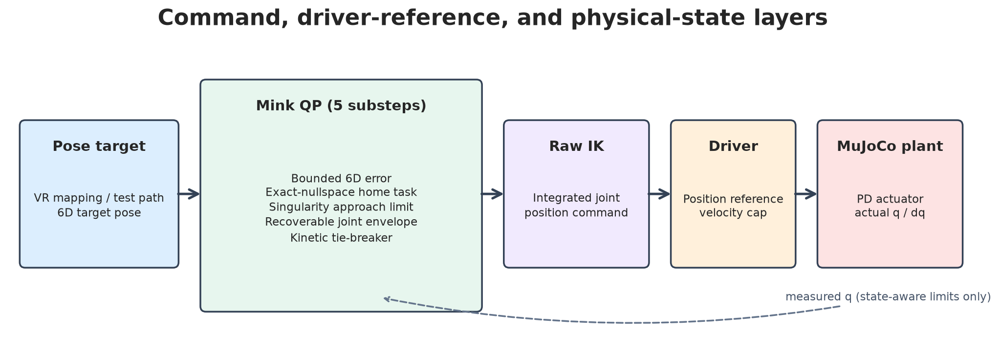

## 实验范围

本轮最终矩阵包含：

- `68` 条内容哈希不同的 target 轨迹；
- `1,939` 个 controller profile × target trajectory 动态 runs；
- 双臂轨迹按左右臂分别统计后得到 `2,045` 条指标记录；
- 全部动态 runs 的 `solver_failures=0`；
- `378` 个静态 joint-limit 越界条件，专门验证恢复可行性。

广覆盖集的 42 条基础 target 由 reach、快速回缩、伸直圆周和四轴向移动、正常/伸直/胸前 wrist roll、正常单臂与双臂工作区轨迹组成。实验矩阵再乘以速度档位、左右镜像和 controller/profile 组合。下方目录视频只展示 21 个几何模式，不重复播放全部速度和 profile。

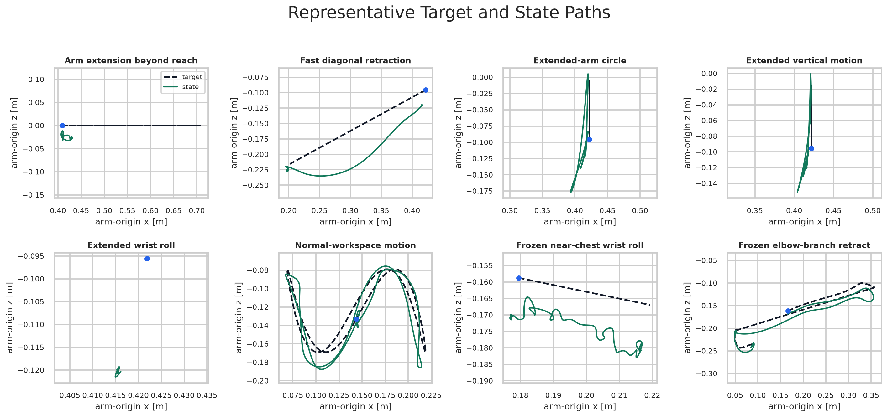

[视频：21 个参考运动模式](videos/ideal_reference_trajectory_catalog.mp4)  
每段压缩到 `2.5 s`，左上角显示实际播放倍率；该视频展示理想 target 与 raw IK command，不是实际 plant 状态对照。

## 两条冻结基准

以下 target 均冻结为逐帧相同的 `arm_origin` 相对位姿，所有 controller 使用相同 MuJoCo plant 和 downstream driver cap。

**Near-chest fast wrist-roll benchmark**

- 来源：典型胸前实机操作片段提取的 target；
- 时长 `3.94 s`，位置总位移约 `4.8 cm`；
- 峰值线速度 `0.027 m/s`，峰值角速度 `12.02 rad/s`；
- 用于评价快速手腕旋转叠加小幅平移时的位置/姿态跟踪、关节加速度和残余振动。

**Fast-retract elbow-branch benchmark**

- 来源：典型右臂伸直回缩实机操作片段提取的 target；
- 时长 `2.92 s`，峰值线速度 `0.589 m/s`，峰值角速度 `6.25 rad/s`；
- 用于评价快速回缩时的肘部横移、分支一致性、Cartesian error 和关节动态。

## Controller Profile 对照

下面的宽场景图比较四种结构：

- **Current deployment**：上表全部机制；
- **Driver cap only**：仍运行 Current IK tasks，但关闭 IK 内速度 envelope，只由 driver 裁剪；
- **Strict ori/main**：`position/orientation cost=1/1`、`damping=0.25`、`posture_cost=0.01`，关闭 PR 新 task；为公平起见保留相同 recoverable position/velocity envelope 和 `0.8 ms` 子步；
- **Full-home 0.01**：保留 Current 其余机制，仅以 full-home `PostureTask(0.01)` 替换 exact-nullspace regulator。

指标均为每条轨迹先计算、再跨场景平均。`p99` 是轨迹内绝对值第 99 百分位；`tail EEF p2p` 是动作末段末端位置峰峰值。

| Profile | Position RMSE | Orientation RMSE | Joint ddq p99 | Elbow accel p99 | Elbow lateral range | Tail EEF p2p |
|---|---:|---:|---:|---:|---:|---:|
| **Current deployment** | **3.97 cm** | 31.27 deg | **29.43 rad/s²** | **5.46 m/s²** | 6.21 cm | **0.84 cm** |
| Driver cap only | 4.01 cm | 30.66 deg | 34.19 rad/s² | 6.22 m/s² | 6.50 cm | 0.88 cm |
| Strict ori/main | 13.78 cm | **11.13 deg** | 57.49 rad/s² | 10.21 m/s² | **6.12 cm** | 3.37 cm |
| Full-home 0.01 | 3.94 cm | 29.03 deg | 33.42 rad/s² | 6.52 m/s² | 7.38 cm | 0.91 cm |

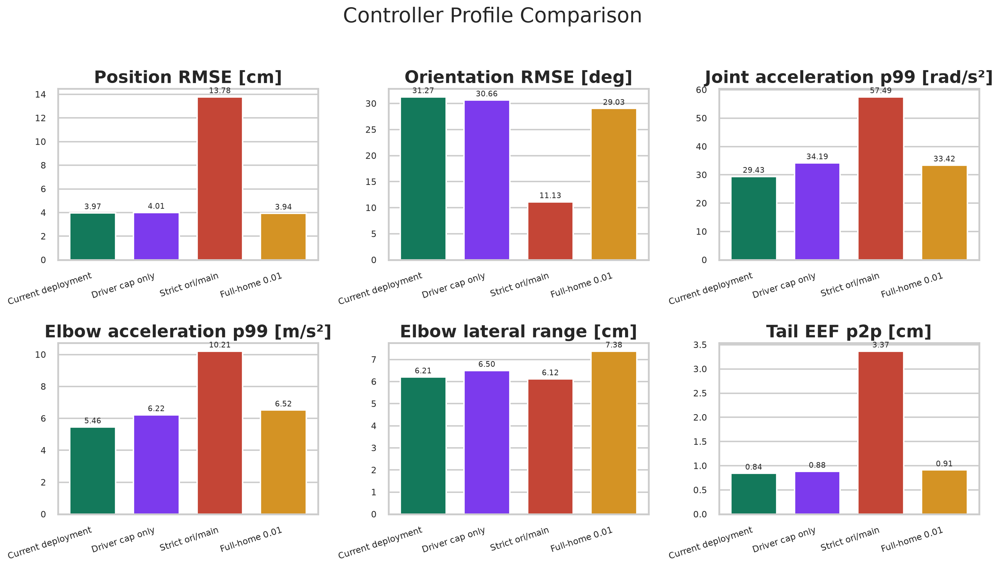

Strict ori/main 的 orientation RMSE 较小，但位置误差、实际加速度和动作末段运动显著更大。宽场景平均肘横移无法单独评价 branch consistency，冻结回缩基准在后文专门隔离该问题。

## 单功能消融

下图每个单元格表示“从 Current deployment 只移除该功能后，指标改变的百分比”。正值表示该指标变大；负值通常表示 tracking 与稳定性之间的交换，不自动等于改善。颜色在 `-150%` 到 `+150%` 截断，但单元格文字保留原始值。

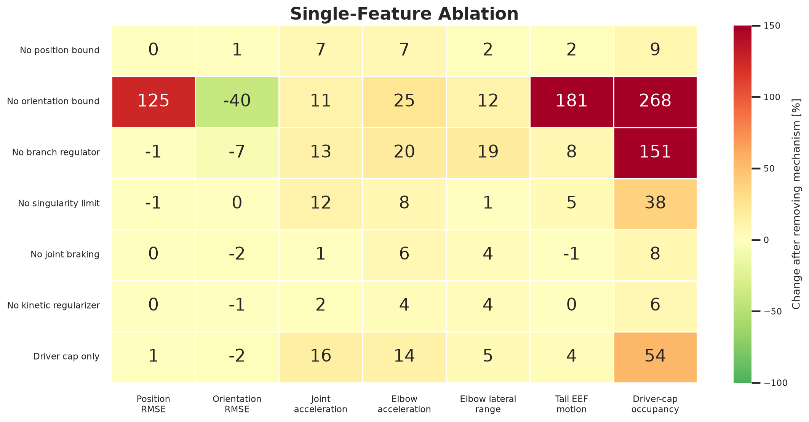

主要结论：

- 移除 orientation error bound 后，位置 RMSE 增加 `125%`、tail motion 增加 `181%`、driver-cap occupancy 增加 `268%`；
- 移除 exact-nullspace regulator 后，肘横向范围增加 `19%`、joint ddq 增加 `13%`、driver-cap occupancy 增加 `151%`；
- 移除 singularity limit 后，joint ddq 增加 `12%`；
- braking 与 kinetic task 在宽场景中是较弱但方向一致的安全/平滑补充，不能替代前两项。

## 各机制的实际收益

### 1. Bounded 6D frame error

它保留原始 target，但只让一个外层 solve 消耗有限的一阶误差。五个子步共享总预算，因此 Current deployment 每个子步最多请求 `4 mm` position error 和 `0.05 rad` orientation error。position bound 随 target 线速度在 `0.6–0.9 m/s` 间平滑激活，并在累计位置误差超过 `6 mm` 时保持 activation；orientation bound 始终可用。

14 条 near-chest wrist-roll stress 轨迹的 suite aggregate：

| 指标 | Current | No 6D bound |
|---|---:|---:|
| Position RMSE | **1.95 cm** | 6.93 cm |
| Orientation RMSE | 2.12 rad | **1.66 rad** |
| Joint ddq p99 | **40.97** | 50.18 rad/s² |
| Elbow accel p99 | **5.31** | 8.05 m/s² |
| Elbow lateral range | **10.96 cm** | 16.31 cm |
| Driver-cap occupancy | **2.1%** | 50.5% |
| Tail EEF p2p | **0.24 cm** | 2.34 cm |

姿态误差增加是设计目的的一部分：限制快速旋转占用关节能力，以保护位置和整臂稳定性。

下图是 suite 中一条代表性合成轨迹，不是 suite aggregate 本身：目标平移速度 `1.2 m/s`、wrist roll `8 rad/s`。

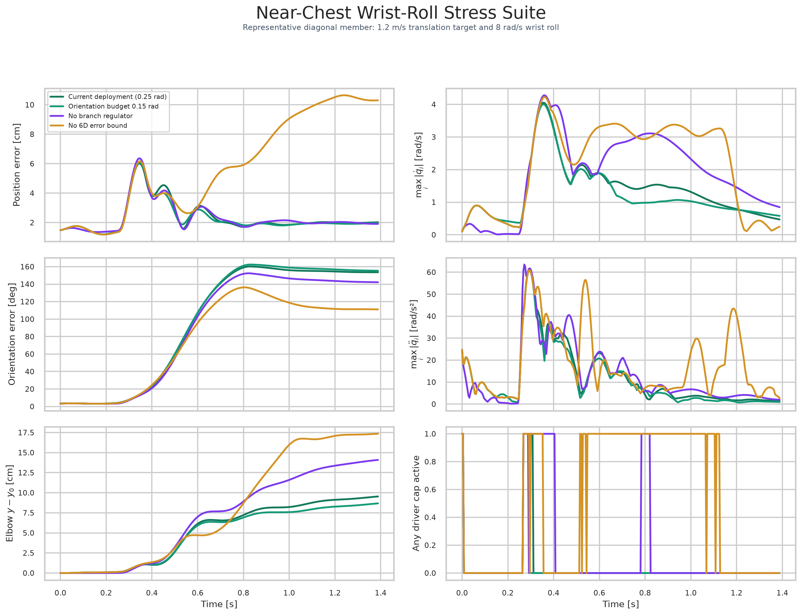

[视频：合成 wrist-roll + diagonal translation，6D bound A/B，0.5x](videos/near_chest_roll_translation_error_bound_comparison.mp4)

冻结 near-chest benchmark 的单轨迹结果：

| Profile | Position RMSE / max | Orientation RMSE | Joint ddq p99 | Driver-cap occupancy |
|---|---:|---:|---:|---:|
| **Current** | **1.28 / 1.78 cm** | 0.495 rad | **39.3 rad/s²** | **1.4%** |
| Strict ori/main | 5.81 / 17.11 cm | **0.253 rad** | 73.0 rad/s² | 19.5% |
| No 6D bound | 1.79 / 4.81 cm | 0.384 rad | 47.3 rad/s² | 11.3% |

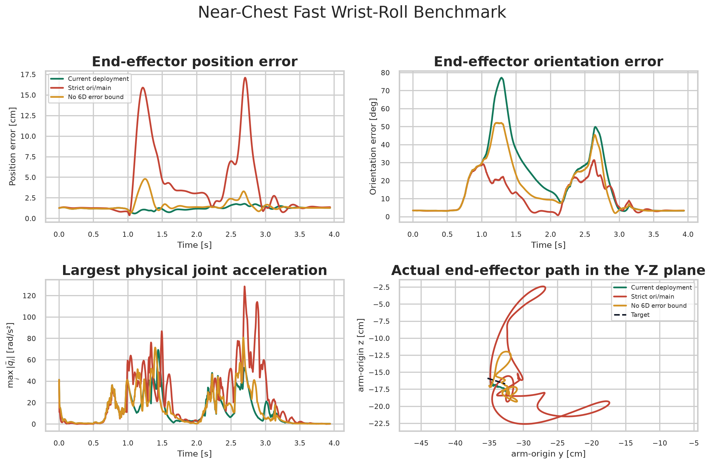

[视频：冻结 near-chest controller 对照，0.5x](videos/near_chest_fast_wrist_roll_controller_comparison.mp4)

### 2. Exact-nullspace home regulation

对归一化几何 Jacobian `J` 做 SVD，取结构性一维零空间方向 `z`。它只调节 home 误差在 `z` 上的投影：

$$
e_{ns}=z^T(q\ominus q_{home}),\qquad
v_{ns}=\operatorname{clip}(-k_{ns}e_{ns},-v_{max},v_{max}).
$$

QP 只惩罚

$$
w_{ns}^2\left(z^T\Delta q-v_{ns}\Delta t\right)^2,
$$

不会像 full-home posture task 那样在非零空间关节方向与 6D frame task 竞争。接近奇异点时仅平滑降低 task cost，不平滑 $z$。

图 08 使用冻结 Fast-retract benchmark，固定其他 Current 参数，仅替换 branch regulator：

- exact-nullspace：`cost=8.5, return=1.6 s^-1, max=1.0 rad/s`；
- no regulator：`nullspace_cost=0, posture_cost=0`；
- full-home replacement：`nullspace_cost=0, posture_cost=0.01`。

| Regulator | Position RMSE / max | Orientation RMSE | Elbow lateral range | Joint ddq p99 | Elbow accel p99 | Driver-cap occupancy |
|---|---:|---:|---:|---:|---:|---:|
| **Exact-nullspace** | 1.80 / 4.38 cm | **0.107 rad** | **4.04 cm** | 40.90 | 10.21 | 36.9% |
| None | 1.51 / 3.08 cm | 0.115 rad | 17.59 cm | 38.92 | **9.55** | 33.7% |
| Full-home 0.01 | **1.49 / 3.00 cm** | 0.115 rad | 17.61 cm | **38.84** | 9.55 | **33.2%** |

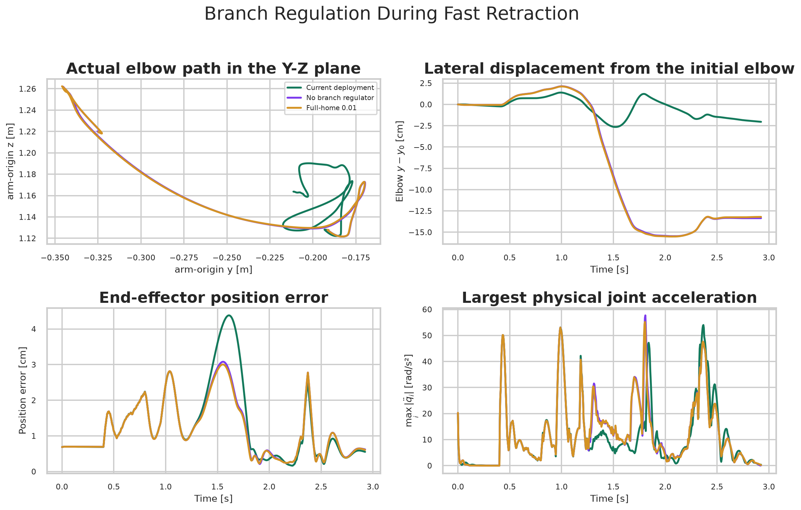

[视频：exact-nullspace / none / full-home 0.01 / full-home 0.03，0.5x](videos/fast_retract_branch_regulator_comparison.mp4)

这条轨迹上，`posture_cost=0.003/0.01/0.03` 的肘横向范围分别为 `17.60/17.61/17.76 cm`，均未提供与 exact-nullspace 等价的 branch constraint。因此本轮不能声称 `0.01` 在“相同分支约束”下竞争更大；可确认的是 exact-nullspace 用约 `3 mm` 的额外 position RMSE 换取约 `13.6 cm` 的肘横移抑制，并避免把 home bias 直接施加到全部关节方向。

图 35 再把 Current、Strict ori/main 和 No branch 放回 controller-level 对照。`y-y0` 是肘关节点 `arm_origin y` 相对初始值；Y-Z path 是肘部实际空间路径；`max_i |dq_i|` 是每个时刻七轴实际速度绝对值的最大值。

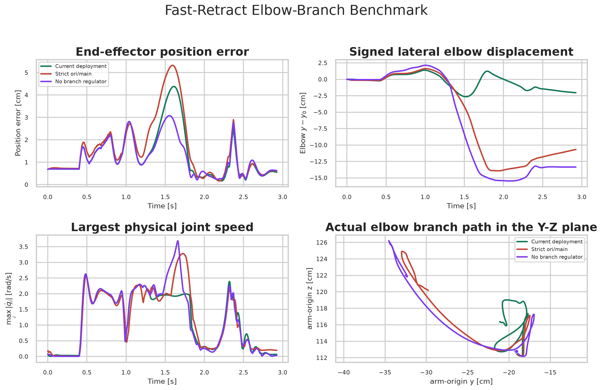

[视频：冻结 fast-retract controller 对照，前视和右后视，0.5x](videos/fast_retract_controller_comparison.mp4)

### 3. Singularity-approach limit

奇异度只由当前几何构型决定：

$$
\rho(q)=\frac{\sigma_{min}(J_{norm})}{\sigma_{max}(J_{norm})},
\qquad g=\nabla_q\rho.
$$

QP 约束 `g^T Delta q >= -v_allowed(rho) Delta t`，只限制让 `rho` 继续下降的分量。离开奇异点或沿等值面运动不受影响。

在 `0.8 m/s` 正前方伸直轨迹上，Current 的最小 `rho` 为 `0.0323`，关闭限制后降到 `0.0047`；joint ddq p99 从 `40.6` 境加到 `48.7 rad/s²`。position RMSE 基本相同，说明该限制主要提高迫近奇异点时，尤其伸直状态下的稳定性。

图中蓝色为伸直阶段，灰色为回缩阶段；黄色带是 `rho=0.02–0.08` 的减速区。

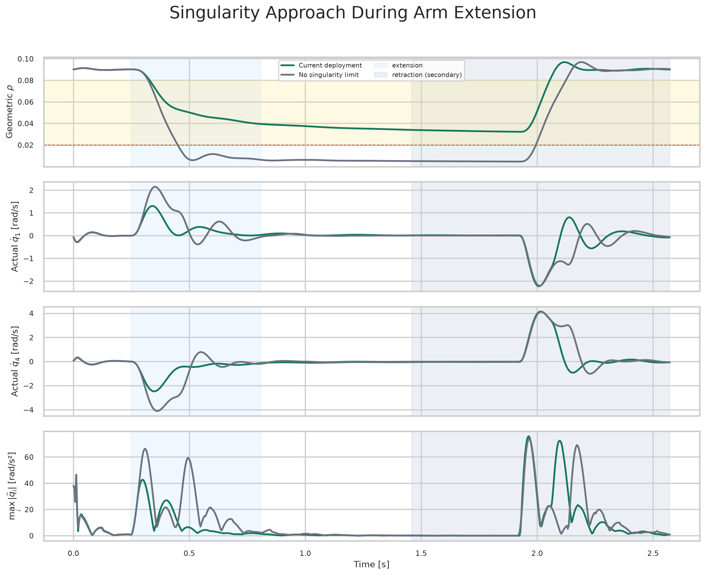

[视频：伸直奇异区 A/B，0.5x](videos/straight_reach_singularity_limit_comparison.mp4)

### 4. Recoverable joint envelope

同步状态略微位于 position limit 外时，独立叠加 position 与 velocity constraints 可能互相冲突。Recoverable envelope 先把回到可行区的 step 裁进同一个速度包络。

| Limit formulation | Solved static conditions |
|---|---:|
| **Recoverable position + velocity** | **126 / 126** |
| Independent position + velocity | 78 / 126 |
| Position only | 126 / 126，但不保证恢复速度 |

右图“position-limit 外剩余距离”表示一个 solve 后仍在物理位置界限外的角距离。

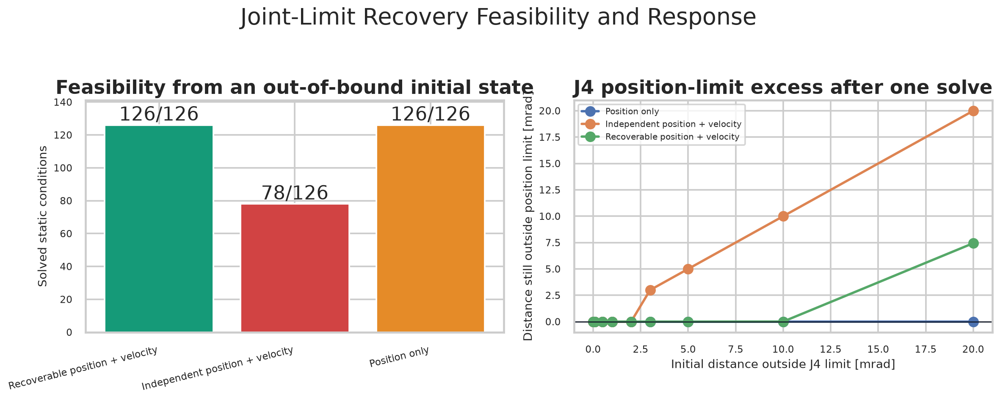

### 5. Distance-dependent joint braking

靠近 position limit 时，允许的朝限位速度按剩余距离平滑降到零。`0.20 rad` 是当前较保守的实机值，不是普通轨迹平滑器。

在 `12 rad/s` wrist target 中：无 braking 的最小 joint margin 为 `26 mrad`；`0.08/0.12/0.20/0.30 rad` braking distance 分别把它提高到 `34/42/62/90 mrad`。代价是更早激活约束并增加 tracking lag。图中无 IK velocity 表示不存在可归一化到 joint cap 的有限 envelope。

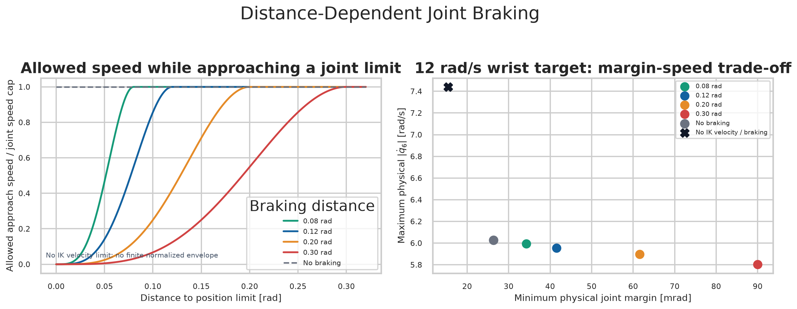

### 6. Kinetic-energy regularization

该 task 向 Hessian 加入很弱的 `cost * M(q) / dt^2`，在运动学相近的解之间偏好较低 MuJoCo kinetic metric。宽场景移除它后 joint ddq 增加约 `2.3%`、elbow acceleration 增加约 `3.6%`，说明收益存在但较小。它不是 inverse dynamics、gravity compensation 或 torque controller。

## IK 与 driver 限速不能互换

`max_i |actual dq_i|` 和 `max_i |actual ddq_i|` 分别表示每个时刻七轴实际速度/加速度绝对值的最大值。driver 只能逐关节裁剪 QP 已经生成的路径，无法让 QP 在物理 envelope 内重新选择 Cartesian 与 secondary-task 的共同解。

在 `0.8 m/s` 合成斜向回缩中：

| Profile | Position RMSE | Actual ddq p99 | Elbow accel p99 | Elbow lateral range |
|---|---:|---:|---:|---:|
| **IK + driver caps** | **3.93 cm** | **46.5** | **9.89** | **2.58 cm** |
| Driver cap only | 5.03 cm | 51.1 | 10.78 | 3.84 cm |
| No velocity caps | **1.36 cm** | 68.4 | 16.34 | 3.71 cm |

完全不限速能降低 tracking error，但实际动态明显更激进；只靠 driver 则同时产生 raw-driver lead 和较差分支。

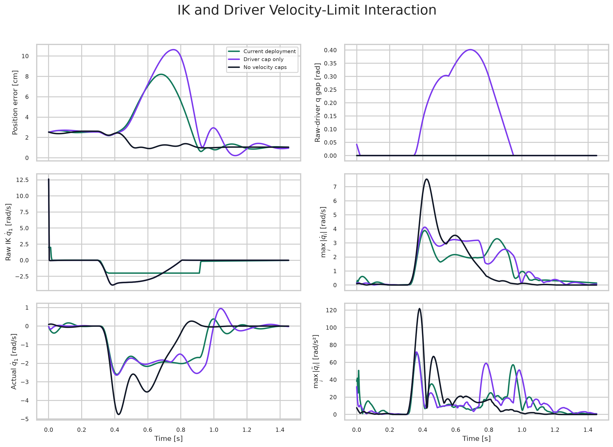

[视频：IK cap A/B，driver cap 均开启，0.5x](videos/fast_retract_ik_velocity_limit_comparison.mp4)

## 参数结论

单参数扫描中的 IK velocity-envelope scale 是对七轴 IK caps 同时乘一个比例，不改变 driver caps。Position error budget 是一个外层 solve 的总预算，不是每个子步预算。

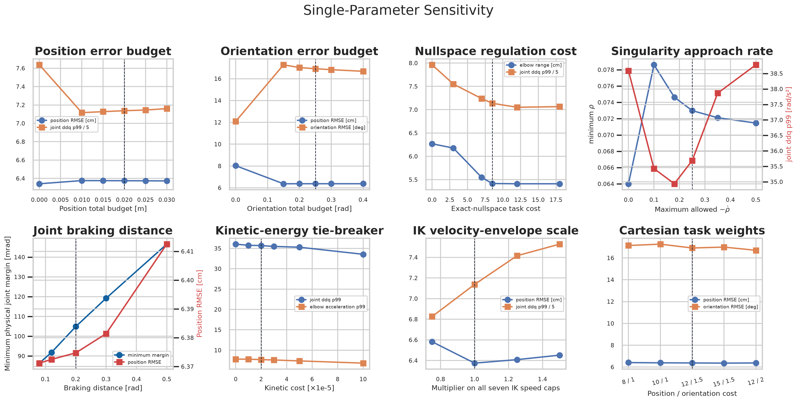

参数扫描没有找到一个跨场景全面支配 Current deployment 的组合。四个组合候选把 joint ddq p99 降低 `2.0–7.1%`，但 elbow acceleration 增加 `5.1–8.2%`，position RMSE 变化 `0.3–0.7%`。因此保留当前实机采用值更容易解释。

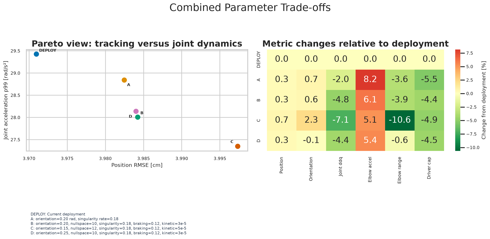

Nullspace 专项扫描中：

- `swivel` 是肘部绕 shoulder-to-wrist 轴相对初始角度的最大偏离；
- `dynamic cost` 指 base cost 经奇异度 activation 调制后的逐时刻有效 cost；
- return rate 决定未饱和时回 home 的一阶速度，max speed 只在该速度饱和时起作用。

冻结回缩上某些候选能再减少约 `0.5 cm` 肘横移，但跨 11 条 reach/retract/wrist/workspace 轨迹后，没有候选同时改善 tracking、branch、joint dynamics 和 driver occupancy。Current `8.5 / 1.6 / 1.0` 保留为部署值。

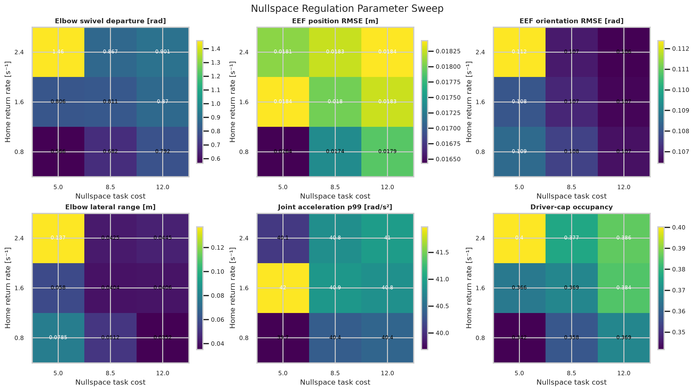

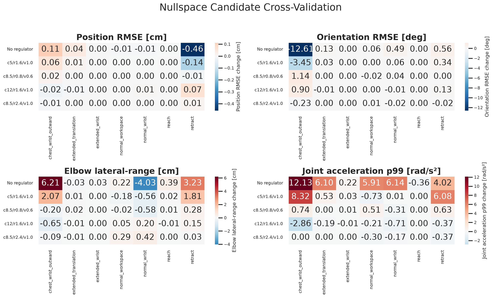

[视频：Nullspace 参数 2x2，冻结 fast-retract，0.5x](videos/fast_retract_nullspace_parameter_comparison.mp4)

## 当前局限

- 胸前快速 wrist roll 同时突然外摆时，某些方向仍会触发 near-weak 肩肘运动；更紧 orientation budget 能保护位置，但会进一步增加姿态滞后。
- 当前 measured q 只保守影响 braking 与 singularity envelope，不持续覆盖 Mink integrated command，因此 command-to-actual lead 仍可能累积。
- Joint limits 不提供环境碰撞安全。低桌面余量需要独立 Cartesian clearance 或 collision layer。
- MuJoCo A/B 支持 controller 相对结论，但不能替代真实摩擦、结构柔性、电机和 firmware 标定。
- 早期实机记录没有同时保存 raw、filtered 和 final Cartesian target，少数残余 wrist-roll 异常暂不做唯一归因。

## 可复现性

- [完整技术报告](detailed_report.md)
- [实验、图、视频和 CSV 索引](experiment_index.md)
- [顶层实验 manifest](manifests/manifest.json)
- [Headline CSV](tables/headline_baseline_means.csv)
- [单功能消融 CSV](tables/ablation_relative_effects_percent.csv)
- [冻结回缩 branch CSV](tables/branch_regulation_frozen_metrics.csv)
