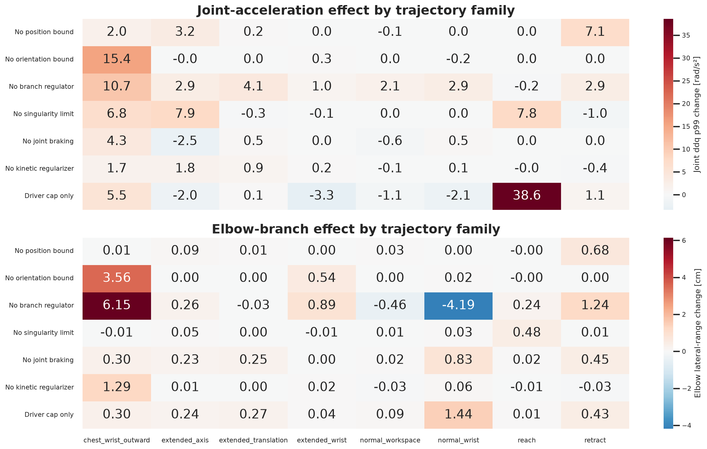
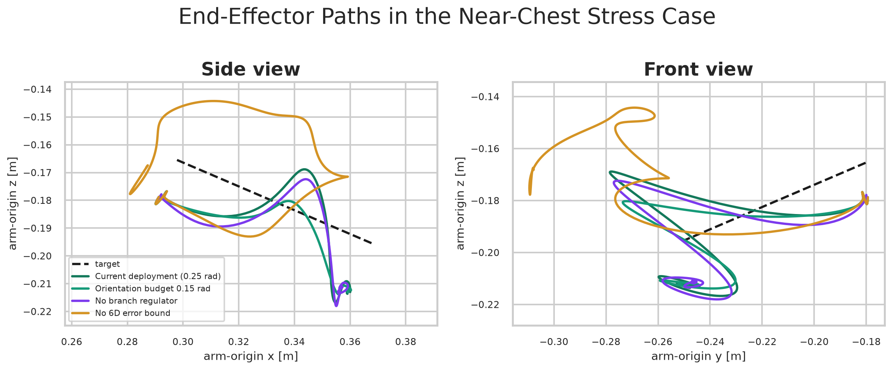
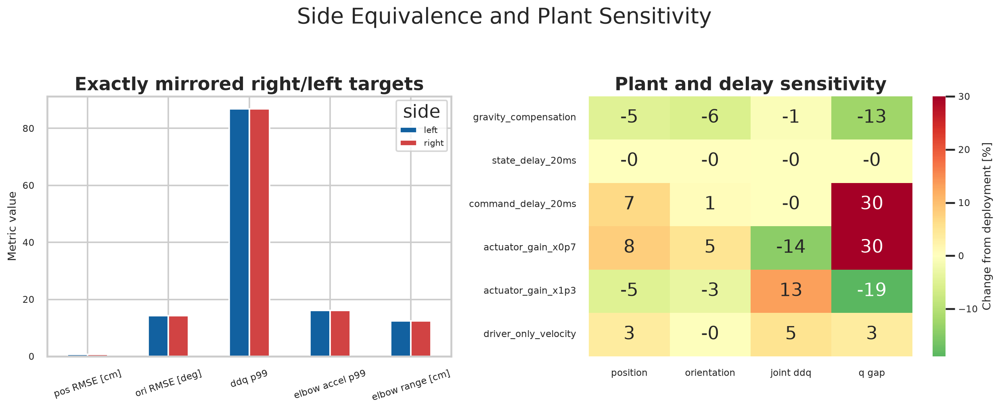
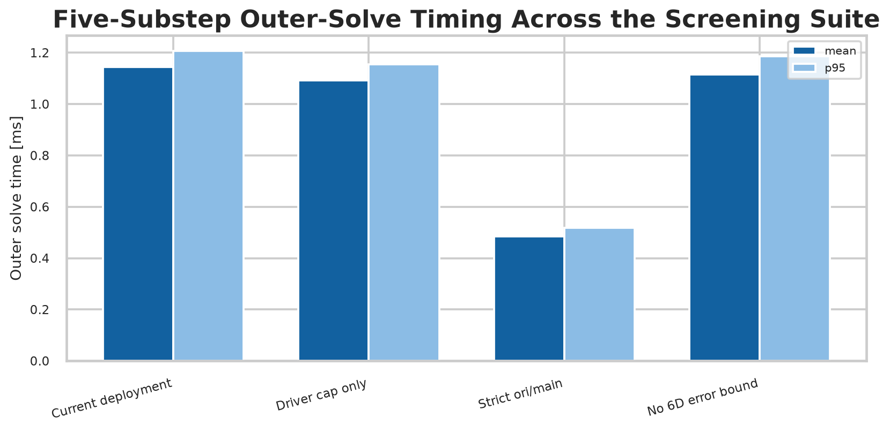

# OpenArm VR IK 大规模仿真与参数研究

日期：2026-07-31  
代码基线：`openarm_control` revision `d006ece506f2` 加本轮 manifest 中记录的默认参数差异  
简明结论：[README.md](README.md) · 完整资产索引：[experiment_index.md](experiment_index.md)

## 1. 研究问题

本研究复验当前 OpenArm differential IK PR，回答以下问题：

1. 相比 `ori/main` 的 `FrameTask + damping + full-home PostureTask`，当前结构是否能减少近奇异、快速回缩和快速手腕旋转时的肩肘跳变？
2. Bounded frame error、exact-nullspace regulation、singularity approach limit、recoverable joint envelope、joint braking 和 kinetic-energy regularization 各自实际解决什么问题？
3. IK 内速度限制是否能由相同数值的 downstream driver clipping 代替？
4. 当前实机参数能否被更简单或更激进的参数组合稳定支配？
5. 新的 `arm_origin` 相对坐标、左右臂镜像、单臂冻结及 `qpos`/`dof` 映射是否保持正确？

研究不把 Current deployment 宣称为仿真全局最优。它是当前实机采用的配置，本轮工作将代码默认、dataflow 语义和报告基准统一到这一配置，并在固定条件下说明其收益和代价。

## 2. 结论摘要

- 当前结构最明显的收益是减少大目标误差经过关节速度饱和后产生的肩肘分支重分配。宽场景中，关闭 orientation error bound 后，position RMSE 增加 `125%`，末段 EEF motion 增加 `181%`，driver-cap occupancy 增加 `268%`。
- Exact-nullspace regulator 在冻结快速回缩上把肘横向范围从无 regulator 的 `17.59 cm` 降到 `4.04 cm`。Full-home `posture_cost=0.003/0.01/0.03` 在该轨迹上均保持约 `17.6 cm`，没有形成等价的 branch constraint。
- Singularity approach limit 把 `0.8 m/s` 伸直轨迹的最小几何奇异度比从 `0.0047` 提高到 `0.0323`，joint ddq p99 从 `48.7` 降到 `40.6 rad/s^2`。
- Recoverable joint envelope 解出 `126/126` 个越界恢复条件；独立叠加原生 position 和 velocity constraints 只解出 `78/126`。
- Joint braking 主要增加物理限位余量，不是普通轨迹平滑器。`0.20 rad` 是当前保守部署值。
- Kinetic-energy regularization 是弱 tie-breaker。宽场景移除后 joint ddq 增加约 `2.3%`，收益存在但远小于 frame bound 和 branch regulation。
- 仅由 driver 裁剪并不等价于在 QP 内约束速度：它无法让 frame task 和 secondary tasks 在物理 envelope 内共同重新求解。
- 54 个单参数 profile、5 个组合 profile 和 44 个冻结 nullspace profile 均未找到跨场景全面支配 Current deployment 的候选。

## 3. 测试系统与可复现性

### 3.1 软件、模型和设备

| 项目 | 版本或条件 |
|---|---|
| CPU | Intel Core Ultra 7 265F |
| OS | Linux 7.0.0-28 x86_64 |
| Python | 3.14.6 |
| MuJoCo | 3.11.0 |
| Mink | 1.1.0 |
| DAQP | 0.7.2 |
| `openarm_mujoco` | 2.0.1 |
| Model | `openarm_mujoco/v2/cell.xml` |
| Model SHA-256 | `cb0322c264b2acd781ea08e873970ef21dd1db491e64ed0c02844aa8c1a3bfa7` |
| Outer control period | `4 ms` (`250 Hz`) |
| QP substeps | `5`, each using `0.8 ms` |
| Random sampling | disabled; recorded seed `0` |

每个 suite 的 revision、dirty-diff hash、命令、依赖版本、模型 hash、profile 和场景 inventory 均保存在 [manifests](manifests/manifest.json)。

### 3.2 坐标系和三层控制链

Target、command EEF 和误差统一在 `arm_origin` 相对坐标下表达。MuJoCo plant 仍在 world frame 积分；报告中的 Y-Z elbow path 是实际肘关节点变换到 `arm_origin` 后的坐标。

三层状态的含义：

- **Raw IK command**：Mink 外层 solve 后的积分配置；
- **Driver command**：downstream per-joint velocity cap 后的配置；
- **Actual state**：MuJoCo actuator、惯性和控制延迟共同产生的 plant 状态。

所有 tracking 指标默认由 target 对 actual state 计算；command/driver 指标均显式带前缀，避免把 IK 指令误当作真实机械臂状态。

### 3.3 Current deployment profile

| 参数 | 值 |
|---|---:|
| Position / orientation cost | `12 / 1.5` |
| Global / LM damping | `0.1 / 0.01` |
| Full-home posture cost | `0` |
| Position / orientation total error budget | `0.020 m / 0.25 rad` |
| Position speed schedule | `0.6 -> 0.9 m/s` |
| Position latch threshold | `0.006 m` |
| Nullspace cost / return / max speed | `8.5 / 1.6 s^-1 / 1.0 rad/s` |
| Nullspace activation ratio | `0.02 -> 0.05` |
| Singularity stop / slow / max approach rate | `0.02 / 0.08 / 0.25 s^-1` |
| Joint braking distance / exponent / buffer | `0.20 / 2 / 0.01 rad` |
| Kinetic-energy cost | `2e-5` |
| IK caps J1-J7 | `[2, 2, 3.14, 3.14, 6.3, 6.3, 6.3] rad/s` |
| Driver caps J1-J7 | `[2, 2, 3.14, 3.14, 12.6, 12.6, 12.6] rad/s` |

### 3.4 实验规模

最终实验由 11 个 suite 构成：

| Suite | Target scenarios | Profiles | Dynamic runs |
|---|---:|---:|---:|
| Screening | 42 | 14 | 588 |
| Parameters | 11 | 54 | 594 |
| Driver coupling | 11 | 6 | 66 |
| Symmetry | 25 | 2 | 50 |
| Chest stress | 14 | 17 | 238 |
| Braking | 4 | 6 | 24 |
| Robustness | 5 | 9 | 45 |
| Combined candidates | 42 | 5 | 210 |
| Frozen benchmarks | 2 | 7 | 14 |
| Frozen nullspace sweep | 1 | 44 | 44 |
| Nullspace cross-validation | 11 | 6 | 66 |
| **合计** | - | - | **1,939** |

此外有 `378` 个静态 boundary cases。动态结果包含 `68` 个内容哈希不同的 target；双臂逐侧统计后形成 `2,045` 条 metric rows，全部 `solver_failures=0`。

广覆盖的 42 条 target 来自 reach、retract、extended-axis、extended-translation、extended-wrist、normal-workspace、normal-wrist 和 near-chest wrist-roll families，再按速度、方向和左右/双臂模式扩增。21 个几何模式可在目录视频中快速浏览；视频不重复 profile 和全部速度档位。

[视频：21 个参考运动模式](videos/ideal_reference_trajectory_catalog.mp4)

## 4. Profile 与指标定义

### 4.1 主要 controller profiles

- **Current deployment**：第 3.3 节全部机制。
- **Driver cap only**：关闭 IK 内 velocity envelope，保留 downstream driver cap 和其他 Current tasks。
- **Strict ori/main**：`cost=1/1`、`damping=0.25`、`lm_damping=0.01`、`posture_cost=0.01`，关闭 PR 新 tasks。为了隔离 task 结构，仍使用当前 recoverable joint envelope、相同 caps 和 `0.8 ms` 子步。
- **Full-home 0.01**：保留 Current 其余机制，仅以 full-home `PostureTask(0.01)` 替换 exact-nullspace regulator。

Strict ori/main 因而是“主线 task 参数和结构在统一时序/安全 envelope 下的对照”，不是逐行执行旧 commit 的历史二进制。

### 4.2 指标

- `position RMSE/max`：target 到 actual EEF 的欧氏位置误差；
- `orientation RMSE`：target 与 actual EEF 的 SO(3) geodesic angle；
- `max_i |actual dq_i|`：每个时刻七轴实际关节速度绝对值最大值；
- `max_i |actual ddq_i|`：上述实际速度离散微分后，每个时刻七轴绝对值最大值；
- `joint ddq p99`：一条轨迹内所有实际关节加速度绝对值的第 99 百分位；
- `elbow lateral range`：肘关节点在 `arm_origin y` 方向的峰峰值；
- `elbow acceleration p99`：肘关节点 Cartesian acceleration norm 的第 99 百分位；
- `tail EEF p2p`：末段实际 EEF position 的最大轴向峰峰值；
- `driver-cap occupancy`：任一 driver joint velocity limit 激活的时间比例；
- `swivel`：肘部绕 shoulder-to-wrist 轴相对初始值的最大角偏移。

除冻结 benchmark 外，表中均先逐轨迹计算指标，再跨目标取平均，避免长轨迹以帧数获得更高权重。

## 5. 宽场景比较

| Profile | Position RMSE | Orientation RMSE | Joint ddq p99 | Elbow accel p99 | Elbow lateral | Tail EEF p2p |
|---|---:|---:|---:|---:|---:|---:|
| **Current** | **3.97 cm** | 31.27 deg | **29.43** | **5.46** | 6.21 cm | **0.84 cm** |
| Driver cap only | 4.01 cm | 30.66 deg | 34.19 | 6.22 | 6.50 cm | 0.88 cm |
| Strict ori/main | 13.78 cm | **11.13 deg** | 57.49 | 10.21 | **6.12 cm** | 3.37 cm |
| Full-home 0.01 | 3.94 cm | 29.03 deg | 33.42 | 6.52 | 7.38 cm | 0.91 cm |

Current 并未优化所有单项指标。它主动容忍部分 orientation lag，以降低 position error、实际加速度和末段残余运动。Strict ori/main 的 orientation RMSE 更低，但 position RMSE 约为 Current 的 3.5 倍。

### 5.1 单功能消融

图中数值是“仅移除该功能”相对 Current 的百分比变化；正值表示指标变大。负值可表示 trade-off，不自动等于整体改善。

主要观察：

- orientation bound 是 near-chest wrist-roll 稳定性的主要来源；
- exact-nullspace regulator 对 retract 和 chest families 的 elbow branch、加速度和 driver saturation 都有贡献；
- singularity limit 的收益集中在 reach/extended families，符合其单向几何约束语义；
- braking 与 kinetic regularization 在宽场景是小幅但方向一致的补充。

## 6. Bounded 6D frame error

### 6.1 算法

FrameTask 的完整切空间误差记为

$$
e = \begin{bmatrix}e_p\\e_R\end{bmatrix}.
$$

每个外层 solve 的总预算为 $b_p=0.020\,\mathrm{m}$ 和 $b_R=0.25\,\mathrm{rad}$。五个子步共享预算，因此每步 cap 为 $b_p/5$ 和 $b_R/5$。裁剪仅改变 QP 本步使用的误差，不移动或遗失原始 target：

$$
\tilde e_p = \operatorname{sat}_{b_p/N}(e_p),\qquad
\tilde e_R = \operatorname{sat}_{b_R/N}(e_R).
$$

Position activation 使用 target linear speed 的 smoothstep schedule，并在累计 position lag 超过 `6 mm` 时 latch。这里 latch 指“即使瞬时 target speed 已下降，只要积累误差仍大，就继续保持 position error modulation”，避免一快一慢之间反复开关。Orientation cap 始终启用。

### 6.2 Near-chest stress suite

14 条 near-chest wrist-roll + translation 仿真 target 的 aggregate：

| 指标 | Current | No 6D bound |
|---|---:|---:|
| Position RMSE | **1.95 cm** | 6.93 cm |
| Orientation RMSE | 2.12 rad | **1.66 rad** |
| Joint ddq p99 | **40.97** | 50.18 |
| Elbow accel p99 | **5.31** | 8.05 |
| Elbow lateral | **10.96 cm** | 16.31 cm |
| Driver occupancy | **2.1%** | 50.5% |
| Tail EEF p2p | **0.24 cm** | 2.34 cm |

图 06 是 suite 中一条 `1.2 m/s + 8 rad/s` 合成对角移动，不代表 aggregate 的逐时序平均。路径方向对照见图 07。

[视频：合成 wrist-roll + translation，0.5x](videos/near_chest_roll_translation_error_bound_comparison.mp4)

### 6.3 冻结 near-chest benchmark

冻结 target 来自典型实机胸前操作片段，时长 `3.94 s`，总位移约 `4.8 cm`，峰值线速度 `0.027 m/s`，峰值角速度 `12.02 rad/s`。所有 profiles 消费逐帧相同的 target。

| Profile | Position RMSE / max | Orientation RMSE | Joint ddq p99 | Driver occupancy |
|---|---:|---:|---:|---:|
| **Current** | **1.28 / 1.78 cm** | 0.495 rad | **39.3** | **1.4%** |
| Strict ori/main | 5.81 / 17.11 cm | **0.253 rad** | 73.0 | 19.5% |
| No 6D bound | 1.79 / 4.81 cm | 0.384 rad | 47.3 | 11.3% |

[视频：冻结 near-chest controller 对照，0.5x](videos/near_chest_fast_wrist_roll_controller_comparison.mp4)

这证明 error modulation 保护的是快速手腕旋转造成的整臂不稳定，而不是把 orientation tracking 本身当作首要目标。姿态追踪变慢是明确的安全 trade-off。

## 7. Exact-nullspace home regulation

### 7.1 几何定义

对当前 7-DoF arm 的归一化几何 Jacobian 做 SVD：

$$
J_{norm}=U\Sigma V^T,\qquad z=V_{:,7},\qquad J_{norm}z=0.
$$

`z` 是 full-rank $6\times7$ Jacobian 的结构性一维零空间。Home configuration error 使用 MuJoCo configuration difference：

$$
e_q=q\ominus q_{home},\qquad e_{ns}=z^Te_q.
$$

期望回正速度为

$$
v_{ns}=\operatorname{clip}(-k_{ns}e_{ns},-v_{max},v_{max}),
$$

QP secondary objective 只约束该方向：

$$
w_{ns}^2\left(z^T\Delta q-v_{ns}\Delta t\right)^2.
$$

因此它不会像 full-home posture task 一样直接惩罚全部七个关节方向。`z` 的整体符号翻转不改变该目标，因为 $e_{ns}$、$v_{ns}$ 和 $z^T\Delta q$ 同时翻号。

### 7.2 奇异附近 activation

用几何 Jacobian 的条件比

$$
\rho=\frac{\sigma_{min}}{\sigma_{max}}
$$

调制 effective nullspace cost。设

$$
u=\operatorname{clip}\left(\frac{\rho-0.02}{0.05-0.02},0,1\right),
\qquad \alpha_{ns}=3u^2-2u^3.
$$

只平滑标量 activation，不平滑 `z`，否则平滑后的方向不再严格满足 $Jz=0$。靠近奇异点时逐渐减弱 home preference，避免即将增长的 near-null dimensions 使一维 reference 不稳定。

### 7.3 冻结快速回缩三方对照

Fast-retract benchmark 来自典型右臂实机 target，时长 `2.92 s`，峰值线速度 `0.589 m/s`，峰值角速度 `6.25 rad/s`。除 branch regulator 外，三方都使用完整 Current deployment：

1. Exact-nullspace：`8.5 / 1.6 / 1.0`；
2. No regulator：`nullspace_cost=0, posture_cost=0`；
3. Full-home replacement：`nullspace_cost=0, posture_cost=0.01`。

| Regulator | Position RMSE / max | Orientation RMSE | Elbow lateral | Joint ddq p99 | Elbow accel p99 | Driver occupancy |
|---|---:|---:|---:|---:|---:|---:|
| **Exact-nullspace** | 1.80 / 4.38 cm | **0.107** | **4.04 cm** | 40.90 | 10.21 | 36.9% |
| None | 1.51 / 3.08 cm | 0.115 | 17.59 cm | 38.92 | **9.55** | 33.7% |
| Full-home 0.01 | **1.49 / 3.00 cm** | 0.115 | 17.61 cm | **38.84** | 9.55 | **33.2%** |

图中 Y-Z 是 `arm_origin` 平面内的实际肘部路径，lateral displacement 是 `y-y0`，即相对初始肘部 y 的横移。`max_i |actual ddq_i|` 是逐时刻七轴实际关节加速度绝对值最大值。

[视频：branch regulator 四方对照，0.5x](videos/fast_retract_branch_regulator_comparison.mp4)

`posture_cost=0.003/0.01/0.03` 的肘横向范围为 `17.60/17.61/17.76 cm`。因此这条 benchmark 没有提供“full-home 已达到相同 branch、但 Cartesian error 更差”的证据。更准确的结论是：

- exact-nullspace 以约 `3 mm` 额外 position RMSE，换取约 `13.6 cm` 的 lateral suppression；
- full-home `0.003–0.03` 在当前其他 constraints 下未建立同等 branch control；
- exact-nullspace 的结构优势仍是只在 $\operatorname{null}(J)$ 内施加 home preference，减少非零空间竞争风险，但这一风险不应被误写成该冻结轨迹上的显著 error 优势。

图 35 用同一 target 比较 Current、Strict ori/main 和 No branch，承担 controller-level 结论；图 08 则只隔离 regulator 结构。

[视频：冻结 fast-retract controller 对照，0.5x](videos/fast_retract_controller_comparison.mp4)

### 7.4 Nullspace 参数扫描

44 个冻结 sweep profiles 扫描 cost、return rate 和 max speed；11 条跨场景轨迹再验证 6 个候选。

图中 `swivel` 表示肘绕 shoulder-wrist 轴的最大偏移；`dynamic cost` 是 base cost 经 $\alpha_{ns}$ 调制后的有效 cost。冻结轨迹上 `cost=12, return=0.8` 可把 lateral range 降到约 `3.52 cm`，但跨场景不同时改善 tracking、joint dynamics、branch 和 occupancy。

[视频：冻结 fast-retract nullspace 2x2，0.5x](videos/fast_retract_nullspace_parameter_comparison.mp4)

## 8. Singularity-approach limit

### 8.1 约束

奇异度使用当前构型的几何 Jacobian，而不是 `FrameTask.compute_jacobian()`。后者包含 target-error-dependent 的 $J_{log}$，会让 target 是否越过可达域污染几何奇异度。

Position rows 以 characteristic length $l_c=0.3\,\mathrm{m}$ 归一化，使平移和旋转 Jacobian rows 具有可比较量纲：

$$
J_{norm}=\begin{bmatrix}J_p/l_c\\J_R\end{bmatrix},
\qquad \rho(q)=\frac{\sigma_{min}(J_{norm})}{\sigma_{max}(J_{norm})}.
$$

数值计算 $g=\nabla_q\rho$。一阶近似下 $\dot\rho\approx g^T\dot q$，所以 $g^T\dot q<0$ 表示接近奇异点。QP 只加入单侧约束：

$$
g^T\Delta q\ge -v_{\rho,allowed}(\rho)\Delta t.
$$

$v_{\rho,allowed}$ 在 `rho=0.08 -> 0.02` 之间按二次曲线从 `0.25 s^-1` 降到零。离开奇异点和沿等值面运动不受限。

### 8.2 结果

在 `0.8 m/s` 正前方伸直 target 上：

| Profile | Minimum rho | Joint ddq p99 | Position RMSE |
|---|---:|---:|---:|
| Current | **0.0323** | **40.6** | 18.88 cm |
| No singularity limit | 0.0047 | 48.7 | 18.58 cm |

Target 最后越过可达域，因此 position RMSE 较大且不适合作为该图主结论。蓝色区是伸直阶段，灰色区是回缩；黄色 band 是 singularity slowdown 区间。

[视频：伸直奇异区 A/B，0.5x](videos/straight_reach_singularity_limit_comparison.mp4)

## 9. Recoverable joint position/velocity envelope

### 9.1 冲突来源

若 measured or command configuration 已略微越过 position limit，普通 configuration limit 会要求本步至少回到界内；独立 velocity limit 又可能不允许如此大的恢复 step，导致不可行。

Recoverable envelope 对每个 scalar hinge 同时构造 position 和 velocity bounds。令 $q_{min},q_{max}$ 为物理边界、$v_{max}$ 为速度上限：

$$
\Delta q_{low}=\max\left(g(q_{min}-q),-v_{max}\Delta t\right),
$$

$$
\Delta q_{high}=\min\left(g(q_{max}-q),v_{max}\Delta t\right).
$$

当位置恢复量超出单步速度范围时，允许按最大安全速度向界内恢复，而不是制造互相矛盾的 inequalities。

### 9.2 静态 boundary matrix

| Formulation | Solved |
|---|---:|
| **Recoverable position + velocity** | **126 / 126** |
| Independent native position + velocity | 78 / 126 |
| Position only | 126 / 126 |

Position-only 可解但不保证恢复速度。图中“position-limit 外剩余距离”是一个 solve 后仍超出物理边界的绝对角距离。

## 10. Distance-dependent joint braking

设到最近 position limit 的 margin 为 $m$，braking distance 为 $d_b$。朝向限位的最大速度按

$$
v_{allowed}(m)=v_{max}\operatorname{clip}\left(\frac{m}{d_b},0,1\right)^2
$$

逐渐降到零，离开限位方向不受这条 braking bound 约束。当前 `d_b=0.20 rad`。

在 `12 rad/s` wrist target 的定向实验中：

| Braking | Minimum joint margin | J6 max speed | Joint ddq p99 |
|---|---:|---:|---:|
| Off | 26 mrad | 6.03 rad/s | 56.0 |
| 0.08 rad | 34 mrad | 6.00 rad/s | 约 56 |
| 0.12 rad | 42 mrad | 5.95 rad/s | 约 55 |
| **0.20 rad** | **62 mrad** | 5.90 rad/s | 约 54 |
| 0.30 rad | 90 mrad | 5.81 rad/s | 约 53 |
| No IK velocity / no braking | 15 mrad | 7.44 rad/s | 78.9 |

Braking distance 越大，越早保护 margin，也越早增加 tracking lag。它应由机械限位风险决定，不应为了普通工作区平滑而无限增大。

## 11. Kinetic-energy regularization

Kinetic task 向 QP Hessian 添加一个很弱的 MuJoCo mass-matrix metric：

$$
H_{kin}=w_{kin}\frac{M(q)}{\Delta t^2}.
$$

它在运动学误差近似相同的解之间偏好较低 kinetic metric。Current 使用 `2e-5`；宽场景关闭后 joint ddq p99 增加约 `2.3%`、elbow acceleration p99 增加约 `3.6%`、elbow range 增加约 `4.2%`。

该项不计算 torque command，也不包含 gravity compensation、contact dynamics 或 inverse dynamics。其作用应描述为弱 tie-breaker，而非动力学控制器。

## 12. IK 与 driver velocity limits

Driver clipping 发生在 QP 之后。若 raw IK 已经借助高关节速度选择某条 Cartesian/secondary-task 路径，driver 只能逐轴截断结果，无法令 QP 在实际 envelope 内重新分配任务。

图中 `max_i |actual dq_i|` 和 `max_i |actual ddq_i|` 是逐时刻七轴实际速度和加速度绝对值的最大值。

在图 10 的合成回缩场景：

| Profile | Position RMSE | Actual ddq p99 | Elbow accel p99 | Elbow lateral |
|---|---:|---:|---:|---:|
| **IK + driver caps** | **3.93 cm** | **46.5** | **9.89** | **2.58 cm** |
| Driver cap only | 5.03 cm | 51.1 | 10.78 | 3.84 cm |
| No caps | **1.36 cm** | 68.4 | 16.34 | 3.71 cm |

No caps 的 tracking 更好，但实际动态明显更激进。Driver-only 既保留 raw-driver lead，又失去 QP 内的共同约束收益。

[视频：冻结回缩 IK cap A/B，driver cap 均开启，0.5x](videos/fast_retract_ik_velocity_limit_comparison.mp4)

## 13. 参数敏感性和组合调参

### 13.1 单参数扫描

扫描项包括 position/orientation total error budget、nullspace cost/return/max speed、singularity envelope、braking distance、kinetic cost 和 IK velocity-envelope scale。Velocity-envelope scale 表示七轴 IK caps 共同乘一个比例，driver caps 不变。

主要趋势：

- position budget 太小增加正常工作区 lag，太大削弱快速回缩分支保护；
- orientation budget 太大明显增加 near-chest position error 与 saturation，太小则增加允许的 orientation lag；
- nullspace cost 越高不保证跨场景越稳；return rate 与 max speed 只有在相应区间未/已饱和时才起主导作用；
- singularity rate 越小越保守，但会更早限制伸直速度；
- braking distance 控制 margin/lag trade-off；
- 放宽 IK caps 会降低部分 command tracking error，却增加实际加速度和 downstream saturation。

### 13.2 组合候选

图 14 使用 Pareto scatter 和 metric heatmap。A-D 不是抽象风格标签，而是图内列出的精确参数差异；bubble size 与 driver occupancy 成比例。

四个候选的 joint ddq p99 相对 Current 降低 `2.0–7.1%`，但 elbow acceleration 增加 `5.1–8.2%`，position RMSE 增加 `0.3–0.7%`。没有候选在 tracking、branch、dynamics 和 occupancy 上同时占优，因此报告保留 Current deployment，而不是用仿真 aggregate 覆盖已验证的实机值。

## 14. 左右镜像、鲁棒性和 API 路径

### 14.1 左右臂与镜像

25 个 symmetry scenarios 验证左右臂镜像。Exact mirror aggregate 的 position RMSE 分别为 `0.6815/0.6821 cm`；joint ddq p99 为 `86.9166/86.9161`，差异在数值噪声量级。

### 14.2 单臂和相对 frame

代码测试覆盖：

- `arm_origin` 下 RelativeFrameTask 与 world-frame 等价关系；
- static-root fast Jacobian 与 general moving-root path 的数值一致；
- right-only 和 left-only 时仅冻结 inactive DoFs；
- MuJoCo `nq` qpos indices 与 `nv` dof indices 分离；
- measured state mapping 不覆盖 gripper command；
- constrained solve 失败时回滚完整 outer step。

`openarm_mujoco>=2.0.1` 提供 `arm_origin` site；控制包没有硬编码另一个 origin point。若显式使用 `origin_frame=world`，仍走 world-frame behavior。

### 14.3 Plant robustness

Robustness suite 扫描 actuator gain、state/command delay、state rate/dropout 和 gravity compensation。它用于检验相对趋势是否依赖单一理想 plant，不用于为实机辨识具体摩擦或柔性参数。当前 measured state 只保守进入 braking/singularity path，不持续覆盖 Mink integrated command。

## 15. 求解耗时

下图统计 42 条 mixed screening trajectories，每个 outer solve 包含 5 个 QP substeps；不是单一 bimanual microbenchmark。

| Profile | Mean | p95 |
|---|---:|---:|
| Current deployment | 1.144 ms | 1.206 ms |
| Driver-only velocity | 1.093 ms | 1.155 ms |
| No frame bounds | 1.116 ms | 1.187 ms |
| Strict ori/main | 0.485 ms | 0.518 ms |

在同一设备的独立 bimanual relative-frame microbenchmark 中，static-root relative Jacobian fast path 曾把外层 5-substep solve 从约 `2.04 ms` 降到 `1.39 ms`，并保持 joint command 数组一致。两组 timing 的轨迹和统计口径不同，不应直接混合。

## 16. 当前不足

1. Near-chest 快速 wrist roll 若同时突然外摆，某些方向仍会激发 near-weak shoulder/elbow motion。更紧 orientation budget 可保护位置，但会增加姿态滞后。
2. Measured state 不持续覆盖 integrated command，command-to-actual lead 仍可能积累。直接每 tick sync 又会把 position command 闭环增量压小，需要独立 reference governor 或预测状态才能彻底处理。
3. Joint envelopes 不是 collision constraints。伸直回缩时的桌面/底板 clearance 需要 Cartesian clearance 或 collision layer。
4. MuJoCo actuator 与实机在摩擦、结构柔性、电机带宽、firmware position loop 和 gravity compensation 上不完全一致。仿真适合 A/B controller 结构，不替代实机验证。
5. 早期实机记录没有同步保存 raw VR、filtered target 和 final limited target，无法对少数 triphasic wrist-roll 异常做唯一归因。

## 17. 生产建议

- 保留 Current deployment 作为可解释基线，参数值与代码默认和 dataflow 保持一致。
- 保留 IK 内 velocity envelope，不用 driver-only clipping 代替。
- 保留 orientation total error budget；它是 near-chest 快速旋转稳定性的主要机制。
- 保留 exact-nullspace regulator；不要把冻结轨迹上的 full-home 低 position RMSE误读成相同 branch behavior。
- 保留 singularity one-sided constraint，其几何 Jacobian 不应改回 target-dependent FrameTask Jacobian。
- Recoverable position+velocity envelope 属于可行性修正，应保持硬约束。
- Braking 可独立关闭用于诊断；`0.20 rad` 是部署安全值，不代表所有硬件的最优 braking distance。
- Kinetic task 可保留为低成本 tie-breaker；若以后需要显著动力学收益，应转向 acceleration/torque-level whole-body QP 或 MPC，而不是继续放大该 cost。

## 18. 数据追溯

- 顶层矩阵：[manifests/manifest.json](manifests/manifest.json)
- 图、视频和 CSV 映射：[experiment_index.md](experiment_index.md)
- 宽场景 headline：[tables/headline_baseline_means.csv](tables/headline_baseline_means.csv)
- 单功能消融：[tables/ablation_relative_effects_percent.csv](tables/ablation_relative_effects_percent.csv)
- 冻结 branch 对照：[tables/branch_regulation_frozen_metrics.csv](tables/branch_regulation_frozen_metrics.csv)
- 文件级追溯：[tables/report_traceability.csv](tables/report_traceability.csv)

