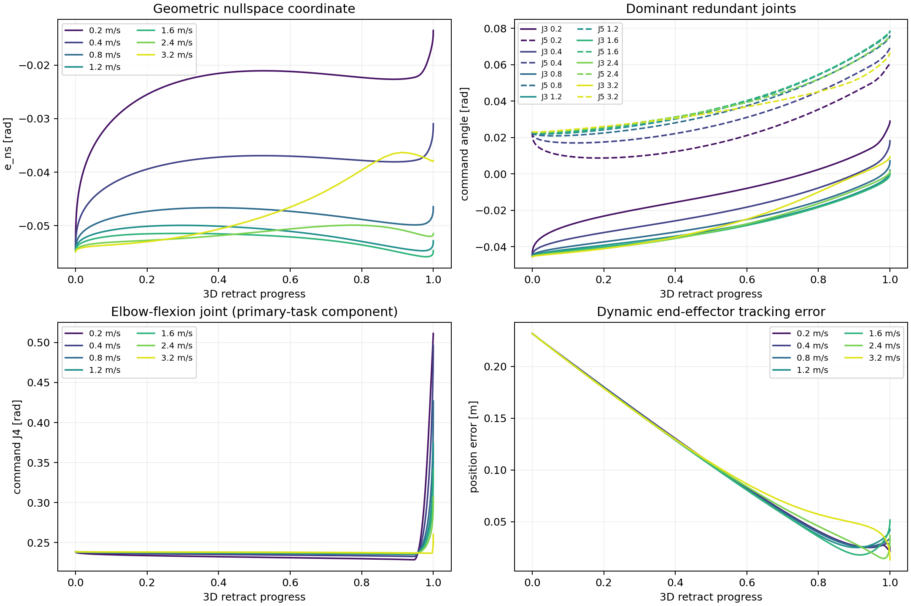
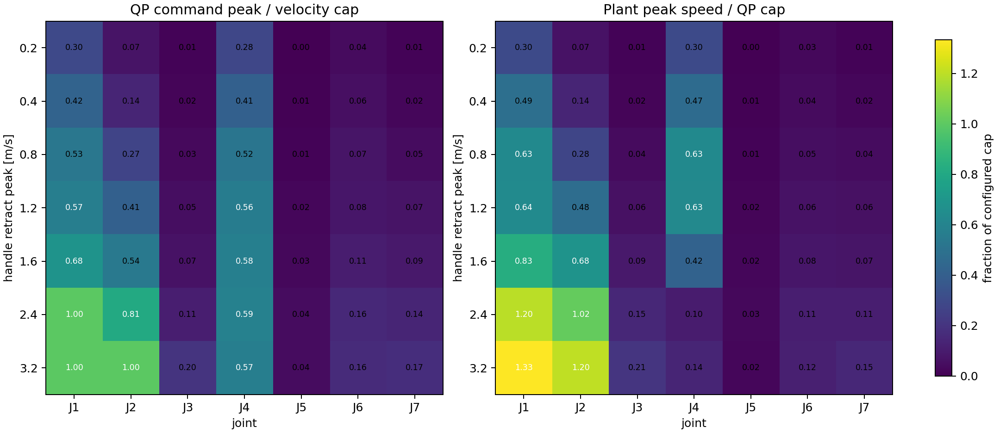
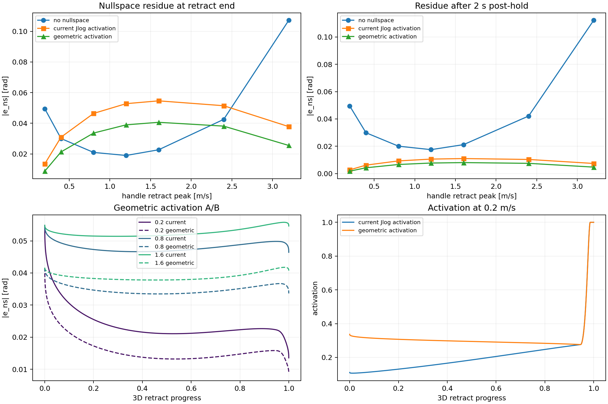

# Diagonal Retract Speed Sweep

## Experiment

The right-hand target follows one common 3D path:

- Near endpoint: `0 cm` forward, `5 cm` right, `6 cm` below the initial
  shoulder-height pose.
- Far endpoint: `25 cm` forward, `5 cm` left, `5 cm` above it.
- Total path length: `0.291 m`.

The arm first moves to the far endpoint with the same `0.2 m/s` extension
profile and holds there for `1.5 s`. Only the retract speed changes:

```text
0.2, 0.4, 0.8, 1.2, 1.6, 2.4, 3.2 m/s
```

The same `0.6 rad` nullspace-offset initial configuration, current joint
velocity caps, full safety stack, MuJoCo position-actuated plant, and
gravity-uncompensated dynamics are used in every run.

Three variants are compared:

- Current rate-limited nullspace task using `FrameTask/Jlog` activation.
- The same task using geometric-Jacobian activation.
- No posture or nullspace task.

All 21 simulations completed without a QP solve failure.

## Speed Dependence Is Real

Every rate-task run starts retraction from the same command configuration
(maximum joint spread below `3e-6 rad`). The current task's geometric
nullspace error at that point is `-0.05485 rad`.

| Retract peak | Duration | Current `|e_ns|` at end | Geometric activation | No nullspace task |
|---:|---:|---:|---:|---:|
| `0.2 m/s` | `2.728 s` | `0.0135` | `0.0088` | `0.0495` |
| `0.4 m/s` | `1.364 s` | `0.0310` | `0.0213` | `0.0301` |
| `0.8 m/s` | `0.684 s` | `0.0464` | `0.0336` | `0.0210` |
| `1.2 m/s` | `0.456 s` | `0.0528` | `0.0390` | `0.0190` |
| `1.6 m/s` | `0.344 s` | `0.0546` | `0.0407` | `0.0227` |
| `2.4 m/s` | `0.228 s` | `0.0515` | `0.0382` | `0.0426` |
| `3.2 m/s` | `0.172 s` | `0.0378` | `0.0255` | `0.1072` |

For the unsaturated `0.2-1.6 m/s` range, faster retraction leaves
progressively more nullspace residue. This follows directly from the current
task definition:

\[
v_{ns}=-k_{ns}e_{ns}, \qquad
\Delta e_{ns}\approx v_{ns}\Delta t.
\]

The task regulates a physical return rate per second. Traversing the same
path in one eighth of the time gives it roughly one eighth as many control
steps in which to return toward home. It is not a path-parameterized
regularizer that guarantees the same redundant coordinate at equal handle
progress.

The no-nullspace runs are also speed-dependent. This shows that some branch
variation comes from finite-rate primary IK, active constraints, and plant
dynamics even without the nullspace objective. At `3.2 m/s`, that uncontrolled
variation becomes especially large.



## How Much Is a True Nullspace Branch Difference?

Trajectories were aligned by 3D retract progress. Each faster command
configuration was compared with the `0.2 m/s` baseline and projected onto its
local geometric nullspace direction.

### Current activation

| Speed | Total configuration difference | Nullspace component | Range-space component | Nullspace fraction |
|---:|---:|---:|---:|---:|
| `0.4` | `0.0877 rad` | `0.0145 rad` | `0.0865 rad` | `16.5%` |
| `0.8` | `0.1726 rad` | `0.0264 rad` | `0.1705 rad` | `15.3%` |
| `1.2` | `0.2139 rad` | `0.0315 rad` | `0.2116 rad` | `14.7%` |
| `1.6` | `0.2377 rad` | `0.0327 rad` | `0.2355 rad` | `13.7%` |
| `2.4` | `0.2620 rad` | `0.0294 rad` | `0.2604 rad` | `11.2%` |
| `3.2` | `0.3088 rad` | `0.0181 rad` | `0.3083 rad` | `5.9%` |

The diagonal path therefore produces a larger genuine branch difference than
the planar test, where the nullspace fraction stayed below `10%`. However,
the primary frame-task component still accounts for more than `83%` of the
largest configuration difference before hard velocity saturation.

At `2.4/3.2 m/s`, the falling nullspace fraction does not mean improved
regulation. Joint velocity constraints are changing the primary solution and
the trajectory no longer reaches the same command configuration during the
very short retract interval.

The structural direction still has a nearly zero J4 component:

```text
far:  [-0.004, -0.084, 0.707, 0.000, -0.697, 0.002, 0.086]
near: [ 0.005, -0.182, 0.702, 0.000, -0.662, 0.011, 0.189]
```

The redundant branch is mainly represented by J2/J3/J5/J7. It can move the
elbow's spatial swivel even though the elbow-flexion joint J4 remains a
primary-task variable.

## Velocity-Limit Boundary

No command joint reaches its QP velocity cap through `1.6 m/s`.

- At `2.4 m/s`, J1 is saturated for `8.8%` of retraction.
- At `3.2 m/s`, J1/J2 are saturated for `48.8%/16.3%`.
- The simulated plant reaches `1.20x/1.02x` of the J1/J2 cap at `2.4 m/s`
  and `1.33x/1.20x` at `3.2 m/s`. QP velocity limits constrain commands, not
  measured plant velocity.

The non-monotonic nullspace curves above `1.6 m/s` are therefore
limit-dominated. The QP must redistribute task motion among the remaining
joints, so these speeds should not be used to tune the nullspace regulator.



## Jlog Activation A/B

Geometric activation raises mean activation during the unreachable far hold
from `0.132` to `0.374`. In the unsaturated speed sweep it:

- reduces the maximum cross-speed `e_ns` spread from `0.0411` to
  `0.0319 rad`;
- lowers the `1.6 m/s` retract-end residue from `0.0546` to `0.0407 rad`;
- lowers the nullspace fraction of the `1.6 m/s` configuration difference
  from `13.7%` to `10.5%`;
- leaves the dominant range-space/J4 trajectory essentially unchanged.

This confirms that geometric activation improves branch consistency, but it
cannot remove speed dependence inherent in a per-second return-rate task.



## Interpretation

There are three separate effects:

1. **Physical-rate nullspace regulation.** Slower trajectories provide more
   wall-clock time to return toward home.
2. **Near-singular primary IK.** At equal target progress, finite convergence
   and workspace re-entry produce a much larger range-space difference than
   the nullspace difference.
3. **Hard velocity limits and plant lag.** Above `2.4 m/s`, J1/J2 clipping
   changes the QP solution itself, while the dynamic plant can temporarily
   move faster than the command cap.

The observed diagonal-path branch variation is therefore genuine, but it is
not evidence of a numerical nullspace-direction jump. The geometric
nullspace direction remains continuous; the controller simply does not
enforce a speed-invariant redundant coordinate.

## Recommendations

1. Change nullspace direction and activation to the geometric Jacobian.
2. Use the `0.2-1.6 m/s` range for nullspace tuning; exclude limit-dominated
   `2.4/3.2 m/s` runs.
3. Increasing `k_ns` can reduce residue but cannot make the branch independent
   of handle speed while retaining a physical speed bound.
4. If equal path progress must imply nearly equal elbow swivel, introduce a
   persistent redundancy-coordinate target or elbow-swivel target. It should
   still be rate-limited before entering the QP.
5. Treat J4 and the final workspace-reentry bend separately as a primary-task
   tracking problem; nullspace-cost tuning cannot directly regulate J4 in
   this arm geometry.
