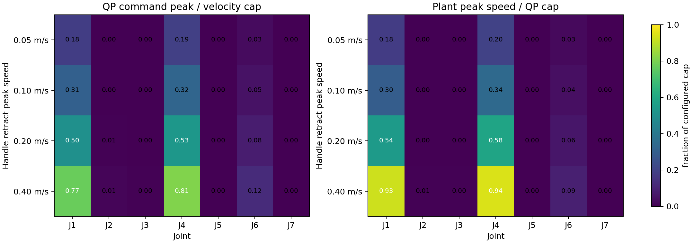
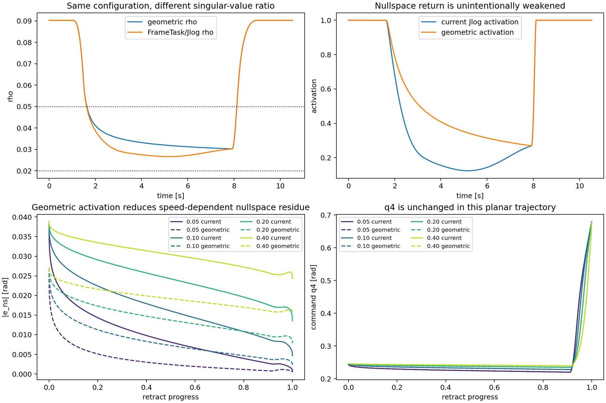

# Home Posture vs. Nullspace Regulation

## Experiment

The right-arm end-effector starts at shoulder height, moves `0.25 m` along
world `+x` beyond the reachable workspace, holds, and retracts along the same
path. The controller runs at `250 Hz` with 10 Mink substeps per control tick.
A separate MuJoCo position-actuated plant tracks the IK position command.

Two initial conditions were tested:

- The original planar initial posture. Its home error projected into the
  structural 1D nullspace is almost zero, so all nullspace regulators are
  effectively inactive.
- A configuration displaced by `0.6 rad` along the geometric nullspace and
  reprojected to exactly the same initial end-effector pose. Its measured
  initial nullspace home error is about `0.71 rad`.

The second condition is the useful comparison because it gives the regulators
an actual redundant-coordinate error to remove without changing the handle
trajectory.

The dynamic plant intentionally has no gravity compensation and no velocity
feed-forward. State-aware joint and singularity limits receive the exact
simulated `q` and `dq`, while Mink retains its command configuration.

## Compared modes

- Historical `PostureTask`, cost `0.01` and `0.10`, historical all-joint
  `1 rad/s` cap and historical integration settings.
- Current safety stack with ordinary `PostureTask`, cost `0.01` and `0.10`.
- Current rate-limited nullspace task:

  \[
  e_{ns}=z^\mathsf{T}(q\ominus q_{home})
  \]

  \[
  v_{ns}=\operatorname{clip}(-k_{ns}e_{ns},
  -v_{ns,max},v_{ns,max})
  \]

  \[
  z^\mathsf{T}\Delta q \simeq v_{ns}\Delta t
  \]

  with `cost=10`, `k_ns=0.8 s^-1`, and `v_ns,max=0.8 rad/s`.

- Direct nullspace-error regulation:

  \[
  w_{ns}^2
  \left\|z^\mathsf{T}\Delta q+
  z^\mathsf{T}(q\ominus q_{home})\right\|^2
  \]

  with costs `0.1`, `1`, and `10`, without an explicit physical return speed.

All current-stack comparisons use position/orientation costs `10/1`, LM
damping `0.02`, global damping `0.1`, joint braking, singularity-approach
braking, and kinetic-energy regularization.

## Results

### Why the old mode can look the same

For a full-rank `6 x 7` Jacobian there is one redundant direction. When the
frame task is satisfiable and the posture cost is weak, an ordinary
`PostureTask` mostly selects that same remaining direction. Similar nominal
joint trajectories are therefore expected; visual similarity alone does not
show that the projected task is ineffective.

The original planar reach has almost zero projected home error throughout.
The rate-limited and direct nullspace tasks consequently produce the same
trajectory. This was an experiment-design issue, not evidence that their
objectives are equivalent.

### What explicit projection improves

With the `0.71 rad` initial nullspace error and a settled-FK target baseline:

| Mode | Time to `|e_ns| < 0.1` | Time to `|e_ns| < 0.01` | Max command position error during initial hold |
|---|---:|---:|---:|
| Full posture cost `0.01` | not reached | not reached | `0.02 mm` |
| Full posture cost `0.10` | `1.004 s` | `2.208 s` | `1.92 mm` |
| Rate nullspace `0.8 / 0.8` | `2.356 s` | `7.644 s` | `0.02 mm` |
| Direct nullspace cost `0.10` | `1.008 s` | `2.668 s` | `0.04 mm` |
| Direct nullspace cost `1` | `0.080 s` | `0.104 s` | `3.67 mm` |
| Direct nullspace cost `10` | `0.036 s` | `0.044 s` | `19.88 mm` |

The ordinary posture cost `0.10` and projected direct cost `0.10` return at
nearly the same rate, explaining the observed similarity. The distinction is
that the ordinary posture task also penalizes range-space motion and therefore
trades about `1.9 mm` of command position accuracy for faster posture return.

The current rate task preserves the frame target best and has a physical,
bounded return speed. Its weaker feel is intentional: with `e_ns = 0.71 rad`,
the initial requested speed is only about `0.57 rad/s`, followed by
exponential decay and singularity-dependent fade-out.

### Direct error regulation is not a free improvement

Direct costs `1` and `10` demand initial nullspace speeds of roughly `11` and
`15 rad/s`. They hit joint velocity limits during about `7.8%` and `8.2%` of
the initial hold. Their simulated peak actual joint accelerations rise to
about `129` and `303 rad/s^2`.

At cost `10`, the nullspace coordinate overshoots and reverses, command
orientation error reaches about `0.63 rad`, and command position error reaches
about `20 mm`. Its apparent strength comes from omitting a physical velocity
scale; the resulting behavior depends strongly on QP weights, damping,
substep size, and active limits.

Direct cost `0.1` is much better behaved, but it is still an implicit and
solver-dependent return rate. It offers no clear advantage over increasing
the explicit rate parameters.

### A bounded way to make return stronger

Additional rate-limited tests produced:

| `k_ns` | `v_ns,max` | Time below `0.1 rad` | Time below `0.01 rad` | Peak achieved nullspace speed | Velocity saturation |
|---:|---:|---:|---:|---:|---:|
| `0.8` | `0.8` | `2.356 s` | `7.644 s` | `0.48 rad/s` | `0%` |
| `1.6` | `0.8` | `1.236 s` | `2.788 s` | `0.69 rad/s` | `0%` |
| `2.0` | `1.2` | `0.964 s` | `2.072 s` | `1.04 rad/s` | `0%` |
| `3.0` | `1.2` | `0.700 s` | `1.432 s` | `1.04 rad/s` | `0%` |

`k_ns=1.6 s^-1` while retaining `v_ns,max=0.8 rad/s` is the conservative
first tuning candidate. It roughly halves convergence time without introducing
velocity saturation or measurable frame-target degradation in this test.

## Retract-Speed Dependence

Current nullspace mode, using the current local velocity caps
`[2, 2, 3.8, 3.8, 12.6, 12.6, 12.6] rad/s`:

| Handle retract peak | Command peak `dq4` | Actual peak `dq4` | Max command/actual `q4` lag | Peak actual `ddq4` | Actual EE z peak-to-peak | QP velocity-cap fraction | Force-cap fraction |
|---:|---:|---:|---:|---:|---:|---:|---:|
| `0.05 m/s` | `0.72` | `0.75` | `0.035 rad` | `5.6 rad/s^2` | `9 mm` | `0%` | `0%` |
| `0.10 m/s` | `1.23` | `1.30` | `0.044 rad` | `11.1 rad/s^2` | `9 mm` | `0%` | `0%` |
| `0.20 m/s` | `2.02` | `2.22` | `0.063 rad` | `22.3 rad/s^2` | `11 mm` | `0%` | `0%` |
| `0.40 m/s` | `3.09` | `3.58` | `0.094 rad` | `43.7 rad/s^2` | `16 mm` | `0%` | `0%` |

Looking at all seven joints, the peak command speed as a percentage of each
joint's configured cap is:

| Handle retract peak | J1 | J2 | J3 | J4 | J5 | J6 | J7 |
|---:|---:|---:|---:|---:|---:|---:|---:|
| `0.05 m/s` | `18.1%` | `0.1%` | `0.2%` | `19.1%` | `0.1%` | `2.9%` | `<0.1%` |
| `0.10 m/s` | `30.8%` | `0.2%` | `0.2%` | `32.5%` | `0.1%` | `4.9%` | `<0.1%` |
| `0.20 m/s` | `50.4%` | `0.5%` | `0.3%` | `53.1%` | `0.1%` | `8.0%` | `0.1%` |
| `0.40 m/s` | `77.0%` | `1.2%` | `0.4%` | `81.2%` | `0.1%` | `12.3%` | `0.1%` |

No joint reaches its QP velocity bound. At `0.40 m/s`, the dynamic plant
reaches `92.5%/94.2%` of the configured J1/J4 caps even though the command
only reaches `77.0%/81.2%`; those caps constrain the QP command, not the
simulated plant state. With the historical all-joint `1 rad/s` cap, only J4
saturates in this trajectory: about `4.7%` of retraction at `0.10 m/s` and
`21.2%` at `0.40 m/s`.



At `0.40 m/s`, peak `q1/q4` actuator forces are `14.4/12.4 Nm`, below their
`40/27 Nm` force limits. The current-speed behavior is therefore not caused
by either QP velocity clipping or actuator-force saturation.

Near a fully extended arm, the reach deficit and elbow bend have the local
relationship

\[
\delta = x_{max}-x \approx C\theta^2,
\qquad
\theta \approx \sqrt{\delta/C}.
\]

Thus

\[
\dot\theta \approx
\frac{\dot\delta}{2\sqrt{C\delta}},
\]

which becomes large as the target first moves back inside the workspace
(`delta -> 0`). Faster handle retraction compresses the same finite elbow bend
into less time. The singularity limit is one-sided: it limits motion that
decreases the singularity ratio, but deliberately does not limit motion
leaving the singularity. The dynamic position actuator then adds increasing
command/actual lag as speed rises.

The historical all-joint `1 rad/s` cap therefore does become active. At
`0.4 m/s`, the elbow completes only about `0.25 rad` of the retraction bend
instead of `0.47 rad` during the finite trajectory. With that old cap,
retract behavior is limit-dominated; with the current caps it is not.

### Is the speed-dependent elbow path a different nullspace branch?

The trajectories were aligned by handle retract progress rather than wall
time. Relative to the `0.05 m/s` trajectory, each faster trajectory's joint
difference was decomposed into the local geometric nullspace direction and
the complementary range-space component:

| Retract speed | Maximum total joint difference | Nullspace component | Range-space component | Nullspace fraction |
|---:|---:|---:|---:|---:|
| `0.10 m/s` | `0.0695 rad` | `0.0052 rad` | `0.0693 rad` | `7.5%` |
| `0.20 m/s` | `0.1463 rad` | `0.0131 rad` | `0.1457 rad` | `8.9%` |
| `0.40 m/s` | `0.2223 rad` | `0.0208 rad` | `0.2213 rad` | `9.4%` |

There is a real speed-dependent redundant-coordinate residue, but it is not
the dominant source of the visible elbow difference in this experiment.
More than `90%` of the configuration difference is the primary frame-task
solution at a different tracking phase near workspace re-entry. Across all
four speeds, the maximum equal-progress J4 spread is `0.1804 rad`, while no
joint velocity bound is active. The trajectories converge once the target
holds.

For this planar reach, the structural nullspace direction near full extension
is approximately

\[
z =
[0.003,\ -0.089,\ 0.710,\ 0,\ -0.693,\ -0.002,\ 0.092].
\]

Its J4 component is numerically zero. Consequently, changing the nullspace
activation primarily changes J3/J5 and cannot directly remove the J4
speed-dependent bend in this particular trajectory.

## Dynamics Caveat

Without gravity compensation, the settled plant has approximately
`11.5 Nm` bias torque at `q1` and `4.4 Nm` at `q4`. It is not force-saturated,
but the actual arm remains displaced from the command, with about `37 mm`
end-effector error in the initial hold. This does not create the IK command
bend, but it amplifies speed-dependent lag and makes subtle millimeter-level
differences between posture objectives difficult to see on the physical state.

## Jacobian Choice

The singularity-approach limit correctly computes

\[
\rho(q)=\sigma_{min}(J_{geo,norm})/\sigma_{max}(J_{geo,norm})
\]

from `Configuration.get_frame_jacobian()`. It therefore depends only on robot
geometry, not target error.

The current nullspace posture task obtains its Jacobian from
`FrameTask.compute_jacobian()`, which includes the target-error `Jlog` factor.
In Mink this Jacobian is

\[
J_{task} = -J_{\log}(T_{tb}) J_{geo}.
\]

When `Jlog` is nonsingular,

\[
\operatorname{null}(J_{task}) = \operatorname{null}(J_{geo}),
\]

so the structural nullspace direction does not change. The replayed worst
sample had an absolute direction alignment of `1.000000000000`. A general
invertible left multiplication does change singular values, however, so

\[
\rho_{task} \ne \rho_{geo}.
\]

At the worst sample, the command pose had `0.224 m` position error and only
`0.000144 rad` orientation error. The combined SE(3) error changed the
normalized Jacobian singular values from

```text
geometric: [2.2269, 1.8580, 1.4399, 0.7927, 0.7417, 0.07832]
Jlog:      [2.6792, 2.2280, 1.4394, 0.6589, 0.6187, 0.07832]
```

The smallest singular value was essentially unchanged, while the largest
increased. This lowered `rho` from `0.03517` to `0.02923` and lowered the
smoothstep activation from `0.508` to `0.226`. Replaying position-only or
orientation-only error did not produce this change at that sample; it came
from the translational/rotational coupling in the combined SE(3) `Jlog`.

During the unreachable far hold, mean activation was `0.164` with the current
task Jacobian and `0.423` with the geometric Jacobian. Thus the current
implementation makes home return depend on target error even though the
robot geometry is unchanged.

### Geometric-activation A/B

A counterfactual simulation changed only the nullspace task's Jacobian source
to `Configuration.get_frame_jacobian()`. All QP weights, limits, target
trajectory, and dynamics remained unchanged.

- At retract start, `|e_ns|` fell from `0.03879` to `0.02707 rad`.
- At `0.40 m/s` retract end, it fell from `0.02429` to `0.01547 rad`.
- The maximum cross-speed `|e_ns|` spread fell from `0.02439` to
  `0.01691 rad`, a `31%` reduction.
- Maximum cross-speed J3/J5 spread fell from `0.01507/0.01465` to
  `0.01092/0.01063 rad`.
- J1/J4/J6 trajectories and all velocity saturation results were effectively
  unchanged.
- Frame-position RMSE changed by less than `0.2 micrometers`, maximum command
  orientation error remained below `0.00121 rad`, and both variants had zero
  solve failures.



The Jacobian-source issue therefore explains part of the speed-dependent
nullspace branch residue and the weak return-to-home feel. It does not explain
the dominant planar J4 bend, which remains a near-singular primary-task and
finite tracking-rate effect.

## Recommendation

1. Keep the rate-limited projected nullspace task.
2. First test `nullspace_return_rate=1.6` while keeping
   `nullspace_max_speed=0.8`.
3. Do not replace it with unbounded direct error regulation at cost `1` or
   `10`.
4. Compute nullspace direction, singularity ratio, and activation from the
   geometric Jacobian, matching the singularity-approach limit.
5. Treat the dominant retract-speed J4 difference below `0.4 m/s` as a
   near-singular primary-task and plant-lag problem, not as current
   velocity-limit clipping or a nullspace branch switch.
6. Separately add gravity compensation or improve the dynamic tracking layer;
   posture-task tuning cannot remove the measured-state sag.
