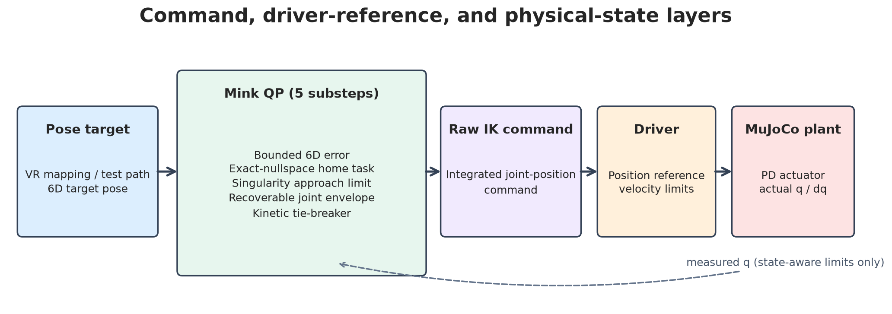
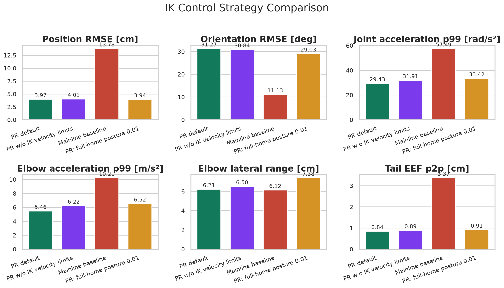
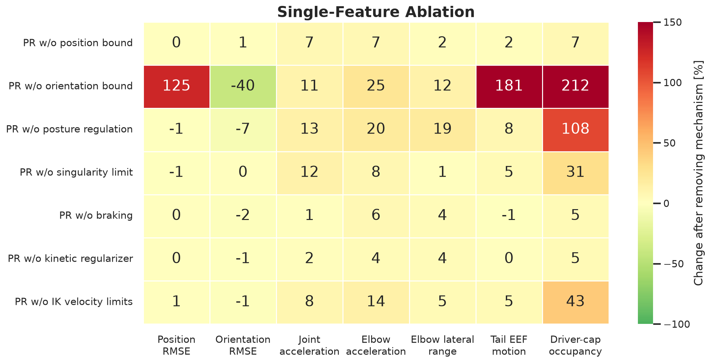
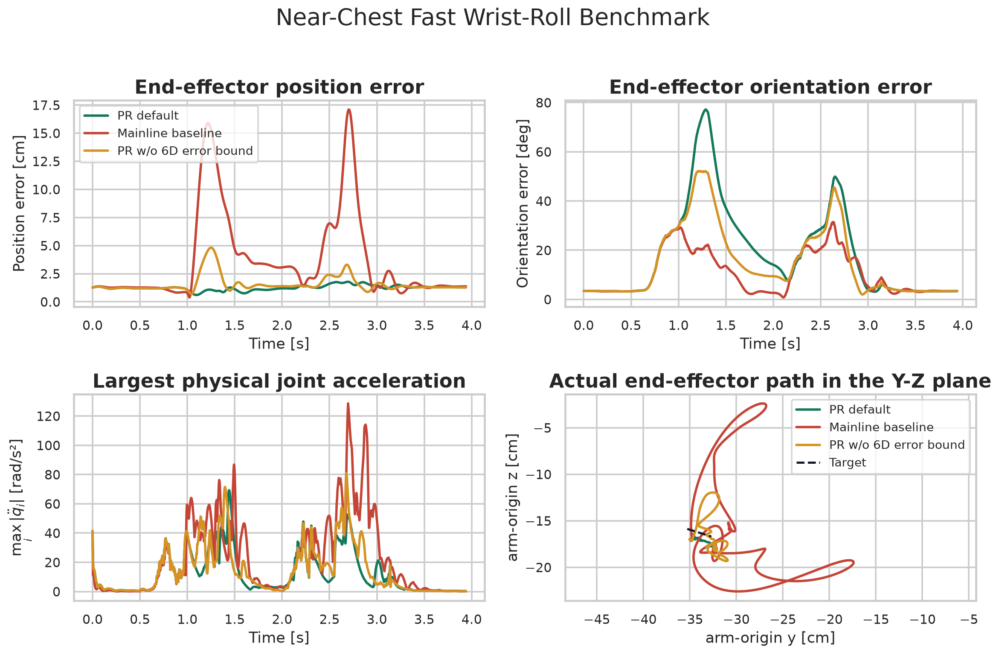
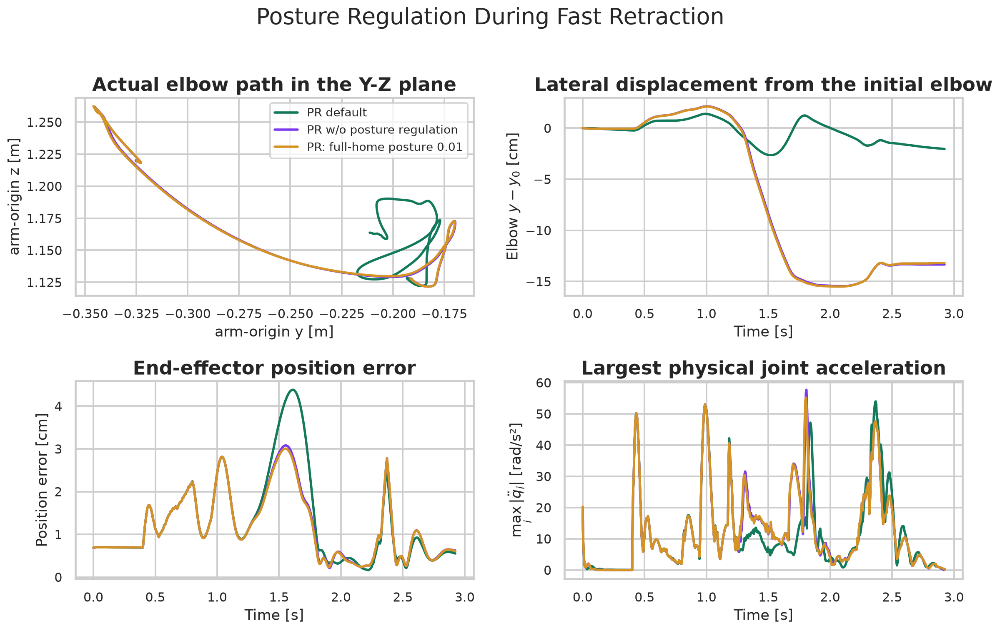
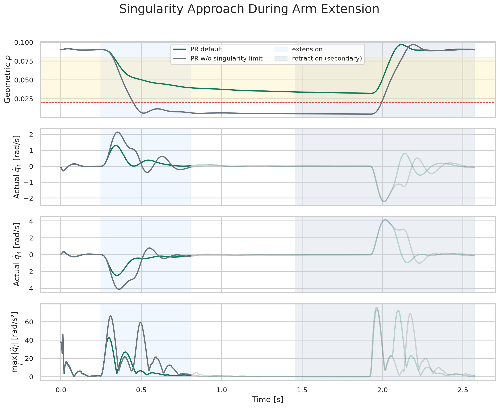

# OpenArm VR IK シミュレーション評価概要

言語：[English](README.md) | [中文](README.zh.md) | **日本語**

日付：2026-08-01 
Upstream baseline：`d543cedeec5f`（upstream `main` branch、tag `0.2.0`） 
評価対象 PR revision：`f983a0eb5cae`（実験 snapshot `d006ece506f2` と記録済み差分 `0ef6a402...` を後に clean commit したもの） 
関連資料：[詳細技術レポート](detailed_report.ja.md) · [実験・アセット索引](experiment_index.ja.md) · [再現手順](run_experiment.ja.md) · [実験 manifest](manifests/manifest.json)

## 判断

**現在の PR デフォルト設定を VR IK のデプロイ基準として採用することを推奨する。** `42` 本の多様なシミュレーション軌道において、**Mainline-task baseline** と比べて位置 RMSE を約 `71%`、実関節加速度 p99 を約 `49%`、肘の Cartesian 加速度 p99 を約 `47%`、動作終端の end-effector（EEF）残留運動を約 `75%` 低減した。

主な代償は、高速な手首回転時の一時的な姿勢追従遅れである。これは明示的な制御上のトレードオフであり、1 回の QP で過大な回転誤差を急いで解消する代わりに、EEF の位置経路、肩・肘の運動分枝、および腕全体の安定性を優先する。

## 比較対象と PR の変更点

本レポートでは次の 3 つを区別する。

| 対象 | Version または名称 | 用途 |
|---|---|---|
| 上流 mainline ベースライン | `d543cedeec5f`（tag `0.2.0`） | PR の merge-base。上流の機能とソース差分を説明するために使用 |
| 評価対象 PR | `f983a0eb5cae` | 本レポートで評価した PR ソース |
| Mainline-task baseline | `strict_mainline` profile | 共通の substep timing と joint envelope の中で mainline の task parameter を復元したアルゴリズム比較用設定。旧 revision の完全な再実行ではない |

上流にはすでに MuJoCo と Mink による differential IK、6D EEF tracking、`arm_origin` 相対座標、damping、full-home posture task、および基本的な位置・速度制限がある。PR はこれに、大きな目標誤差、7-DoF の冗長分枝、特異点への接近、および小さな関節限界超過からの復帰処理を追加する。背景は[詳細レポート第 1 節](detailed_report.ja.md#1-研究背景と評価範囲)、アルゴリズムは[第 2 節](detailed_report.ja.md#2-pr-のソルバ構成と新規メカニズム)を参照。

| メカニズム | 推奨 | 主な役割 |
|---|---|---|
| 6D frame error modulation | **維持** | 大きな位置・姿勢誤差が関節速度飽和時に肩・肘へ運動を再配分することを防ぐ |
| Exact-nullspace home regulation | **維持** | 7-DoF 腕の 1 次元 exact nullspace に沿ってのみ肘の分枝を正則化する |
| 片側 singularity-approach limit | **維持** | 幾何学的な可操作性をさらに低下させる運動だけを減速する |
| QP 内 joint-velocity envelope | **維持** | 実行可能な関節速度範囲内で Cartesian task と secondary task を同時に解く |
| Recoverable joint envelope | **維持** | わずかに限界を超えた関節を速度上限内で復帰させる |
| 距離依存 joint braking | **維持。診断時は独立に無効化可能** | 物理関節境界へ到達する前に、境界方向の速度を低下させる |
| Kinetic-energy regularization | **低 weight で維持** | 運動学的コストが近い解の間に弱い選好を与える |

## 実験設計とデータ

評価では制御経路上の 4 種類の状態を区別する。

- **Target pose**: VR mapping 後に IK へ渡される EEF 目標;
- **Raw IK command**: Mink の outer solve 1 回後の関節構成;
- **Driver command**: driver の関節別速度制限後の IK command;
- **Actual state**: driver command に対する MuJoCo plant の動的応答。

特記がない限り、tracking metric は target pose と**シミュレーション actual state**を比較する。IK velocity limit は QP 内で働き、driver velocity limit は QP 後に軸ごとに clip する。両方の command layer を記録し、[第 5.5 節](detailed_report.ja.md#55-qp-内速度制限と-driver-速度制限の-ab)の専用 A/B で driver limit のみを残した場合を検証する。

実験では `70` 本の unique target trajectory を使用する。このうち固定した `42` 本を主要 controller 比較、機能 ablation、組み合わせ parameter 候補に用い、追加の `28` 本を個別試験に用いる。さらに、その中から `21` 本の代表 clip を動画化した。

| 実験内容 | 構成 | 用途 |
|---|---|---|
| 固定比較セット | `42` 本: reach/extended `19`、retract `6`、wrist/chest `12`、normal workspace `5` | 主要方式、単一機能 ablation、組み合わせ候補で同一入力を使用 |
| 追加の個別軌道 | `28` 本。全体の和集合は `70` unique target | 左右 mirror、追加速度・方向、胸前高速手首回転、joint braking、記録 command replay、deep-start singularity motion |
| 動作例動画 | `70` target から選んだ `21` clip | 目標運動と代表的応答を表示。別の定量データセットではない |

13 個の動的実験 group で、`119` controller profile に対する `1,921` 回の controller-profile × target-trajectory simulation を実行し、QP solver failure は 0 件だった。別の静的 suite には `378` 個の joint-boundary condition がある。動作 family の内訳、21 clip の名称、suite 一覧は[実験・アセット索引](experiment_index.ja.md#3-目標軌道)を参照。[Catalog のアニメーションプレビュー](assets/video_previews/ideal_reference_trajectory_catalog.webp)では動作をすばやく確認でき、[元の MP4](videos/ideal_reference_trajectory_catalog.mp4)も利用できる。

2 本の重点 target は実機 command 記録から作成し、共通 target、MuJoCo plant、driver velocity limit を使って replay する。

- **Near-chest fast wrist-roll**: 胸前での高速手首回転と約 `4.8 cm` の並進。最大角速度 `12.02 rad/s`;
- **Fast-retract elbow-branch**: ほぼ伸展した姿勢からの右腕 retract。最大並進速度 `0.589 m/s`。

これらの target は、記録 command の frame ごとの pose、speed、direction 変化を保持する。ただし actual state と定量 metric はシミュレーション由来であり、実機 closed-loop 性能を示すものではない。

## 主要結果

4 方式はいずれも同じ `42` trajectory を用いる。Metric は trajectory ごとに算出した後に平均し、終端 EEF peak-to-peak motion は最後の `0.35 s` を用いる。姿勢誤差が意図的なトレードオフを表す点を除き、値は小さいほど良い。

| IK controller | Position RMSE ↓ | Orientation RMSE ↓ | Joint acceleration p99 ↓ | Elbow acceleration p99 ↓ | Elbow lateral range ↓ | Terminal EEF p2p ↓ |
|---|---:|---:|---:|---:|---:|---:|
| **PR default** | **3.97 cm** | 31.27° | **29.43 rad/s²** | **5.46 m/s²** | 6.21 cm | **0.84 cm** |
| PR w/o IK velocity limits | 4.01 cm | 30.84° | 31.91 rad/s² | 6.22 m/s² | 6.50 cm | 0.89 cm |
| Mainline-task baseline | 13.78 cm | **11.13°** | 57.49 rad/s² | 10.21 m/s² | 6.12 cm | 3.37 cm |
| PR: full-home posture 0.01 | 3.94 cm | 29.03° | 33.42 rad/s² | 6.52 m/s² | 7.38 cm | 0.91 cm |

Trajectory 間平均の elbow range だけでは、単一 fast retract で選ばれた nullspace branch を判別できないため、個別 fast-retract case も確認する必要がある。

## 機能 ablation

以下では PR default から機能を 1 つずつ取り除く。値は相対変化で、正値は metric の増加を表す。Orientation lag は意図したトレードオフなので、単一 metric の低下が必ずしも controller 全体の改善を意味しない。

主な観察結果:

- Orientation-error bound を外すと、position RMSE が `125%`、terminal EEF residual motion が `181%`、driver-limit activation が `212%` 増加;
- Exact-nullspace regulation を外すと、elbow lateral range が `19%`、joint-acceleration p99 が `13%`、driver-limit activation が `108%` 増加;
- Singularity limit を外すと joint-acceleration p99 が `12%` 増加し、主に reach と extended-arm trajectory に現れる;
- Joint braking と kinetic regularization の trajectory 全体平均への影響は小さく、効果は position boundary 付近、または複数の運動学解のコストが近い状況に集中する。

動作 family 別の内訳は[第 4.2 節](detailed_report.ja.md#42-単一機能-ablation)を参照。

## 3 つの代表例

### 1. 胸前での高速手首回転: 6D error modulation

Target の並進は約 `4.8 cm` にすぎないが、最大角速度は `12.02 rad/s` に達する。A/B 結果から、完全な回転誤差を急いで追従すると、回転要求と関節速度飽和が同時に肩・肘の配分を変え、EEF が意図した位置経路から外れることが分かる。

| Controller | Position RMSE / maximum ↓ | Orientation RMSE | Joint acceleration p99 ↓ | Driver-limit activation ↓ |
|---|---:|---:|---:|---:|
| **PR default** | **1.28 / 1.78 cm** | 28.4° | **39.3 rad/s²** | **15.3%** |
| Mainline-task baseline | 5.81 / 17.11 cm | **14.5°** | 73.0 rad/s² | 29.3% |
| PR w/o 6D error bound | 1.79 / 4.81 cm | 22.0° | 47.3 rad/s² | 22.1% |

[3 controller のアニメーションプレビュー](assets/video_previews/near_chest_fast_wrist_roll_controller_comparison.webp) · [MP4 をダウンロード](videos/near_chest_fast_wrist_roll_controller_comparison.mp4) · [胸前 stress-test A/B](detailed_report.ja.md#511-胸前-stress-test)

### 2. 高速 retract: Exact-nullspace branch regulation

Exact-nullspace task は、home configuration error の現在の 1 次元 nullspace への射影だけを調整する。Full-home preference を全関節方向へ直接加えない。

| Secondary regularizer | Position RMSE / maximum | Elbow lateral range ↓ | Joint acceleration p99 | Driver-limit activation |
|---|---:|---:|---:|---:|
| **Exact nullspace (PR default)** | 1.80 / 4.38 cm | **4.04 cm** | 40.90 rad/s² | 36.9% |
| No posture regulation | 1.51 / 3.08 cm | 17.59 cm | 38.92 rad/s² | 33.7% |
| Full-home posture 0.01 | **1.49 / 3.00 cm** | 17.61 cm | **38.84 rad/s²** | **33.2%** |

約 `3 mm` の追加 position RMSE と引き換えに、exact-nullspace regulation は elbow lateral range を約 `13.6 cm` 減らす。`posture_cost=0.003/0.01/0.03` の full-home `PostureTask` はいずれも約 `17.6 cm` の range となり、同等の branch constraint にはならない。

[Posture-regulation プレビュー](assets/video_previews/fast_retract_posture_regulation_comparison.webp) · [Controller 全体プレビュー](assets/video_previews/fast_retract_controller_comparison.webp) · [MP4 ファイル](experiment_index.ja.md#6-動画索引)

### 3. 到達域外への伸展: Singularity-approach limiting

Singularity limit は現在の幾何構成だけで決まる無次元 singular-value ratio を使用する。

$$
\rho(q)=\frac{\sigma_{\min}(J_{\mathrm{norm}})}{\sigma_{\max}(J_{\mathrm{norm}})}.
$$

QP は $\rho$ をさらに低下させる関節運動だけを制限し、特異点から離れる運動や等特異度面に接する運動は制限しない。`0.8 m/s` の肩高伸展では、PR default により最小 $\rho$ が `0.0047` から `0.0323` に増え、joint-acceleration p99 が `48.7` から `40.6 rad/s²` に低下し、position RMSE はほぼ変わらない。

[伸展 singularity A/B プレビュー](assets/video_previews/straight_reach_singularity_limit_comparison.webp) · [MP4 をダウンロード](videos/straight_reach_singularity_limit_comparison.mp4)

## その他の主要検証

| 問い | 結果 | 結論 |
|---|---|---|
| わずかな joint-limit 超過後に位置制約と速度制約は競合するか | Recoverable envelope は `126/126` condition を解き、独立した位置・速度制約は `78/126` のみ | Combined envelope が復帰時の実行可能性を修復 |
| Driver velocity limit は QP velocity envelope を置き換えられるか | 高速 diagonal retract で IK limit を無効にすると position RMSE は `3.93 cm` から `5.03 cm`、最大 lateral path deviation は `2.68 cm` から `9.43 cm` に増加 | この A/B では QP limit の方が意図した経路に近い task allocation を維持 |
| Joint braking は物理境界余裕を増やすか | `12 rad/s` wrist target で、`0.20 rad` braking distance は最小 joint margin を `26` から `62 mrad` に増加 | より早い tracking lag と引き換えに境界余裕を増加 |
| Kinetic regularization は大きな動力学的効果を持つか | 除去すると joint- と elbow-acceleration p99 がそれぞれ約 `2.3%`、`3.6%` 増加 | 弱い tie-breaker であり、inverse dynamics や gravity compensation ではない |

QP と driver limit の完全な timing および path decomposition は[第 5.5 節](detailed_report.ja.md#55-qp-内速度制限と-driver-速度制限の-ab)を参照。

## Parameter とデプロイ推奨値

単一 parameter sweep、組み合わせ tuning、exact-nullspace 個別 sweep のいずれでも、tracking、joint dynamics、elbow branch、driver-limit activation を全 scenario で同時に改善する設定は見つからなかった。現在の default は各 trajectory の単項最適ではないが、scenario 間で安定した折衷を与える。

| Parameter group | 現在のデプロイ値 |
|---|---|
| EEF task / damping | `position_cost=12`, `orientation_cost=1.5`, `damping=0.1`, `lm_damping=0.01` |
| Outer timing | `4 ms`, `5` QP substep |
| Total 6D error budget | `0.020 m / 0.25 rad`; position-speed interval `0.6 -> 0.9 m/s`; latch threshold `0.006 m` |
| Exact-nullspace regulation | cost `8.5`; return rate `1.6 s⁻¹`; maximum speed `1.0 rad/s`; activation `0.02 -> 0.05` |
| Singularity-approach limit | stop/slow `0.02 / 0.08`; maximum approach rate `0.25 s⁻¹` |
| Joint braking | distance `0.20 rad`; exponent `2`; measured-state buffer `0.01 rad` |
| Kinetic regularization | `2e-5` |
| IK / driver velocity limit J1-J7 | `[2, 2, 3.14, 3.14, 6.3, 6.3, 6.3] rad/s` |

Exact-nullspace sweep と cross-validation は[第 6.1 節](detailed_report.ja.md#61-nullspace-parameter-sweep-と-cross-validation)、その他の parameter curve と組み合わせ候補は[第 6.2 節以降](detailed_report.ja.md#62-単一-parameter-感度)を参照。

## 現在の制約

- 胸前で高速手首回転と急な外向き並進を同時に行うと、一部の弱可制御方向が依然として大きな肩・肘運動を励起する。Orientation budget を厳しくすると位置をさらに保護できるが、orientation lag は増える。
- 実測関節位置は braking と singularity envelope にのみ保守的に影響し、Mink の積分 command を継続的に上書きしない。Command が actual state に先行する量は依然として蓄積し得る。
- Joint envelope は環境 collision protection を提供しない。Table と base の clearance には独立した Cartesian constraint または collision constraint が必要。
- MuJoCo A/B は controller 間の相対比較には使えるが、実際の摩擦、構造 compliance、motor bandwidth、firmware position loop を含む実機検証を置き換えない。
- 初期の実機記録では raw VR target、filtered target、最終 limited target を同期保存していないため、一部の複合 wrist-rotation anomaly を一意に帰属できない。

## 再現性

- [実験再現手順](run_experiment.ja.md): environment、trajectory、simulation、figure、video、最終検証までの完全な手順;
- [実験ソースと command](src/README.md): simulation、analysis、video generation、frozen input、local raw result;
- [詳細技術レポート](detailed_report.ja.md): 数式、実験条件、個別結果、parameter sweep、性能、API validation;
- [実験・アセット索引](experiment_index.ja.md): figure、video、CSV、suite、生成 script の対応;
- [Top-level experiment manifest](manifests/manifest.json): revision、dependency、model hash、profile、scenario inventory;
- [主要 controller CSV](tables/headline_baseline_means.csv);
- [単一機能 ablation CSV](tables/ablation_relative_effects_percent.csv);
- [高速 retract posture-regulation CSV](tables/branch_regulation_frozen_metrics.csv)。
