# OpenArm VR IK Simulation Evaluation: Algorithms, Experiments, and Parameters

Language: **English** | [中文](detailed_report.zh.md) | [日本語](detailed_report.ja.md)

Date: 2026-08-01 
Upstream baseline: `d543cedeec5f` (upstream `main` branch, tag `0.2.0`) 
Evaluated PR revision: `f983a0eb5cae` (the committed form of experiment snapshot `d006ece506f2` and its recorded diff `0ef6a402...`) 
Decision brief: [README.md](README.md) · Asset index: [experiment_index.md](experiment_index.md) · Reproduction guide: [run_experiment.md](run_experiment.md) · Experiment manifest: [manifest.json](manifests/manifest.json)

## Abstract

**The current PR default is recommended as the deployment baseline for VR IK.** Across `42` diverse simulation trajectories, it reduced position RMSE by approximately `71%`, actual joint-acceleration p99 by approximately `49%`, Cartesian elbow-acceleration p99 by approximately `47%`, and end-of-motion EEF residual movement by approximately `75%` relative to the Mainline-task baseline.

The main cost is transient orientation lag during fast wrist rotation. This is an intentional control tradeoff: preserve the end-effector position path, shoulder/elbow branch, and whole-arm stability instead of consuming an excessive rotation error as quickly as possible in one QP. All actual-state metrics come from MuJoCo simulation and do not represent hardware closed-loop performance.

## Reading Guide

This report documents the algorithms, experimental conditions, complete A/B studies, parameter sweeps, implementation checks, and performance data. For only the merge or deployment decision, begin with the [decision brief](README.md).

| Question | Section |
|---|---|
| What did upstream already provide, what is compared, and why was the PR needed? | Section 1 |
| What solver architecture and algorithms does the PR add? | Section 2 |
| How were trajectories, comparison profiles, and metrics defined? | Section 3 |
| How do the complete controllers and individual features compare? | Section 4 |
| What does each mechanism do in its targeted A/B experiment? | Section 5 |
| How were parameters, correctness, and performance evaluated? | Section 6 |
| What are the final conclusions, limitations, and deployment recommendations? | Section 7 |
| How can the raw results be traced or reproduced? | Appendix and [experiment index](experiment_index.md) |

## 1. Research Background and Evaluation Scope

### 1.1 Questions Addressed

This study evaluates the current OpenArm differential-IK PR and asks:

1. Relative to a common baseline using the mainline task structure and parameters, does the PR reduce abrupt shoulder/elbow branch changes near singularity, during fast retraction, and during fast wrist rotation?
2. What problems are individually addressed by frame-error modulation, exact-nullspace regulation, singularity-approach limiting, the recoverable joint envelope, joint braking, and kinetic-energy regularization?
3. In targeted A/B cases, can QP velocity limits be replaced by numerically identical post-QP driver joint limits?
4. Is there a simpler or more aggressive parameter combination that consistently outperforms the current defaults across scenarios?
5. Do the new tasks, limits, and Jacobian fast path preserve `arm_origin` relative-frame semantics, left/right symmetry, single-arm freezing, and correct `qpos`/`dof` mapping?

The PR default is not claimed to be a global simulation optimum. It is the configuration used by the evaluated code and hardware deployment. The report freezes those values in the experiment profile and evaluates their benefits and costs under fixed conditions.

### 1.2 Three Distinct Comparison Objects

The source baseline, evaluated PR, and experimental comparison profile serve different purposes:

| Object | Fixed revision or name | Meaning in this report |
|---|---|---|
| **Upstream baseline** | `d543cedeec5f742d08a817999d430c4a87f7660f` (upstream `main` branch, tag `0.2.0`) | Merge base between the PR and upstream; used to describe upstream capabilities and calculate source changes |
| **Evaluated PR revision** | `f983a0eb5caeb3d96783416b21219a1f31fd3046` | Source evaluated by this report; the experiment revision `d006ece506f2` and recorded diff `0ef6a402...` were subsequently committed unchanged as this revision |
| **Mainline-task baseline** | `strict_mainline` profile | Restores the mainline task structure and parameters inside the PR's common substep timing and joint envelope to isolate task and regularization differences; it is not a literal replay of `d543cede` |

Consequently, numerical results for the **Mainline-task baseline** are algorithm comparisons within one controlled experimental framework. Apart from static source analysis, the report does not directly compare historical `d543cede` binary performance with the PR.

### 1.3 Capabilities Already Present Upstream

`d543cede` already provided the complete MuJoCo + Mink differential-IK backbone:

- 6D end-effector tracking with `FrameTask` or `RelativeFrameTask`; relative coordinates are used by default when the model contains `arm_origin`, while world-frame operation remains selectable;
- soft QP objectives composed from position/orientation task costs, task-level LM damping, and global damping;
- a default full-home `PostureTask` targeting the joint configuration at IK initialization;
- `ConfigurationLimit` and an optional Mink `VelocityLimit`;
- `DofFreezingTask` for inactive degrees of freedom;
- multiple `solve_ik()` calls and configuration integrations for every outer event;
- bimanual FK/IK, synchronization from driver state, gripper pass-through, and the `arm_origin` relative-pose API.

These capabilities are sufficient for teleoperation in the normal workspace. Field anomalies appeared mainly when large 6D target errors, reachability boundaries, joint-position limits, and lagging actual state acted together.

### 1.4 Control Problems Not Covered by the Original Structure

The following table is limited to control issues not covered by the upstream source structure and directly motivated by field analysis or static verification.

| Upstream mechanism | Uncovered issue | PR treatment |
|---|---|---|
| Frame task consumes the full 6D error | Fast wrist rotation, fast retraction, or unreachable targets can request excessive motion in one outer solve and alter shoulder/elbow allocation when joint velocities saturate | Total position/orientation error budgets, plus speed-activated and latched position clipping |
| Full-home `PostureTask` acts in the complete joint space | On a redundant 7-DoF arm, the home bias is not confined to the one-dimensional nullspace that preserves the EEF pose | Exact-nullspace home regulation; original task retained but disabled by default |
| Damping suppresses only overall motion magnitude | No geometric constraint distinguishes motion approaching a singularity from motion leaving it | One-sided singularity-approach limit |
| Position and velocity limits are stacked independently | When a configuration is slightly outside bounds, “return inside in one step” can conflict with the one-step velocity bound | Recoverable combined position/velocity envelope |
| Position limits constrain displacement only at the boundary | Allowed velocity toward a mechanical limit does not decrease smoothly before reaching it | Distance-dependent joint braking |
| Solver retries without limits after failure | Safety constraints can be bypassed precisely when they are most needed | Roll back the complete outer solve; no unconstrained retry |
| Every iteration uses the full `dt` | `max_iters` integrations represent multiple physical periods unless velocity caps are compensated separately | `dt_sub = dt_outer / max_iters` |
| Frozen DoFs are inferred indirectly from active qpos | Single-arm mode and general MuJoCo models must not assume `nq == nv` or that both arms are active | Explicit active-qpos and tangent-space DoF handling |
| Safety envelopes observe only the integrated command | Braking and singularity activation can occur too late when command state leads actual state | Measured $q$ conservatively affects state-aware constraints without replacing the integrated command |
| Only Euclidean damping is available | Kinematically similar solutions have no configuration-dependent mass-matrix preference | Low-weight kinetic-energy regularization |

## 2. PR Solver Architecture and New Mechanisms

### 2.1 Unified QP and Physical Substeps

Ignoring constant terms internal to Mink, each substep can be summarized as

$$
\min_{\Delta q}
\sum_i \left\|W_i\left(J_i\Delta q-r_i\right)\right\|^2
+\lambda\|\Delta q\|^2,
\qquad G\Delta q\le h.
$$

Here, $\Delta q$ is a one-step displacement in the MuJoCo tangent space, and $r_i$ is the correction requested by a task in that substep. Tasks provide tradeable soft objectives through the cost function; limits define one-step bounds that must satisfy $G\Delta q\le h$.

The PR divides one outer control period evenly among all QP substeps:

$$
\Delta t_{\mathrm{sub}}=
\frac{\Delta t_{\mathrm{outer}}}{N}.
$$

With the current $\Delta t_{\mathrm{outer}}=4\,\mathrm{ms}$ and $N=5$, each substep represents $0.8\,\mathrm{ms}$, and all five integrations together still represent one physical control period.

### 2.2 6D End-Effector Error Modulation

Let $e_p,e_R\in\mathbb{R}^3$ denote the frame task's position and orientation errors. Define the direction-preserving norm saturation

$$
\mathrm{sat}_b(x)=
\begin{cases}
x, & \lVert x\rVert\le b,\\
b\dfrac{x}{\lVert x\rVert}, & \lVert x\rVert>b.
\end{cases}
$$

The position and orientation parameters $B_p,B_R$ are total budgets for one outer solve and are divided equally among $N$ substeps:

$$
\bar e_p=\mathrm{sat}_{B_p/N}(e_p),\qquad
\bar e_R=\mathrm{sat}_{B_R/N}(e_R).
$$

Orientation always uses $\bar e_R$. Position obtains an activation $\alpha_p\in[0,1]$ from target linear speed and continuously blends the full and clipped errors:

$$
\hat e_p=(1-\alpha_p)e_p+\alpha_p\bar e_p,
\qquad \hat e_R=\bar e_R.
$$

If $v_t$ is the target-position finite-difference velocity over the outer period,

$$
u_p=\mathrm{clip}\left(
\frac{\lVert v_t\rVert-v_{\mathrm{slow}}}
{v_{\mathrm{fast}}-v_{\mathrm{slow}}},0,1\right),
\qquad \alpha_p=3u_p^2-2u_p^3.
$$

The current speed-scheduling interval is `0.6 -> 0.9 m/s`. Once position clipping activates, a latch retains the current activation while accumulated position error exceeds `6 mm`; it releases after the error returns within that threshold. The task changes only how much error the current QP consumes and does not overwrite the original target.

### 2.3 Exact-Nullspace Home Regulation

Let $J_p,J_R$ be the geometric linear- and angular-velocity Jacobians. A characteristic length $l_c=0.3\,\mathrm{m}$ places their rows on comparable numerical scales:

$$
J_{\mathrm{norm}}=
\begin{bmatrix}J_p/l_c\\J_R\end{bmatrix}.
$$

This invertible row scaling does not change the nullspace. A full SVD of the $6\times7$ Jacobian of one 7-DoF arm gives

$$
J_{\mathrm{norm}}=U\Sigma V^\mathsf{T},
\qquad V=[v_1,\ldots,v_7],\quad z=v_7,
\qquad J_{\mathrm{norm}}z=0.
$$

The home error uses the MuJoCo configuration difference, and only its scalar component along $z$ is retained:

$$
e_q=q\ominus q_{\mathrm{home}},
\qquad e_{\mathrm{ns}}=z^\mathsf{T}e_q,
$$

$$
v_{\mathrm{ns}}=\mathrm{clip}
\left(-k_{\mathrm{ns}}e_{\mathrm{ns}},
-v_{\mathrm{ns,max}},v_{\mathrm{ns,max}}\right).
$$

The secondary objective is

$$
L_{\mathrm{ns}}=w_{\mathrm{eff}}^2
\left(z^\mathsf{T}\Delta q-v_{\mathrm{ns}}\Delta t_{\mathrm{sub}}\right)^2.
$$

It regulates only the nullspace component that preserves the 6D EEF pose to first order, rather than applying a full-home preference in other directions. Near singularity, activation uses

$$
\rho=\frac{\sigma_{\min}(J_{\mathrm{norm}})}
{\sigma_{\max}(J_{\mathrm{norm}})},
\quad
u_{\mathrm{ns}}=\mathrm{clip}
\left(\frac{\rho-\rho_{\mathrm{low}}}
{\rho_{\mathrm{high}}-\rho_{\mathrm{low}}},0,1\right),
$$

$$
\alpha_{\mathrm{ns}}=3u_{\mathrm{ns}}^2-2u_{\mathrm{ns}}^3,
\qquad w_{\mathrm{eff}}=w_0\sqrt{\alpha_{\mathrm{ns}}}.
$$

Only the task weight is smoothed; $z$ is not smoothed, preserving $Jz=0$. At low $\rho$, the home preference fades to avoid letting an unstable direction dominate as the nullspace dimension is about to change.

### 2.4 One-Sided Singularity-Approach Limit

Singularity must be computed from the **geometric** Jacobian of the current configuration, not from `FrameTask.compute_jacobian()`, whose target-dependent $J_{\log}$ alters the singular values. Define

$$
\rho(q)=\frac{\sigma_{\min}(J_{\mathrm{norm}})}
{\sigma_{\max}(J_{\mathrm{norm}})},
\qquad g=\nabla_q\rho.
$$

The implementation computes $g$ with central finite differences along joint tangent-space directions. To first order, $\dot\rho\approx g^\mathsf{T}\dot q$; the arm approaches a singularity only when $g^\mathsf{T}\dot q<0$. The permitted approach rate tightens smoothly with the current $\rho$:

$$
u_\rho=\mathrm{clip}
\left(\frac{\rho-\rho_{\mathrm{stop}}}
{\rho_{\mathrm{slow}}-\rho_{\mathrm{stop}}},0,1\right),
\qquad
v_{\rho,\mathrm{allowed}}
=v_{\rho,\max}(3u_\rho^2-2u_\rho^3)^p.
$$

The QP receives the one-sided constraint

$$
g^\mathsf{T}\Delta q
\ge -v_{\rho,\mathrm{allowed}}\Delta t_{\mathrm{sub}}.
$$

Thus, only the component that decreases $\rho$ is slowed; motion leaving the singularity or tangent to an equal-singularity contour is unaffected. When measured $q$ is available, activation uses the lower $\rho$ of command and measured states, while the gradient remains linearized at the current QP configuration.

### 2.5 Recoverable Joint Envelope and Preventive Braking

For each scalar arm joint, let $q_{min},q_{max}$ be position limits, $v_{max}$ the physical velocity limit, and $k_q\in(0,1]$ a position gain. The recoverable envelope combines position recovery and velocity bounds into one pair of one-step limits:

$$
\Delta q_{low}=\mathrm{clip}
\left(k_q(q_{min}-q),-v_{max}\Delta t_{\mathrm{sub}},
v_{max}\Delta t_{\mathrm{sub}}\right),
$$

$$
\Delta q_{high}=\mathrm{clip}
\left(k_q(q_{max}-q),-v_{max}\Delta t_{\mathrm{sub}},
v_{max}\Delta t_{\mathrm{sub}}\right).
$$

If a joint is slightly outside its position range and the required recovery exceeds one velocity-limited step, both bounds collapse to the maximum safe recovery step. The solver no longer receives contradictory demands to return inside in one step and remain within the step velocity limit.

When braking is enabled, let $m$ be the effective distance to the position limit in the direction of motion and $d_b$ the braking distance:

$$
u=\mathrm{clip}\left(\frac{\max(m,0)}{d_b},0,1\right),
\qquad
v_{\mathrm{allowed}}(m)=v_{max}(3u^2-2u^3)^p.
$$

As distance decreases, permitted velocity toward the limit approaches zero; motion away from the limit is unaffected. Measured $q$ can select a more conservative margin than command state, after subtracting a fixed buffer.

### 2.6 QP Velocity Envelope and Measured State

With `--limit-velocity`, per-joint velocity limits enter the hard QP envelope from Section 2.5. The Cartesian task, nullspace task, and other soft objectives are therefore solved within one executable velocity set. The driver can retain identical post-QP limits as an execution-layer safeguard. Section 5.5 tests whether keeping only the driver limit is equivalent.

Measured $q$ does not overwrite Mink's integrated command configuration. It only conservatively affects braking margin and singularity-limit activation. This allows real state to correct safety boundaries without repeatedly shrinking incremental position commands through forced synchronization on every tick.

### 2.7 Kinetic-Energy Regularization

A low-weight kinetic task adds the MuJoCo mass-matrix metric to the Hessian:

$$
H_{\mathrm{kin}}=w_{\mathrm{kin}}
\frac{M(q)}{\Delta t_{\mathrm{sub}}^2}.
$$

It supplies only a weak preference between solutions with similar kinematic cost. It produces no torque command and includes neither gravity compensation, contact dynamics, nor inverse dynamics.

### 2.8 Solver, Coordinate, and Indexing Semantics

In addition to the tasks and limits above, the PR changes these behaviors:

- if any constrained QP substep fails, the complete outer solve is rolled back instead of retried without limits;
- MuJoCo `qpos` (`nq`) and tangent-space DoF (`nv`) indices are handled separately;
- single-arm mode freezes only inactive degrees of freedom;
- `sync()` no longer overwrites the independent gripper command;
- the upstream `arm_origin` / `RelativeFrameTask` API is preserved without another hard-coded coordinate transform;
- a static-root relative-Jacobian fast path is used when valid, while moving roots retain the general calculation.

## 3. Experimental Design and Metric Computation

### 3.1 Environment and Control Chain

#### 3.1.1 Software, Model, and Hardware

| Item | Version or condition |
|---|---|
| CPU | Intel Core Ultra 7 265F |
| Kernel | Linux 7.0.0-28 x86_64 |
| Python | 3.14.6 |
| MuJoCo | 3.11.0 |
| Mink | 1.1.0 |
| DAQP | 0.7.2 |
| `openarm_mujoco` | 2.0.1 |
| Model | `openarm_mujoco/v2/cell.xml` |
| Model SHA-256 | `cb0322c264b2acd781ea08e873970ef21dd1db491e64ed0c02844aa8c1a3bfa7` |
| Outer control period | `4 ms` (`250 Hz`) |
| QP substeps | `5`, each `0.8 ms` |
| Random sampling | Disabled; recorded seed `0` |

Revision, dirty-diff hash, command, dependency versions, model hash, profile, and scenario list for every suite are stored in the [manifest](manifests/manifest.json).

#### 3.1.2 Frames, Terms, and Control-Chain States

Target poses, EEF poses corresponding to IK commands, and errors are expressed relative to `arm_origin`. The MuJoCo plant still integrates in the world frame. Elbow Y-Z paths in the report are obtained by transforming the actual elbow joint position into `arm_origin`.

The quantities in the control chain mean:

- **target pose**: end-effector target delivered to IK after VR-side processing;
- **raw IK command**: integrated configuration after one outer Mink solve;
- **driver command**: reference configuration after per-joint driver velocity limiting;
- **actual state**: state produced jointly by the MuJoCo actuator, inertia, and control delay.

All tracking metrics are computed from target and simulated actual state unless explicitly stated otherwise. Command metrics are labeled `raw IK` or `driver` to avoid treating the IK command as robot state. Profile names, targets, and parameter identifiers retain their source English spelling so they map directly to code, CSV files, and videos.

### 3.2 Default Configuration and Test Trajectories

#### 3.2.1 PR Default

| Parameter | Value |
|---|---:|
| Position/orientation cost | `12 / 1.5` |
| Global damping / LM damping | `0.1 / 0.01` |
| Full-home posture cost | `0` |
| Total position/orientation error budget | `0.020 m / 0.25 rad` |
| Position speed-scheduling interval | `0.6 -> 0.9 m/s` |
| Position latch threshold | `0.006 m` |
| Nullspace cost / return rate / maximum speed | $8.5 / 1.6\,\mathrm{s}^{-1} / 1.0\,\mathrm{rad/s}$ |
| Nullspace activation interval (dimensionless) | `0.02 -> 0.05` |
| Singularity stop/slow interval (dimensionless) | `0.02 / 0.08` |
| Maximum singularity-approach rate | $0.25\,\mathrm{s}^{-1}$ |
| Joint braking distance / measured-state buffer | `0.20 / 0.01 rad` |
| Joint braking exponent | `2` |
| Kinetic regularization cost | `2e-5` |
| IK velocity limits J1-J7 | `[2, 2, 3.14, 3.14, 6.3, 6.3, 6.3] rad/s` |
| Driver velocity limits J1-J7 | `[2, 2, 3.14, 3.14, 6.3, 6.3, 6.3] rad/s` |

Here, the **IK velocity limits** are joint constraints inside the QP, whereas the **driver velocity limits** are per-joint clipping after the QP. They are abbreviated as IK caps and driver caps where context is unambiguous.

#### 3.2.2 Composition of the Test Trajectories

The study uses `70` unique target trajectories:

1. **Fixed comparison set (42 trajectories):** every headline controller, single-feature ablation, and combined candidate uses the same targets for direct comparison;
2. **Additional targeted set (28 trajectories):** tests left/right mirroring, extra speeds and directions, near-chest fast wrist motion, joint braking, recorded-command replay, and deep-start singular motion;
3. **Motion-example video (21 clips):** representative motions selected from those `70` targets to show path geometry, movement direction, and typical controller response; it is not an additional quantitative dataset.

The table below shows the number and purpose of trajectories in each motion family. Complete scenario names, family counts, and the order of the 21 video clips appear in [Experiment Index, Section 3](experiment_index.md#3-target-trajectories).

| Motion family | Fixed comparison | Additional targeted | Unique total | Video clips | Purpose |
|---|---:|---:|---:|---:|---|
| Reach and extended arm | 19 | 10 | 29 | 9 | Extension singularity, targets beyond reach, translation and wrist rotation while extended |
| Fast retract | 6 | 2 | 8 | 3 | Nullspace branch and elbow lateral motion under joint velocity limits |
| Normal/near-chest wrist motion | 12 | 10 | 22 | 7 | 6D error modulation during fast rotation and coupled translation |
| Normal workspace and bimanual/mirror motion | 5 | 2 | 7 | 2 | Routine tracking, left/right consistency, and regression |
| Joint braking | 0 | 4 | 4 | 0 | Velocity margin near physical position limits |
| **Total** | **42** | **28** | **70** | **21** | - |

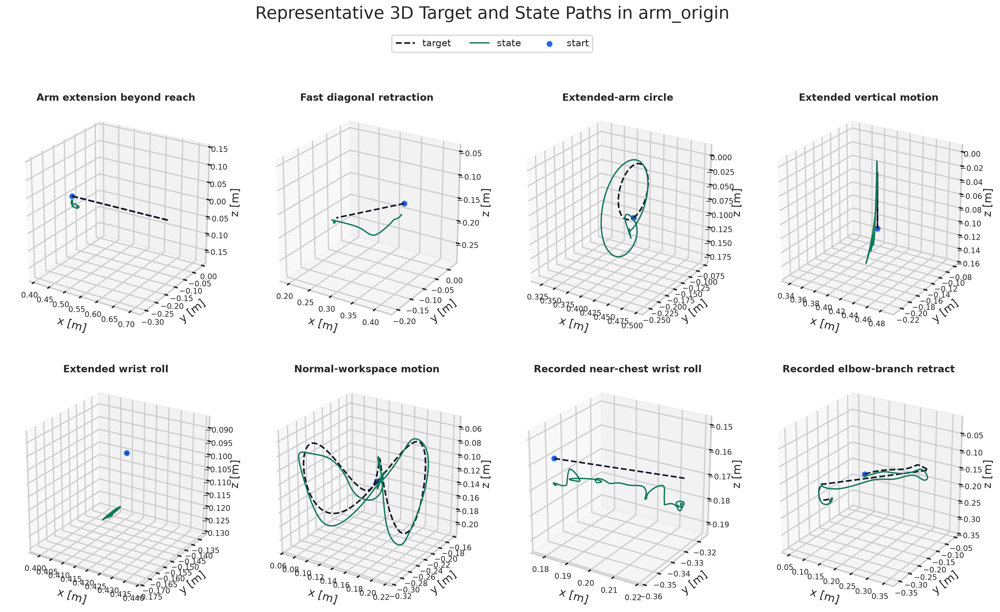

GitHub does not render repository MP4 files inline. This report therefore embeds higher-resolution animated WebP previews at `8-12 fps`, displayed at `760-980 px` according to panel layout. Click a preview to open the full-size animation; use the adjacent MP4 link to download the source video. A compact GIF fallback remains available from the video index.

**Video: 21 reference-motion clips; on-screen labels show each family's counts in the 42-trajectory fixed set and all 70 targets**

Animated preview (click to expand)

<a href="assets/video_previews/ideal_reference_trajectory_catalog.webp">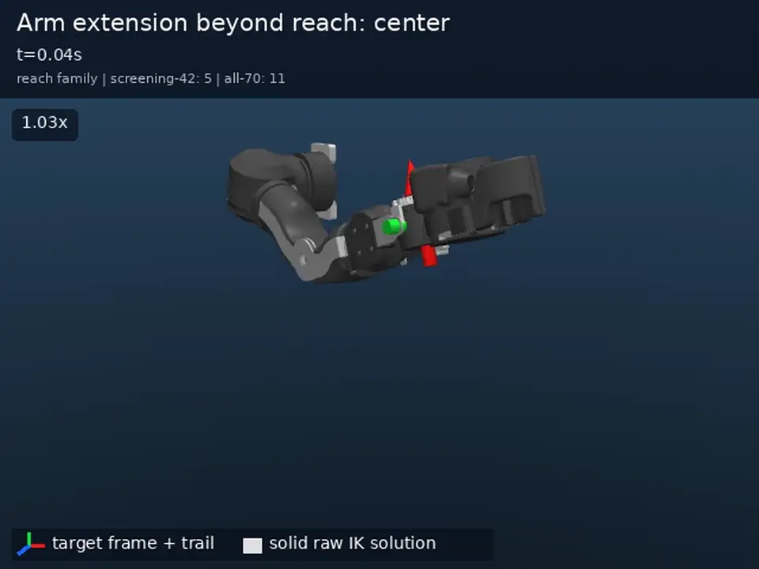</a>

[Open high-resolution preview](assets/video_previews/ideal_reference_trajectory_catalog.webp) · [Download MP4](videos/ideal_reference_trajectory_catalog.mp4?raw=1)

#### 3.2.3 Experiment Suites and Run Counts

The final study comprises `13` experiment groups:

| Experiment group | Trajectories | Profiles | Dynamic simulations |
|---|---:|---:|---:|
| Screening | 42 | 14 | 588 |
| Parameters | 11 | 54 | 594 |
| Driver coupling | 11 | 4 | 44 |
| Symmetry | 25 | 2 | 50 |
| Chest stress | 14 | 17 | 238 |
| Braking | 4 | 6 | 24 |
| Robustness | 5 | 9 | 45 |
| Combined candidates | 42 | 5 | 210 |
| Recorded benchmarks | 2 | 7 | 14 |
| Accelerated recorded fast-retract | 1 | 2 | 2 |
| Deep-start singularity video | 1 | 2 | 2 |
| Recorded fast-retract nullspace sweep | 1 | 44 | 44 |
| Nullspace cross-validation | 11 | 6 | 66 |
| **Total** | - | - | **1,921** |

Dynamic experiments cover `119` controller profiles and `70` unique targets. Each group runs only combinations relevant to its question; the study does not evaluate the complete $119\times70$ Cartesian product. All `1,921` dynamic simulations completed with `solver_failures=0`, in addition to `378` static boundary cases. Bimanual metrics are computed separately by arm, but run counts are not duplicated.

### 3.3 Comparison Profiles and Metrics

#### 3.3.1 Main IK Controller Profiles

- **PR default:** the complete PR implementation and parameters from Section 3.2.1.
- **PR w/o IK velocity limits:** disables the QP velocity envelope while retaining driver limits and all other PR-default tasks.
- **Mainline-task baseline** (abbreviated **Mainline baseline**): uses mainline `cost=1/1`, `damping=0.25`, `lm_damping=0.01`, and `posture_cost=0.01`, with all new PR tasks disabled. To isolate task structure, it retains the same recoverable joint envelope, velocity limits, and `0.8 ms` substeps.
- **PR: full-home posture 0.01:** retains the other PR-default mechanisms but replaces exact-nullspace regulation with full-home `PostureTask(0.01)`.

The Mainline baseline is therefore a controlled algorithmic comparison of mainline task parameters and structure under common timing and joint envelopes, not a historical binary replay of the old commit.

#### 3.3.2 Metrics

- `position RMSE/max`: Euclidean position error between target and actual EEF;
- `orientation RMSE`: SO(3) geodesic angle between target and actual EEF;
- $\max_i |\dot q_{i,\mathrm{actual}}|$: maximum absolute actual joint velocity across seven joints at each instant;
- $\max_i |\ddot q_{i,\mathrm{actual}}|$: maximum absolute value across seven joints after finite-differencing actual velocity at each instant;
- `joint ddq p99`: 99th percentile of absolute actual joint acceleration over one trajectory and all joints;
- `elbow lateral range`: peak-to-peak elbow-joint displacement along `arm_origin y`;
- `elbow acceleration p99`: 99th percentile of the elbow Cartesian-acceleration norm;
- `tail EEF p2p`: largest axis-wise peak-to-peak actual EEF position during the final `0.35 s`;
- `driver velocity-cap occupancy`: fraction of time when any driver joint velocity limit is active;
- `swivel`: maximum angular departure of the elbow about the shoulder-wrist axis from its initial value.

Except for the two hardware-record-derived benchmarks, each table first computes metrics per trajectory and then averages across targets, preventing longer trajectories from receiving more weight merely because they contain more frames.

#### 3.3.3 Two Simulation-Replay Benchmarks Derived from Hardware Records

Both targets were extracted from hardware command records and transformed frame by frame into `arm_origin` relative coordinates. Every controller receives the same target, MuJoCo plant, and driver velocity limits. These results compare controller structures and do not represent hardware closed-loop performance.

| Benchmark | Trajectory characteristics | Main question |
|---|---|---|
| **Near-chest fast wrist-roll** | `3.94 s`; total translation approximately `4.8 cm`; peak linear/angular speed `0.027 m/s / 12.02 rad/s` | Does fast wrist rotation pull the shoulder, elbow, and EEF away from the intended position path? |
| **Fast-retract elbow-branch** | `2.92 s`; peak linear/angular speed `0.589 m/s / 6.25 rad/s` | Do retraction speed and joint velocity limits induce a different elbow/nullspace branch? |

## 4. Overall Results

### 4.1 Complete Controller Comparison

| IK controller | Position RMSE ↓ | Orientation RMSE ↓ | Joint acceleration p99 ↓ | Elbow acceleration p99 ↓ | Elbow lateral range ↓ | Tail EEF p2p ↓ |
|---|---:|---:|---:|---:|---:|---:|
| **PR default** | **3.97 cm** | 31.27° | **29.43 rad/s²** | **5.46 m/s²** | 6.21 cm | **0.84 cm** |
| PR w/o IK velocity limits | 4.01 cm | 30.84° | 31.91 rad/s² | 6.22 m/s² | 6.50 cm | 0.89 cm |
| Mainline-task baseline | 13.78 cm | **11.13°** | 57.49 rad/s² | 10.21 m/s² | **6.12 cm** | 3.37 cm |
| PR: full-home posture 0.01 | 3.94 cm | 29.03° | 33.42 rad/s² | 6.52 m/s² | 7.38 cm | 0.91 cm |

The PR default does not optimize every individual metric. It deliberately accepts some orientation lag to reduce position error, actual acceleration, and end-of-motion residual movement. The Mainline baseline has lower orientation RMSE, but its position RMSE is approximately `3.5` times that of the PR default.

### 4.2 Single-Feature Ablation

Each row below removes one feature from the PR default. For the metric named by each column, every cell is

$$
100\%\times\frac{m_{\mathrm{without\ feature}}-m_{\mathrm{PR}}}
{|m_{\mathrm{PR}}|}.
$$

Columns are position RMSE, orientation RMSE, joint-acceleration p99, elbow-acceleration p99, elbow lateral range, tail EEF movement, and driver-cap occupancy. A positive value means the metric increased. A negative value may reflect a tracking/stability tradeoff and does not necessarily indicate an overall improvement.

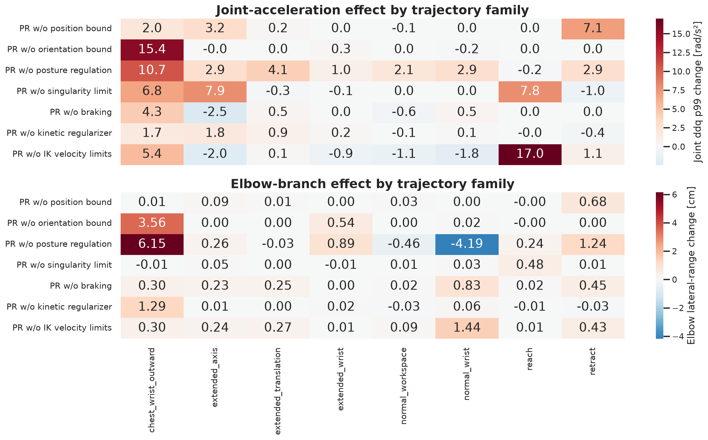

Main observations:

- the orientation-error budget is the principal source of stability during near-chest wrist rotation;
- exact-nullspace regulation improves elbow branch, acceleration, and driver-cap occupancy in retract and near-chest motions;
- the singularity limit's benefits concentrate in the reach/extended family, matching its one-sided geometric meaning;
- braking and kinetic regularization have small averages over the `42` trajectories because their benefits concentrate near position limits or where kinematic solutions are nearly equivalent.

## 5. Targeted Mechanism Evaluation

### 5.1 End-Effector Task Shaping

The algorithm is defined in Section 2.2. This section evaluates the error budgets in a synthetic near-chest stress test and in two recorded-command replays: near-chest wrist rotation and fast retraction.

#### 5.1.1 Near-Chest Stress Test

This suite contains `14` trajectories: `9` speed combinations of **Near-chest roll + diagonal translation** (`0.3/0.8/1.2 m/s` with `4/8/12 rad/s`), `4` forward/lateral/downward/diagonal direction variants peaking at `1.2 m/s + 8 rad/s`, and `1` **Near-chest wrist roll only** trajectory. Names match the [reference trajectory-catalog preview](assets/video_previews/ideal_reference_trajectory_catalog.webp). Metrics are computed over each complete trajectory and then averaged across all `14`:

| Metric | PR default | PR w/o 6D error bound |
|---|---:|---:|
| Position RMSE | **1.95 cm** | 6.93 cm |
| Orientation RMSE | 2.12 rad | **1.66 rad** |
| Joint acceleration p99 | **40.97** | 50.18 |
| Elbow acceleration p99 | **5.31** | 8.05 |
| Elbow lateral range | **10.96 cm** | 16.31 cm |
| Driver velocity-cap occupancy | **3.9%** | 52.3% |
| Tail EEF p2p | **0.24 cm** | 2.34 cm |

The increase in orientation RMSE from `1.66 rad` to `2.12 rad` is intentional: limiting the joint capacity consumed by rapid rotation trades transient orientation lag for lower position error, joint acceleration, elbow excursion, driver-cap occupancy, and end-of-motion residual movement.

The following figure selects **Near-chest roll + diagonal translation** with peak linear/angular speed `1.2 m/s / 8 rad/s`. It compares PR default, PR: orientation budget 0.15 rad, PR w/o posture regulation, and PR w/o 6D error bound. This separates the effects of orientation budget, secondary posture task, and complete error modulation on tracking, joint dynamics, and driver limiting.

$\max_i |\dot q_{i,\mathrm{actual}}|$ and $\max_i |\ddot q_{i,\mathrm{actual}}|$ are the maximum absolute actual velocity and acceleration across seven joints at each instant. `elbow y-y0` is actual elbow lateral displacement from its initial value. `any driver velocity cap active` means that at least one driver joint is being velocity-limited.

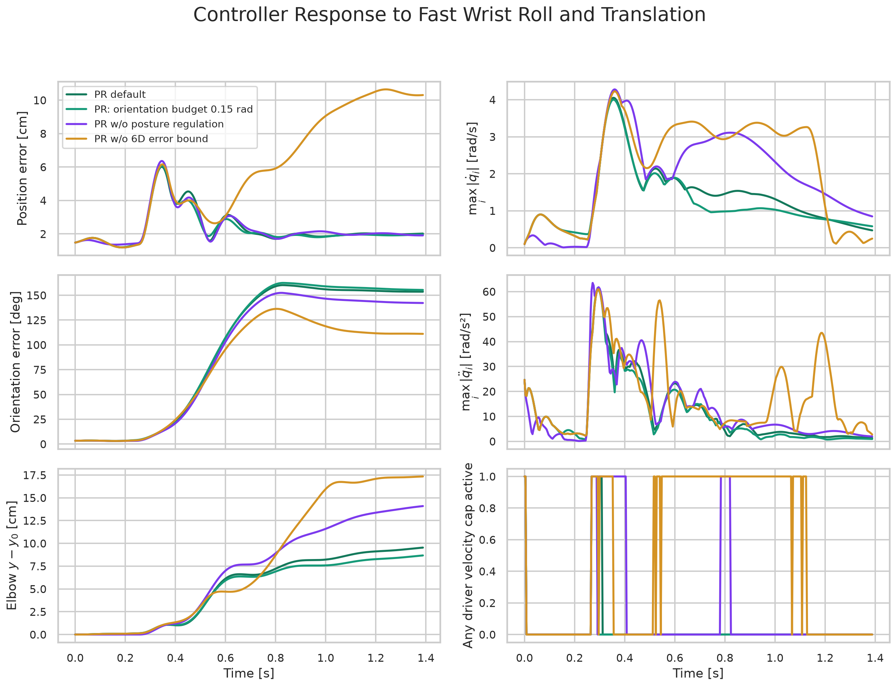

Without the 6D error bound, position error, elbow lateral motion, joint acceleration, and time under driver limiting all increase markedly. A tighter orientation budget is more conservative at the cost of additional orientation lag. Disabling posture regulation changes elbow motion but cannot replace 6D error modulation. The next figure compares target and actual EEF paths.

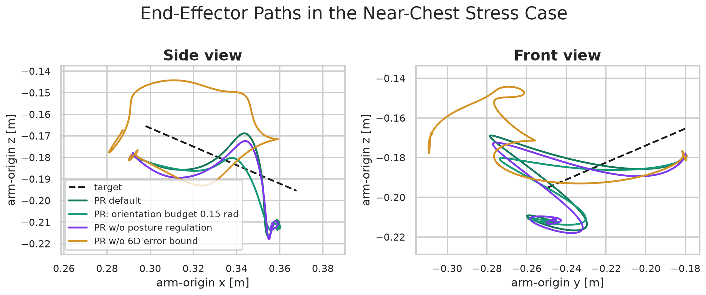

**Video: Near-chest roll + diagonal translation, 0.5x playback**

Animated preview (click to expand)

<a href="assets/video_previews/near_chest_roll_translation_error_bound_comparison.webp">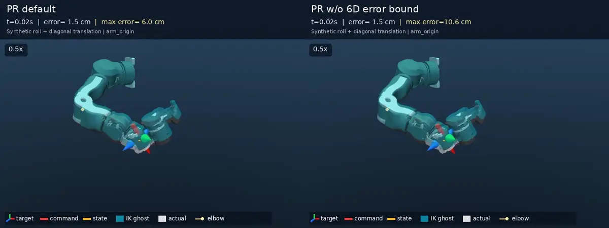</a>

[Open high-resolution preview](assets/video_previews/near_chest_roll_translation_error_bound_comparison.webp) · [Download MP4](videos/near_chest_roll_translation_error_bound_comparison.mp4?raw=1)

#### 5.1.2 Hardware-Record-Derived Near-Chest Simulation Replay

The **Near-chest fast wrist-roll benchmark** lasts `3.94 s`, translates approximately `4.8 cm` in total, and reaches peak linear/angular speeds of `0.027 m/s` and `12.02 rad/s`. Every target frame is expressed relative to `arm_origin`. PR default, Mainline baseline, and PR w/o 6D error bound replay the same command while Cartesian tracking, joint acceleration, and driver-cap occupancy are compared.

| Profile | Position RMSE / maximum | Orientation RMSE | Joint acceleration p99 | Driver velocity-cap occupancy |
|---|---:|---:|---:|---:|
| **PR default** | **1.28 / 1.78 cm** | 0.495 rad | **39.3** | **15.3%** |
| Mainline baseline | 5.81 / 17.11 cm | **0.253 rad** | 73.0 | 29.3% |
| PR w/o 6D error bound | 1.79 / 4.81 cm | 0.384 rad | 47.3 | 22.1% |

The Mainline baseline has the lowest orientation RMSE, but its EEF position path first departs substantially from the target and then returns. Maximum position error reaches `17.11 cm`, and joint-acceleration p99 reaches `73.0 rad/s²`. PR default reduces maximum position error to `1.78 cm` and preserves a more stable spatial path, at the cost of larger transient orientation error. PR w/o 6D error bound lies between them.

**Video: controller comparison for near-chest fast wrist rotation, one hardware-record-derived trajectory, 0.5x playback**

Animated preview (click to expand)

<a href="assets/video_previews/near_chest_fast_wrist_roll_controller_comparison.webp">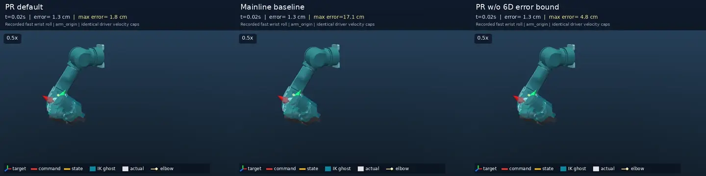</a>

[Open high-resolution preview](assets/video_previews/near_chest_fast_wrist_roll_controller_comparison.webp) · [Download MP4](videos/near_chest_fast_wrist_roll_controller_comparison.mp4?raw=1)

This result shows that error modulation primarily suppresses whole-arm instability induced by fast wrist rotation rather than prioritizing orientation catch-up. Slower orientation tracking is an explicit control tradeoff.

#### 5.1.3 Hardware-Record-Derived Fast-Retract Replay

To isolate the role of the 6D error bound during fast retraction, the following comparison preserves the complete position and orientation path of the **Fast-retract elbow-branch benchmark** but compresses its time axis by `1/2`, feeding the controller at `2x` command speed. This is an accelerated simulation replay of a hardware-recorded command path, not a hardware-state video. Both columns use identical parameters except for the position/orientation error bounds.

**Video: side-by-side fast-retract 6D error-bound comparison, trajectory accelerated 2x and played at 0.5x**

Animated preview (click to expand)

<a href="assets/video_previews/fast_retract_frame_error_bound_comparison.webp">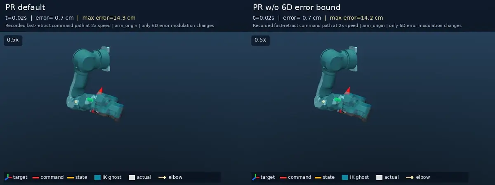</a>

[Open high-resolution preview](assets/video_previews/fast_retract_frame_error_bound_comparison.webp) · [Download MP4](videos/fast_retract_frame_error_bound_comparison.mp4?raw=1)

### 5.2 Redundancy and Singularity

#### 5.2.1 Exact-Nullspace Regulation During Fast Retraction

The geometric definition, home-return speed, and singularity activation are given in Section 2.3. This experiment tests whether the mechanism stabilizes the elbow branch during fast retraction.

The hardware-record-derived **Fast-retract elbow-branch benchmark** lasts `2.92 s` and has peak linear/angular speeds of `0.589 m/s` and `6.25 rad/s`. Every frame is relative to `arm_origin`. Three profiles replay exactly the same target with all other PR parameters fixed, changing only the secondary posture task:

1. PR default: exact-nullspace `8.5 / 1.6 / 1.0`;
2. PR w/o posture regulation: `nullspace_cost=0, posture_cost=0`;
3. PR: full-home posture 0.01: `nullspace_cost=0, posture_cost=0.01`.

| Secondary posture regulation | Position RMSE / maximum | Orientation RMSE | Elbow lateral range | Joint acceleration p99 | Elbow acceleration p99 | Driver velocity-cap occupancy |
|---|---:|---:|---:|---:|---:|---:|
| **PR default** | 1.80 / 4.38 cm | **0.107** | **4.04 cm** | 40.90 | 10.21 | 36.9% |
| PR w/o posture regulation | 1.51 / 3.08 cm | 0.115 | 17.59 cm | 38.92 | **9.55** | 33.7% |
| PR: full-home posture 0.01 | **1.49 / 3.00 cm** | 0.115 | 17.61 cm | **38.84** | 9.55 | **33.2%** |

The table summarizes the full trajectory. The next figure shows elbow Y-Z path, lateral displacement from the initial position, EEF position error, and instantaneous maximum actual joint acceleration to expose how each secondary posture task affects nullspace branch and Cartesian tracking.

Y-Z is the actual elbow path in the `arm_origin` plane, and `y-y0` is displacement from its initial lateral position. $\max_i |\ddot q_{i,\mathrm{actual}}|$ is the maximum absolute actual joint acceleration across seven joints at each instant.

**Video: four-way secondary-posture comparison, one hardware-record-derived trajectory, 0.5x playback**

Animated preview (click to expand)

<a href="assets/video_previews/fast_retract_posture_regulation_comparison.webp">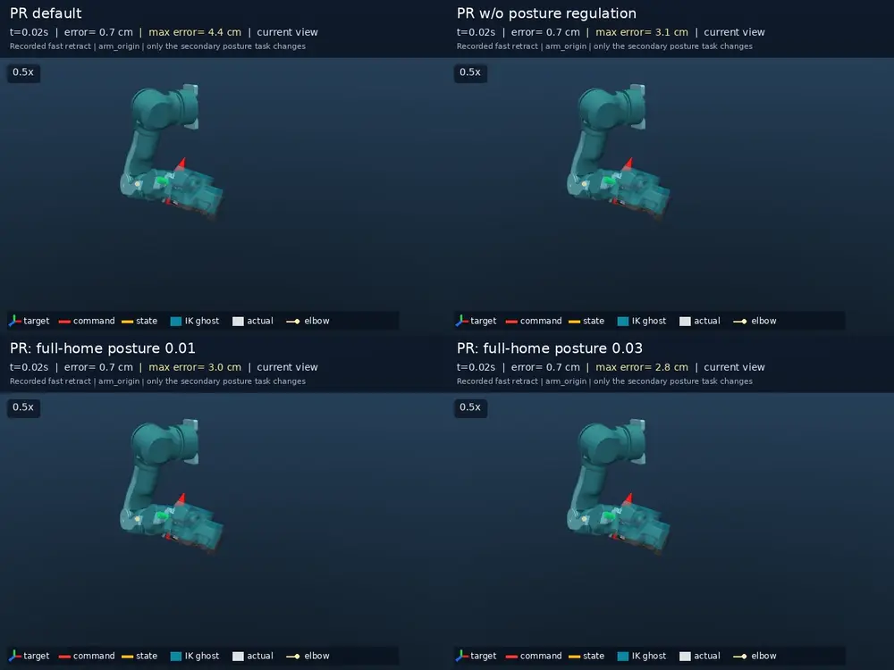</a>

[Open high-resolution preview](assets/video_previews/fast_retract_posture_regulation_comparison.webp) · [Download MP4](videos/fast_retract_posture_regulation_comparison.mp4?raw=1)

With `posture_cost=0.003/0.01/0.03`, elbow lateral ranges are `17.60/17.61/17.76 cm`; none forms a branch constraint equivalent to exact-nullspace regulation. Exact-nullspace regulation accepts approximately `3 mm` additional position RMSE to reduce elbow excursion by approximately `13.6 cm`, without applying the home preference directly in all joint-space directions.

The preceding experiment changes only the secondary posture task. The following figure uses the same target but compares PR default, Mainline-task baseline, and PR w/o posture regulation to evaluate the complete PR controller. Panel order is unchanged.

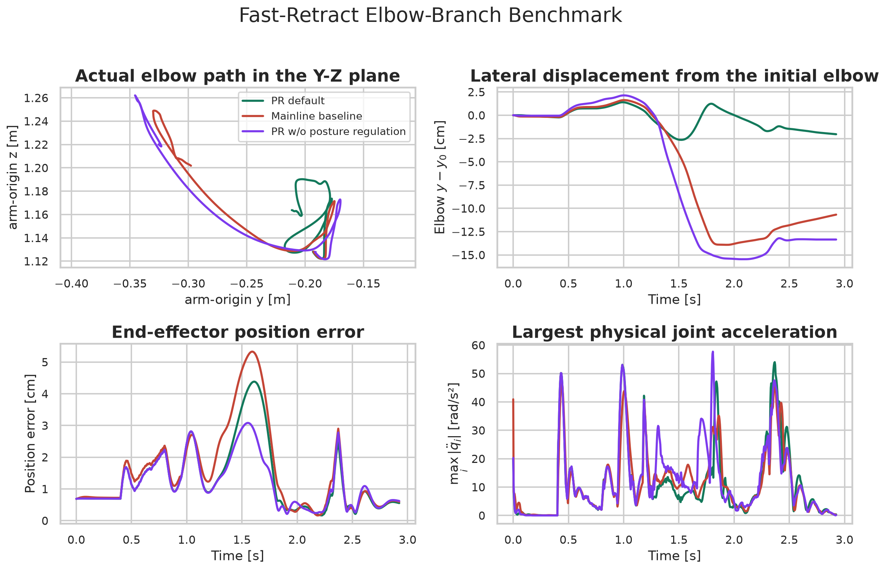

**Video: fast-retract controller comparison, one hardware-record-derived trajectory, 0.5x playback**

Animated preview (click to expand)

<a href="assets/video_previews/fast_retract_controller_comparison.webp">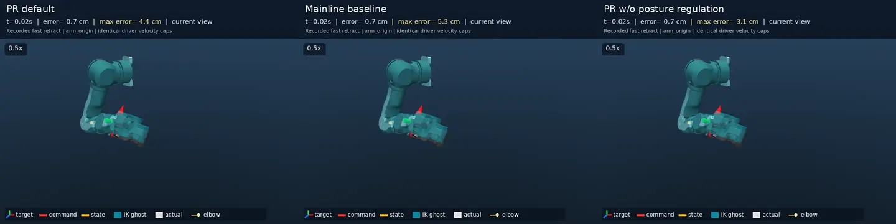</a>

[Open high-resolution preview](assets/video_previews/fast_retract_controller_comparison.webp) · [Download MP4](videos/fast_retract_controller_comparison.mp4?raw=1)

#### 5.2.2 Singularity-Approach Limit During Extension and Retraction

The one-sided singularity constraint is defined in Section 2.4. A trajectory extends the target from shoulder level beyond the reachable workspace and then retracts, testing whether the limit slows only approach to singularity and releases automatically while leaving it.

For the `0.8 m/s` straight-ahead extension target:

| Profile | Minimum $\rho$ | Joint acceleration p99 | Position RMSE |
|---|---:|---:|---:|
| PR default | **0.0323** | **40.6** | 18.88 cm |
| PR w/o singularity limit | 0.0047 | 48.7 | 18.58 cm |

The target ultimately crosses the reachability boundary, so the large position RMSE is not the principal conclusion of this experiment. Blue denotes extension, gray denotes retraction, and yellow denotes the singularity slow zone. The complete $\rho$ curve remains visible; velocity and acceleration traces become lighter after the farthest point to emphasize extension.

With the limit enabled, the blue extension segment retains a higher geometric $\rho$ after entering the yellow slow zone and reduces joint acceleration near the farthest point. The gray retract segment is not slowed by the same one-sided constraint.

The video uses a deep-start variant with the same farthest target. Its start and return endpoint move from `arm_origin x=0.410 m` to `x=0.310 m`, while the farthest point remains `x=0.710 m`. This variant has an independently solved initial IK configuration to avoid a first-frame error. The yellow trace at upper right is actual J1 acceleration, sharing a vertical scale across both columns. The video experiment stores complete time series for both profiles separately; the preceding figure and table still summarize the standard `reach_right_p0p00_v0p80` scenario.

**Video: A/B comparison in the extended-arm singular region, 0.5x playback**

Animated preview (click to expand)

<a href="assets/video_previews/straight_reach_singularity_limit_comparison.webp">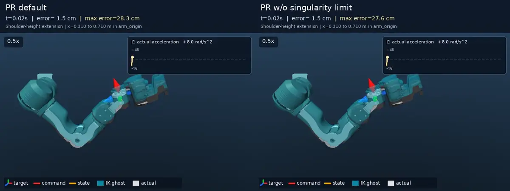</a>

[Open high-resolution preview](assets/video_previews/straight_reach_singularity_limit_comparison.webp) · [Download MP4](videos/straight_reach_singularity_limit_comparison.mp4?raw=1)

### 5.3 Joint Safety Envelope

#### 5.3.1 Recoverable Joint Envelope

The combined position/velocity bounds are defined in Section 2.5. Static boundary cases test whether the constraints remain feasible and return toward the valid range at a velocity-bounded rate when the configuration begins slightly outside a joint limit.

| Constraint form | Feasible cases |
|---|---:|
| **Recoverable position + velocity envelope** | **126 / 126** |
| Independent native position + velocity constraints | 78 / 126 |
| Position constraint only | 126 / 126 |

Although position-only constraints are feasible, they do not bound recovery speed. In the figure, “remaining distance outside position limit” is the absolute angular distance by which command configuration remains outside the physical boundary after one complete `Kinematics.solve()`. That solve represents one `4 ms` control period containing five `0.8 ms` QP substeps. Zero indicates the boundary or valid range; positive values remain out of bounds.

When a conventional position constraint requests an immediate return but the velocity constraint prohibits a large enough step, the QP can be infeasible. The recoverable envelope remains feasible in all `126/126` cases and progressively reduces the violation. Independent constraints fail in `48` cases, while position-only constraints can request an overspeed recovery.

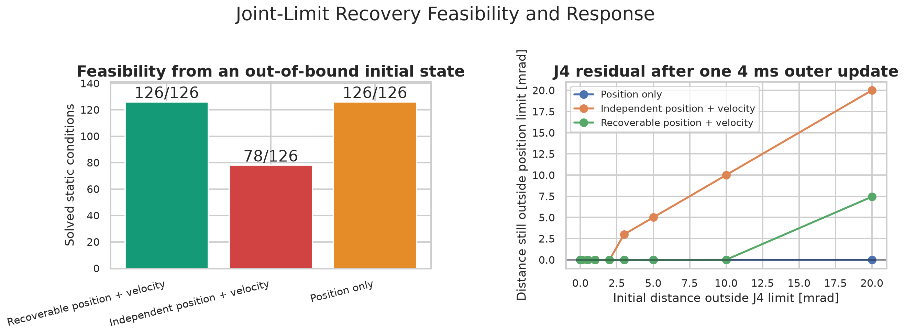

#### 5.3.2 Distance-Dependent Joint Braking

The one-sided distance-dependent velocity envelope is defined in Section 2.5. This experiment fixes all other PR parameters and varies braking distance to quantify the tradeoff between physical position margin and earlier tracking lag.

For a targeted `12 rad/s` wrist-rotation command:

| Braking profile | Minimum joint margin | Maximum J6 speed | Joint acceleration p99 |
|---|---:|---:|---:|
| Off | 26 mrad | 6.03 rad/s | 56.0 |
| 0.08 rad | 34 mrad | 5.99 rad/s | 55.5 |
| 0.12 rad | 42 mrad | 5.95 rad/s | 54.5 |
| **0.20 rad** | **62 mrad** | 5.90 rad/s | 53.2 |
| 0.30 rad | 90 mrad | 5.80 rad/s | 52.1 |
| PR w/o IK velocity limits / braking | 22 mrad | 6.01 rad/s | 59.3 |

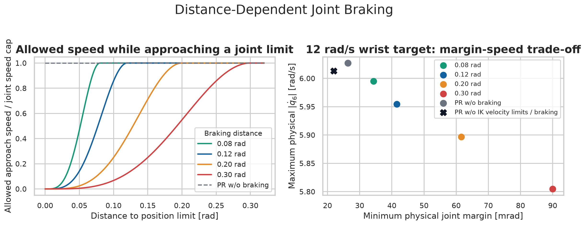

Curves and scatter points use the same color for the same braking distance. `PR w/o braking` disables only distance braking; `PR w/o IK velocity limits / braking` disables both QP velocity constraints and distance braking. A larger braking distance increases position margin earlier but also introduces tracking lag earlier. This parameter should be selected from mechanical-limit risk. Braking is inactive far from position limits and should not be used to tune smoothness in ordinary motion.

### 5.4 Weak Dynamics Regularization

The mass-matrix regularizer and its scope are defined in Section 2.7. PR default uses `2e-5`. Disabling it across the `42` trajectories increases joint-acceleration p99 by approximately `2.3%`, elbow-acceleration p99 by approximately `3.6%`, and elbow lateral range by approximately `4.2%`.

This term does not compute torque commands and includes no gravity compensation, contact dynamics, or inverse dynamics. It is a weak solution preference, not a dynamics controller.

### 5.5 QP vs Driver Velocity Limits

This section compares velocity limits inside the QP and in the driver. If the QP envelope is disabled, does per-axis driver clipping alter Cartesian and secondary-task paths rather than merely slowing the same path uniformly? This is a separately designed A/B experiment, not one of the upstream limitations listed in Section 1.4.

The experiment uses `1` target trajectory and `3` limit profiles. The target is the right-arm **Fast diagonal retract: lateral +** from the [reference trajectory-catalog preview](assets/video_previews/ideal_reference_trajectory_catalog.webp), with peak linear speed `0.8 m/s`. Profiles are PR default, PR w/o IK velocity limits, and PR w/o velocity limits:

| Profile | Position RMSE | Actual joint acceleration p99 | Elbow acceleration p99 | Elbow lateral range |
|---|---:|---:|---:|---:|
| **QP + driver velocity limits** | **3.93 cm** | **46.5** | **9.89** | **2.58 cm** |
| PR w/o IK velocity limits | 5.03 cm | 51.1 | 10.78 | 3.84 cm |
| PR w/o velocity limits | **1.36 cm** | 68.4 | 16.34 | 3.71 cm |

PR w/o velocity limits tracks better but has substantially more aggressive actual dynamics. PR w/o IK velocity limits retains a lead between raw IK and driver commands and loses the QP's ability to trade tasks within the executable envelope. In this scenario, position RMSE rises from `3.93 cm` to `5.03 cm`, elbow lateral range from `2.58 cm` to `3.84 cm`, and actual acceleration also increases.

The QP and driver use identical per-joint numerical limits, but their functions are not equivalent. If QP output already satisfies the limit, the driver usually need not clip again. Without the QP limit, the driver can only process overspeed commands after optimization has finished.

The next figure expands the same **Fast diagonal retract: lateral +** trajectory. **Along-track lag** is the signed spatial distance from actual EEF to raw IK command along the local command direction; positive means lagging and negative means leading. It is measured in centimeters and is not communication latency. **Cross-track gap** is distance perpendicular to the local command direction. The lower plots show raw IK and actual J1 velocity; gray dotted lines mark the `±2 rad/s` bounds.

Maximum absolute along-track lag over the full run increases from `2.57 cm` under PR default to `9.15 cm` without IK velocity limits. Maximum cross-track gap increases from `2.68 cm` to `9.43 cm`. In this A/B case, driver per-axis clipping is not equivalent to uniform time scaling.

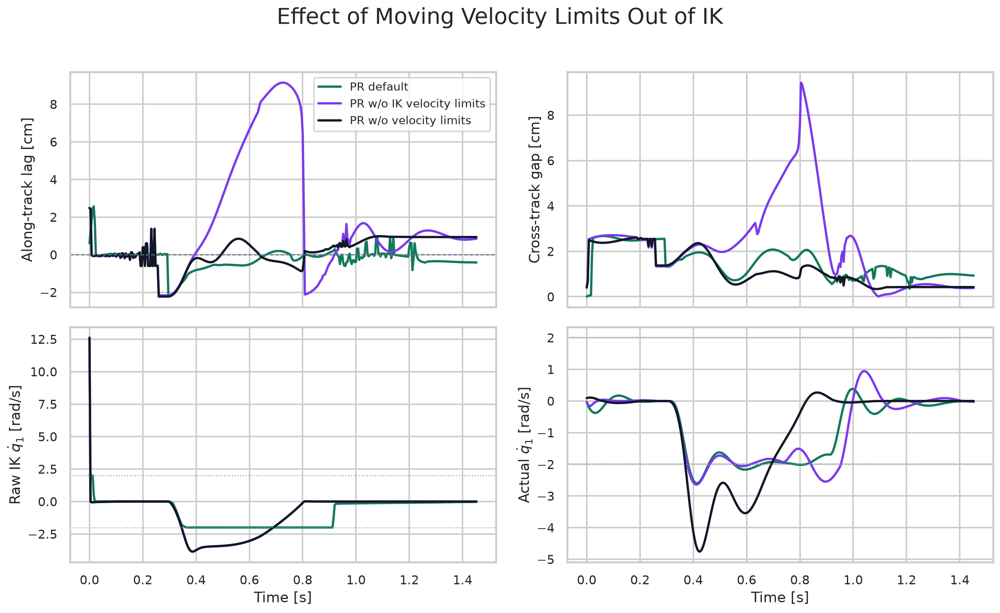

**Video: fast-retract QP velocity-limit A/B; driver limits enabled in both columns, 0.5x playback**

Animated preview (click to expand)

<a href="assets/video_previews/fast_retract_ik_velocity_limit_comparison.webp">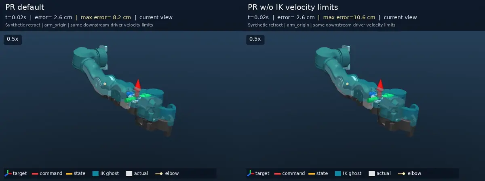</a>

[Open high-resolution preview](assets/video_previews/fast_retract_ik_velocity_limit_comparison.webp) · [Download MP4](videos/fast_retract_ik_velocity_limit_comparison.mp4?raw=1)

## 6. Parameters, Correctness, and Performance

This section consolidates the basis for default parameters, implementation correctness, plant robustness, and solve-time measurements.

### 6.1 Nullspace Parameter Sweep and Cross-Validation

First, `44` profiles sweep cost, return rate, and maximum return speed on the **Fast-retract elbow-branch benchmark**. Then `6` candidates are validated on `11` cross-scenario trajectories. `cost` is the base weight before singularity activation, `return rate` is the unsaturated home-return rate, and `max return speed` bounds that return velocity.

In the figure, `swivel departure` is the maximum elbow rotation about the shoulder-wrist axis relative to its initial value; `dynamic cost` is the real-time weight after modulation by $\alpha_{ns}$; `driver velocity-cap occupancy` is the time fraction when at least one driver joint is limited.

Maximum return speed is fixed at `1.0 rad/s` in this figure. Panel titles and blue-outlined cells show absolute values for PR default (`cost=8.5, return=1.6`); other cells show relative changes. Lower is better for all six metrics, so green denotes a decrease and red an increase. Units and color scales differ between panels and must not be compared across panels.

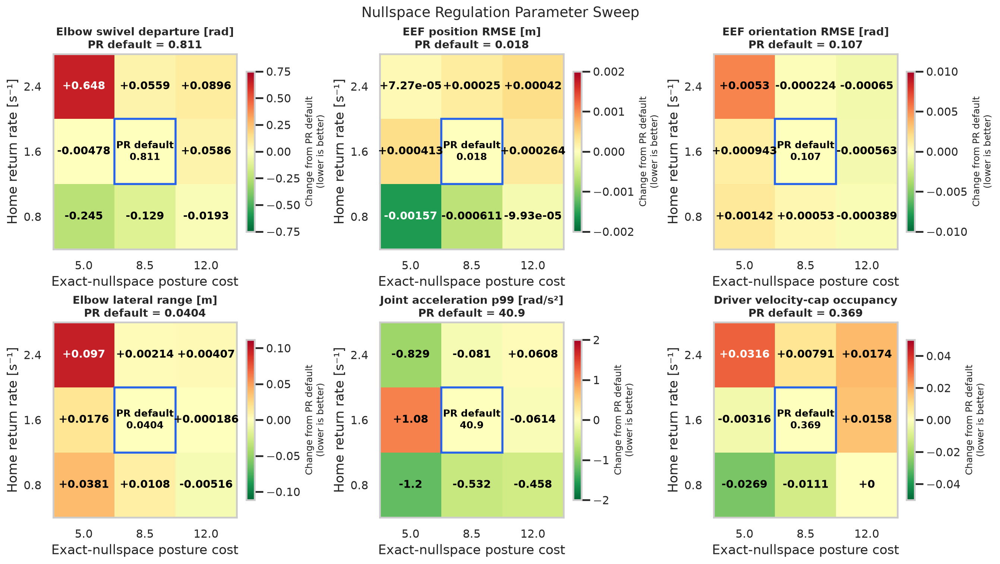

On this trajectory, `cost=12, return=0.8, max=0.6` reduces elbow lateral range to approximately `3.52 cm`, but no candidate simultaneously improves tracking, joint dynamics, nullspace branch, and cap occupancy across scenarios.

To test generalization, the next figure cross-validates candidates on `11` direction/speed variants spanning seven motion types: **Near-chest roll + diagonal translation**, **Extended-arm circle**, **Extended-arm wrist roll**, **Bimanual workspace motion**, **Normal-workspace wrist roll**, **Arm extension beyond reach**, and **Fast diagonal retract**. Rows are identified by `cost / return rate / max return speed`; `c/r/v` is the same abbreviation in the CSV. Each cell is a change relative to PR default, with green indicating improvement and red degradation.

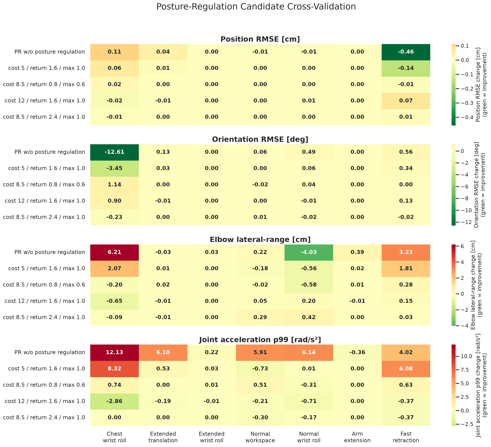

**Video: 2x2 exact-nullspace parameters during fast retraction, one hardware-record-derived trajectory, 0.5x playback**

Animated preview (click to expand)

<a href="assets/video_previews/fast_retract_nullspace_parameter_comparison.webp">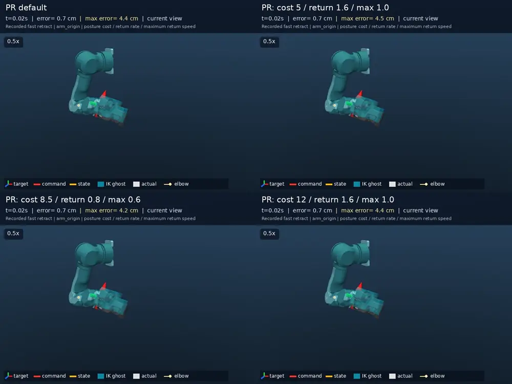</a>

[Open high-resolution preview](assets/video_previews/fast_retract_nullspace_parameter_comparison.webp) · [Download MP4](videos/fast_retract_nullspace_parameter_comparison.mp4?raw=1)

Visual differences are modest.

### 6.2 Single-Parameter Sensitivity

The sweep uses `11` representative trajectories: `3` Arm extension beyond reach, `2` Fast diagonal retract, `2` Extended-arm circle, and one each of Extended-arm wrist roll, Normal-workspace wrist roll, Near-chest roll + diagonal translation, and Bimanual workspace motion. Swept parameters include total position/orientation error budgets, nullspace cost/return rate/maximum speed, singularity envelope, braking distance, kinetic cost, and the QP velocity-limit scale.

Each curve is one-dimensional: only the horizontal-axis parameter changes, while all other parameters remain at PR default. Position and orientation budgets are total budgets for one outer solve and are divided among five substeps. The QP velocity-limit scale multiplies all seven IK caps while driver limits remain fixed.

The black vertical dashed line marks PR default; the star marks the best sampled value for that metric. Lower is better for RMSE, acceleration, lateral range, and cap occupancy; higher is better for minimum $\rho$ and physical joint margin. Consequently, the best parameter values for different metrics generally do not coincide.

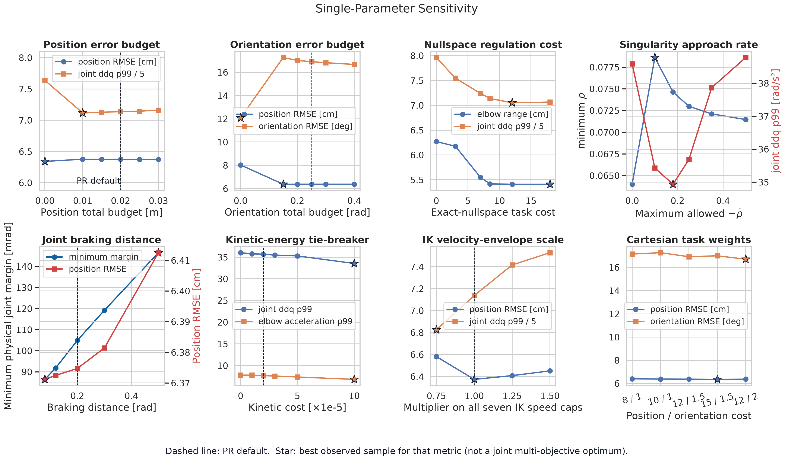

Main trends:

- an excessively small position budget increases normal-workspace lag, while an excessively large one weakens branch stability during fast retraction;
- a larger orientation budget markedly increases near-chest position error and driver-cap occupancy, while a smaller one increases orientation lag;
- a higher nullspace cost does not guarantee cross-scenario stability; return rate and maximum speed dominate only in their respective unsaturated and saturated regimes;
- a smaller singularity-approach rate is more conservative but limits extension earlier;
- braking distance trades position margin against tracking lag;
- relaxing the QP velocity limits reduces some command-tracking errors but increases actual acceleration and driver-cap occupancy.

### 6.3 Combined Candidates

Combined candidates use the same `42` trajectories as the complete-controller comparison, covering extension, retraction, extended-arm circle/axial motion, wrist rotation in normal and extended configurations, normal single/bimanual workspace motion, and near-chest wrist rotation with translation. Figure abbreviations are: `orientation` for total orientation-error budget, `singularity rate` for maximum singularity-approach rate, `nullspace` for exact-nullspace base cost, `braking` for braking distance, and `kinetic` for kinetic-regularization cost. Full parameter names and units appear below the figure.

The figure combines a metric heatmap with a Pareto plot. A-D are representative configurations selected from single-parameter trends, not winners of the combined space. They cover tightening only the most sensitive parameter, moderate joint adjustment, aggressive joint adjustment, and retaining the default orientation budget while changing only secondary mechanisms. The heatmap shows percentage change from PR default, with green for decreases and red for increases. Lower left is better in the Pareto plot of position RMSE against joint-acceleration p99.

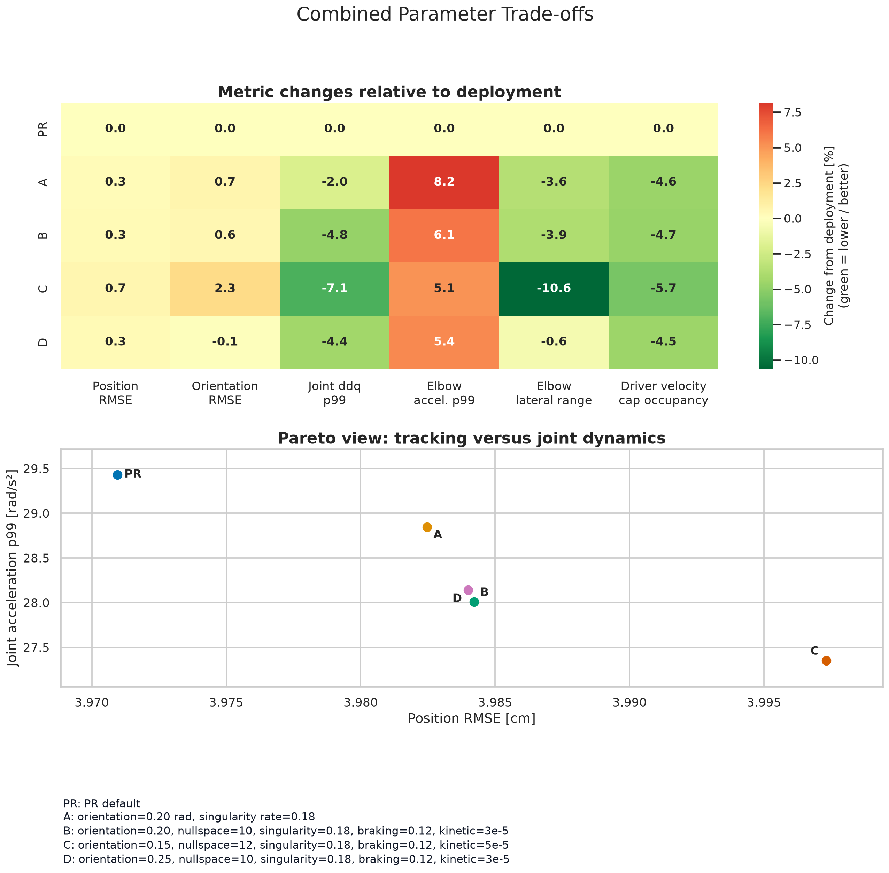

The four candidates reduce joint-acceleration p99 by `2.0–7.1%`, but increase elbow-acceleration p99 by `5.1–8.2%` and position RMSE by `0.3–0.7%`. No candidate simultaneously improves tracking, nullspace branch, dynamics, and driver-cap occupancy, so PR default is retained.

### 6.4 Implementation Correctness and Robustness

#### 6.4.1 Left/Right Arms and Mirroring

`25` mirrored scenarios verify left/right consistency. Exact-mirror aggregate position RMSE is `0.6815/0.6821 cm`, and joint-acceleration p99 is `86.9166/86.9161 rad/s²`; differences are at numerical-noise scale.

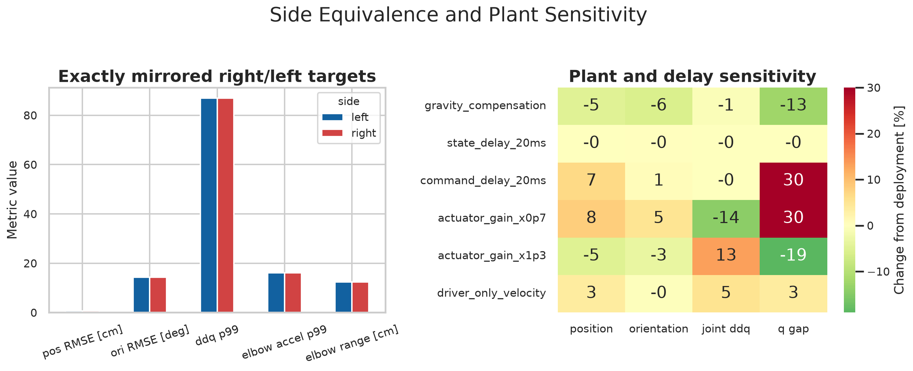

#### 6.4.2 Single-Arm Mode and Relative Coordinates

Code tests cover:

- equivalence between `RelativeFrameTask` under `arm_origin` and world-frame formulation;
- numerical agreement between the static-root Jacobian fast path and moving-root general path;
- right-only and left-only modes freezing only inactive degrees of freedom;
- separation of MuJoCo `nq` qpos indices from `nv` dof indices;
- measured-state mapping not overwriting the gripper command;
- rollback of the complete outer step after constrained-solve failure.

`openarm_mujoco>=2.0.1` provides the `arm_origin` site; the control package does not hard-code another origin. Explicit `origin_frame=world` retains world-frame behavior.

#### 6.4.3 Plant Robustness

Robustness experiments vary actuator gain, state/command delay, state rate and dropout, and gravity compensation. They test whether relative trends depend on one idealized plant and are not intended to identify hardware friction or structural compliance. Measured state currently affects braking and singularity constraints conservatively and does not continuously overwrite Mink's integrated command.

### 6.5 Solve Time

The figure summarizes the `42` mixed screening trajectories; every outer solve contains `5` QP substeps. It is not a single bimanual microbenchmark.

| Profile | Mean | p95 |
|---|---:|---:|
| PR default | 1.140 ms | 1.195 ms |
| PR w/o IK velocity limits | 1.077 ms | 1.145 ms |
| PR w/o 6D error bound | 1.103 ms | 1.163 ms |
| Mainline baseline | 0.483 ms | 0.511 ms |

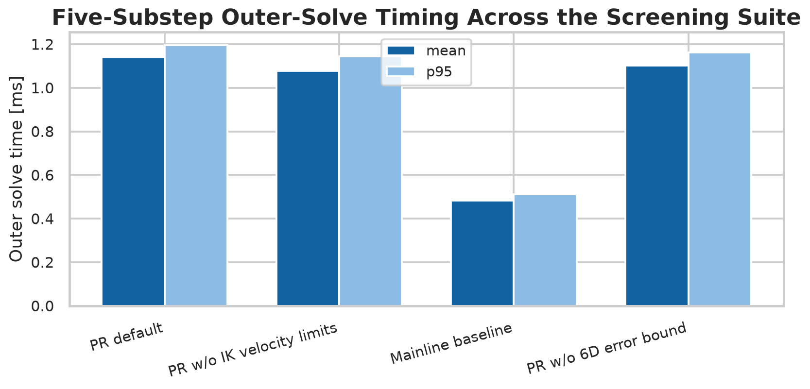

In a separate bimanual relative-coordinate microbenchmark on the same machine, the static-root Jacobian fast path reduced a five-substep outer solve from approximately `2.04 ms` to `1.39 ms`, with identical joint-command arrays. The two timing datasets use different trajectories and aggregation methods and should not be compared directly.

## 7. Conclusions, Limitations, and Deployment Recommendation

### 7.1 Main Conclusions

**Retain the current PR default as the deployment baseline for VR IK.** It is not the simulation optimum for every individual metric; it is a stable compromise among EEF position path, shoulder/elbow branch, joint dynamics, physical envelopes, and orientation lag during fast rotation.

- Across the `42` common comparison trajectories, disabling the orientation-error bound increases position RMSE by `125%`, tail EEF residual movement by `181%`, and driver-cap occupancy by `212%`.
- In the hardware-record-derived fast-retract benchmark, the exact-nullspace task reduces elbow lateral range from `17.59 cm` without posture regulation to `4.04 cm`; a low-weight full-home task does not form an equivalent constraint.
- The singularity limit raises minimum $\rho$ from `0.0047` to `0.0323` and reduces joint-acceleration p99 from `48.7` to `40.6 rad/s²` on the `0.8 m/s` extension trajectory.
- The recoverable envelope solves `126/126` out-of-bounds recovery cases; independent position and velocity constraints solve only `78/126`.
- Joint braking primarily increases margin near position limits; kinetic regularization supplies only a weak preference.
- The targeted A/B in Section 5.5 shows that, in that scenario, retaining only post-QP limiting changes path and dynamics rather than uniformly slowing the same motion.
- Neither `54` single-parameter profiles, `5` combined profiles, nor `44` fast-retract nullspace profiles identify a candidate that comprehensively outperforms PR default across scenarios.

### 7.2 Current Limitations

1. During near-chest fast wrist rotation with a simultaneous abrupt outward translation, some weakly controllable directions can still excite large shoulder/elbow motion. Tightening the orientation budget protects position but increases orientation lag.
2. Measured state does not continuously overwrite the integrated command, so command lead over actual state can still accumulate. Direct synchronization every tick instead shrinks incremental position commands. A complete treatment requires a separate reference governor or state prediction.
3. The joint envelope provides no collision constraints. Table and base clearance during extension and retraction require a separate Cartesian-space or collision layer.
4. MuJoCo actuators do not exactly reproduce hardware friction, structural compliance, motor bandwidth, firmware position loops, or gravity compensation. Simulation is suitable for comparing controller structures but does not replace hardware validation.
5. Early hardware records did not synchronously preserve raw VR, filtered target, and final limited target, preventing unique attribution of a few three-stage wrist-rotation anomalies.

### 7.3 Deployment Recommendation

- Retain PR default as an interpretable baseline and keep deployment arguments synchronized with the documented code defaults.
- Retain the QP velocity envelope; do not replace it with PR w/o IK velocity limits.
- Retain the total orientation-error budget; it is the principal mechanism stabilizing fast near-chest rotation.
- Retain the exact-nullspace posture task. The lower position RMSE of full-home posture in the fast-retract benchmark does not make it an equivalent elbow-branch constraint.
- Retain the one-sided singularity constraint, and do not replace its geometric Jacobian with the target-dependent FrameTask Jacobian.
- Treat the recoverable position/velocity envelope as a feasibility correction and keep it hard.
- Braking may be disabled independently for diagnosis. `0.20 rad` is the current deployment safety value, not a universal optimum for all hardware.
- Retain the kinetic task as a low-cost weak regularizer. Material dynamics benefits require an acceleration/torque-level whole-body QP or MPC rather than increasing this cost.

## Appendix: Data and Reproduction

- Experiment code, frozen inputs, and local raw results: [`exp/src`](src/README.md)
- Top-level experiment manifest: [manifests/manifest.json](manifests/manifest.json)
- Figure, video, and CSV mapping: [experiment_index.md](experiment_index.md)
- Complete-controller comparison across motion types: [tables/headline_baseline_means.csv](tables/headline_baseline_means.csv)
- Single-feature ablation: [tables/ablation_relative_effects_percent.csv](tables/ablation_relative_effects_percent.csv)
- Fast-retract posture-regulation comparison: [tables/branch_regulation_frozen_metrics.csv](tables/branch_regulation_frozen_metrics.csv)
- File-level traceability: [tables/report_traceability.csv](tables/report_traceability.csv)
