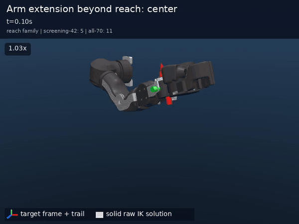
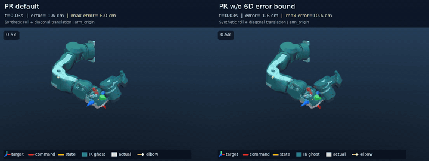
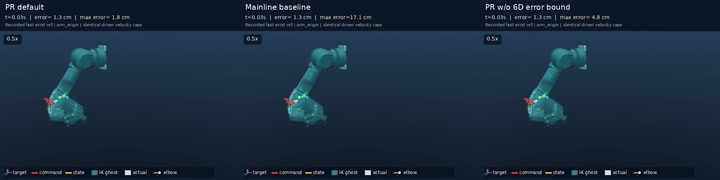
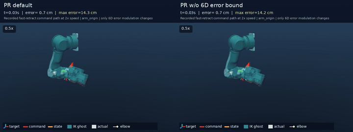
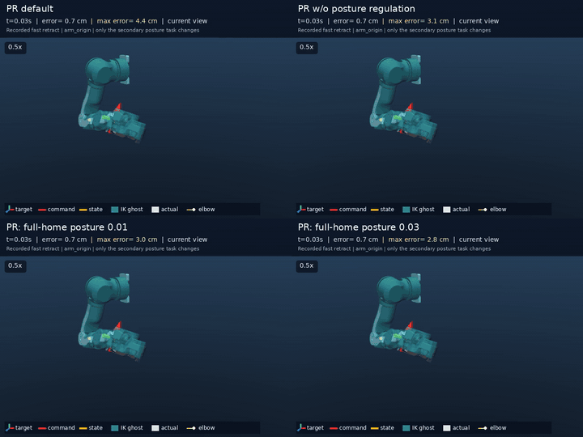
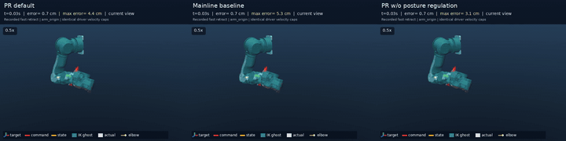
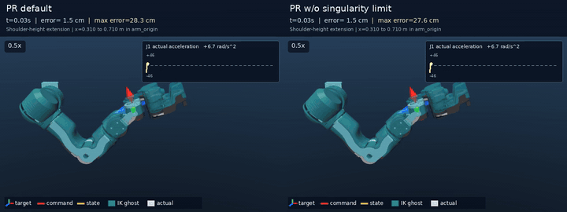
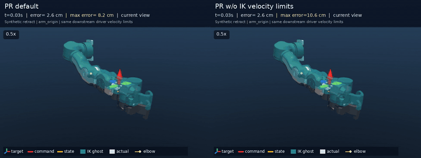
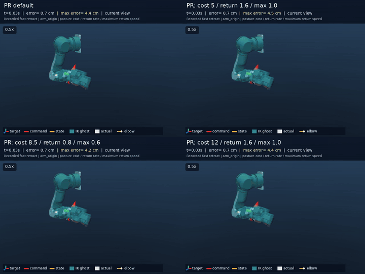

# OpenArm VR IK 仿真评估：算法、实验与参数

语言：[English](detailed_report.md) | **中文** | [日本語](detailed_report.ja.md)

日期：2026-08-01 
上游主线基准：`d543cedeec5f`（上游 `main` 分支，tag `0.2.0`） 
受测 PR revision：`f983a0eb5cae`（将实验快照 `d006ece506f2` 及其已记录差异 `0ef6a402...` 原样提交后的版本） 
决策简报：[README.zh.md](README.zh.md) · 资产索引：[experiment_index.zh.md](experiment_index.zh.md) · 复现指南：[run_experiment.zh.md](run_experiment.zh.md) · 实验 manifest：[manifest.json](manifests/manifest.json)

## 摘要

**建议将当前 PR 默认配置作为 VR IK 的部署基线。** 在 `42` 条多类型仿真轨迹上，与 Mainline-task baseline 相比，位置 RMSE 降低约 `71%`，实际关节加速度 p99 降低约 `49%`，肘部笛卡尔加速度 p99 降低约 `47%`，动作末段的 EEF 残余运动降低约 `75%`。

主要代价是快速翻腕时的暂态朝向滞后。这是主动的控制取舍：优先保持末端位置路径、肩肘运动分支和整臂稳定性，而非在一次 QP 中尽快消化过大的旋转误差。所有实际状态指标均来自 MuJoCo 仿真，不代表实机闭环性能。

## 阅读导航

本报告记录算法、实验条件、完整 A/B、参数扫描、实现验证和性能数据。若只需判断是否合并或部署，请先阅读[决策简报](README.zh.md)。

| 阅读目的 | 建议章节 |
|---|---|
| 了解上游能力、比较对象和 PR 修改动机 | 第 1 节 |
| 查阅 PR 的统一求解架构与算法公式 | 第 2 节 |
| 理解测试轨迹、对照配置和指标计算 | 第 3 节 |
| 查看整体方案与单功能消融 | 第 4 节 |
| 查阅各机制的专项 A/B | 第 5 节 |
| 理解参数选择、正确性和性能 | 第 6 节 |
| 查看最终结论、局限和部署建议 | 第 7 节 |
| 复现实验或追溯原始结果 | 附录与[实验索引](experiment_index.zh.md) |

## 1. 研究背景与评估对象

### 1.1 研究范围与问题

本研究评估当前 OpenArm 微分 IK PR，回答以下问题：

1. 相比采用主线 task 结构和参数的统一基准，PR 能否减少近奇异、快速回缩和快速翻腕时肩肘运动分支的突变？
2. 末端误差调制、精确零空间正则、奇异点接近限速、可恢复关节包络、关节制动和动能正则各自解决什么问题？
3. 在定向 A/B 场景中，QP 内速度限制能否由 QP 后、数值相同的驱动器逐关节限速替代？
4. 是否存在更简单或更激进、且能跨场景稳定优于当前默认值的参数组合？
5. 新增 task、limit 和 Jacobian 快路径是否保持 `arm_origin` 相对坐标语义，以及左右镜像、单臂冻结和 `qpos`/`dof` 映射是否正确？

本报告不将 PR 默认配置视为仿真全局最优。它是受测代码和实机使用的配置；实验 profile 冻结这些数值，并在固定条件下评估其收益与代价。

### 1.2 三类比较对象

本报告涉及源码基准、受测 PR 和实验对照 profile，三者用途不同：

| 对象 | 固定版本或名称 | 本报告中的含义 |
|---|---|---|
| **上游主线基准** | `d543cedeec5f742d08a817999d430c4a87f7660f`（上游 `main` 分支，tag `0.2.0`） | PR 与上游主线的 merge-base；用于说明上游能力并计算代码差异 |
| **受测 PR revision** | `f983a0eb5caeb3d96783416b21219a1f31fd3046` | 本报告评价的源码；实验所用 `d006ece506f2` 与差异 `0ef6a402...` 后续原样提交为该 revision |
| **Mainline-task baseline** | `strict_mainline` profile | 在 PR 的统一子步时序和关节包络中恢复主线 task 结构与参数，用于隔离 task 和正则差异；不是 `d543cede` 的原样回放 |

因此，**Mainline-task baseline** 的数值仅用于统一实验框架内的算法对照。除静态源码分析外，本报告不直接比较 `d543cede` 的历史二进制性能与 PR。

### 1.3 上游已有能力

`d543cede` 已具备完整的 MuJoCo + Mink 微分 IK 主干：

- 使用 `FrameTask` 或 `RelativeFrameTask` 跟踪末端 6D 位姿；模型含 `arm_origin` 时默认采用相对坐标，也可显式选择 world frame；
- 以位置/朝向 task cost、task 级 LM damping 和全局 damping 构成软 QP 目标；
- 默认启用 full-home `PostureTask`，目标为 IK 初始化时的关节构型；
- 使用 `ConfigurationLimit`，并可选启用 Mink `VelocityLimit`；
- 通过 `DofFreezingTask` 固定非活动自由度；
- 每个外层事件执行多次 `solve_ik()` 和构型积分；
- 支持双臂 FK/IK、驱动器状态同步、夹爪透传和 `arm_origin` 相对位姿 API。

这些能力足以支持常规工作区遥操作。现场异常主要出现在大 6D 目标误差、可达域边缘、关节位置边界和实际状态滞后共同作用时。

### 1.4 原结构未覆盖的控制问题

下表只列上游源码结构尚未覆盖、且由现场问题分析或静态验证直接指向的控制问题。

| 上游机制 | 未覆盖的问题 | PR 对应处理 |
|---|---|---|
| Frame task 使用完整 6D 误差 | 快速翻腕、快速回缩或不可达目标会在一次外层求解中请求过大运动，并在关节速度饱和时改变肩肘分配 | 位置/旋转总误差预算，以及随位置速度激活并保持的限幅 |
| Full-home `PostureTask` 作用于完整关节空间 | 7-DoF 冗余臂中，home bias 不只作用于保持末端不动的一维零空间 | 精确零空间 home 正则；原 task 保留但默认关闭 |
| Damping 只抑制整体运动幅值 | 没有区分“接近奇异点”和“离开奇异点”的专门几何约束 | 单侧奇异点接近限速 |
| 位置与速度 limit 独立叠加 | 构型略微越界时，“一步回界”可能与单步速度上限冲突 | 可恢复位置/速度联合包络 |
| 位置 limit 只在边界约束位移 | 接近机械限位时，朝向边界的允许速度不会提前平滑降至零 | 距离相关关节制动 |
| 求解失败后移除 limit 重试 | 安全约束可能在最需要时被绕开 | 失败时回滚整个外层求解，不做无约束重试 |
| 每个迭代使用完整 `dt` | `max_iters` 次积分对应多倍物理周期，velocity caps 需额外换算才能补偿 | `dt_sub = dt_outer / max_iters` |
| Active qpos 集合间接推导冻结 DoF | 单臂模式和一般 MuJoCo 模型中不应假定 `nq == nv` 或默认两臂都活动 | 显式区分 active qpos 与 tangent-space DoF |
| 安全边界只读取积分指令 | 指令领先实际状态时，制动和奇异度判断可能过晚 | 实测 $q$ 仅保守进入状态相关约束，不覆盖积分指令 |
| 仅有欧氏 damping | 运动学代价相近的解之间缺少基于构型质量矩阵的选择偏好 | 低权重动能正则 |

## 2. PR 求解架构与新增机制

### 2.1 统一 QP 与物理子步

省略 Mink 内部常数项后，每个子步可抽象为

$$
\min_{\Delta q}
\sum_i \left\|W_i\left(J_i\Delta q-r_i\right)\right\|^2
+\lambda\|\Delta q\|^2,
\qquad G\Delta q\le h.
$$

其中 $\Delta q$ 是 MuJoCo 切空间中的单步位移，$r_i$ 是 task 在该子步期望实现的误差修正量。Task 通过目标函数提供可权衡的软目标；limit 通过 $G\Delta q\le h$ 给出不可违反的单步边界。

PR 将一个外层控制周期平均分配给所有 QP 子步：

$$
\Delta t_{\mathrm{sub}}=
\frac{\Delta t_{\mathrm{outer}}}{N}.
$$

当前 $\Delta t_{\mathrm{outer}}=4\,\mathrm{ms}$、$N=5$，每个子步代表 $0.8\,\mathrm{ms}$；五次积分合计仍对应一个物理控制周期。

### 2.2 6D 末端误差调制

令 $e_p,e_R\in\mathbb{R}^3$ 为 frame task 的位置和朝向误差，并定义保持方向的范数截断

$$
\mathrm{sat}_b(x)=
\begin{cases}
x, & \lVert x\rVert\le b,\\
b\dfrac{x}{\lVert x\rVert}, & \lVert x\rVert>b.
\end{cases}
$$

位置和朝向参数 $B_p,B_R$ 表示一次外层求解的总预算，并平均分配给 $N$ 个子步：

$$
\bar e_p=\mathrm{sat}_{B_p/N}(e_p),\qquad
\bar e_R=\mathrm{sat}_{B_R/N}(e_R).
$$

朝向始终使用 $\bar e_R$；位置根据目标线速度得到 $\alpha_p\in[0,1]$，在完整误差和限幅误差之间连续混合：

$$
\hat e_p=(1-\alpha_p)e_p+\alpha_p\bar e_p,
\qquad \hat e_R=\bar e_R.
$$

令 $v_t$ 为相邻目标位置在外层周期上的差分速度，则

$$
u_p=\mathrm{clip}\left(
\frac{\lVert v_t\rVert-v_{\mathrm{slow}}}
{v_{\mathrm{fast}}-v_{\mathrm{slow}}},0,1\right),
\qquad \alpha_p=3u_p^2-2u_p^3.
$$

当前速度调度区间为 `0.6 -> 0.9 m/s`。位置限幅激活后，若累积误差仍大于 `6 mm`，保持机制会维持当前激活量，直至误差回到阈值内。该 task 只调制 QP 本次消化的误差，不改写原始目标。

### 2.3 精确零空间 home 正则

令 $J_p,J_R$ 为几何线速度和角速度 Jacobian。以特征长度 $l_c=0.3\,\mathrm{m}$ 统一两类行的数值尺度：

$$
J_{\mathrm{norm}}=
\begin{bmatrix}J_p/l_c\\J_R\end{bmatrix}.
$$

该可逆行缩放不改变零空间。对 7-DoF 单臂的 $6\times7$ Jacobian 做完整 SVD：

$$
J_{\mathrm{norm}}=U\Sigma V^\mathsf{T},
\qquad V=[v_1,\ldots,v_7],\quad z=v_7,
\qquad J_{\mathrm{norm}}z=0.
$$

使用 MuJoCo 构型差计算 home 误差，并只保留其在 $z$ 上的标量分量：

$$
e_q=q\ominus q_{\mathrm{home}},
\qquad e_{\mathrm{ns}}=z^\mathsf{T}e_q,
$$

$$
v_{\mathrm{ns}}=\mathrm{clip}
\left(-k_{\mathrm{ns}}e_{\mathrm{ns}},
-v_{\mathrm{ns,max}},v_{\mathrm{ns,max}}\right).
$$

对应的次级目标为

$$
L_{\mathrm{ns}}=w_{\mathrm{eff}}^2
\left(z^\mathsf{T}\Delta q-v_{\mathrm{ns}}\Delta t_{\mathrm{sub}}\right)^2.
$$

它只约束一阶上保持末端 6D 位姿不变的零空间分量，不把 full-home 偏好施加到其他方向。奇异附近使用

$$
\rho=\frac{\sigma_{\min}(J_{\mathrm{norm}})}
{\sigma_{\max}(J_{\mathrm{norm}})},
\quad
u_{\mathrm{ns}}=\mathrm{clip}
\left(\frac{\rho-\rho_{\mathrm{low}}}
{\rho_{\mathrm{high}}-\rho_{\mathrm{low}}},0,1\right),
$$

$$
\alpha_{\mathrm{ns}}=3u_{\mathrm{ns}}^2-2u_{\mathrm{ns}}^3,
\qquad w_{\mathrm{eff}}=w_0\sqrt{\alpha_{\mathrm{ns}}}.
$$

这里只平滑 task 权重，不平滑 $z$，从而保持 $Jz=0$。当 $\rho$ 较低时，home 偏好逐渐减弱，避免零空间维数即将变化时由不稳定方向主导求解。

### 2.4 单侧奇异点接近限速

奇异度必须由当前构型的**几何** Jacobian 计算，而不能使用含目标相关 $J_{\log}$ 的 `FrameTask.compute_jacobian()`。令

$$
\rho(q)=\frac{\sigma_{\min}(J_{\mathrm{norm}})}
{\sigma_{\max}(J_{\mathrm{norm}})},
\qquad g=\nabla_q\rho.
$$

当前实现沿关节切空间方向用中心有限差分计算 $g$。一阶近似下 $\dot\rho\approx g^\mathsf{T}\dot q$；仅当 $g^\mathsf{T}\dot q<0$ 时，机械臂才在接近奇异点。允许接近率随当前 $\rho$ 平滑收紧：

$$
u_\rho=\mathrm{clip}
\left(\frac{\rho-\rho_{\mathrm{stop}}}
{\rho_{\mathrm{slow}}-\rho_{\mathrm{stop}}},0,1\right),
\qquad
v_{\rho,\mathrm{allowed}}
=v_{\rho,\max}(3u_\rho^2-2u_\rho^3)^p.
$$

QP 增加单侧约束

$$
g^\mathsf{T}\Delta q
\ge -v_{\rho,\mathrm{allowed}}\Delta t_{\mathrm{sub}}.
$$

因此，仅降低 $\rho$ 的运动分量会被减速；离开奇异点和沿等奇异度方向运动不受限。若实测 $q$ 可用，激活量取指令与实测状态中更低的 $\rho$，梯度仍在当前 QP 构型上线性化。

### 2.5 可恢复关节包络与预防性制动

对每个标量手臂关节，令 $q_{min},q_{max}$ 为位置界限，$v_{max}$ 为物理速度上限，$k_q\in(0,1]$ 为位置增益。可恢复包络将位置恢复与速度边界合并为同一组单步上下界：

$$
\Delta q_{low}=\mathrm{clip}
\left(k_q(q_{min}-q),-v_{max}\Delta t_{\mathrm{sub}},
v_{max}\Delta t_{\mathrm{sub}}\right),
$$

$$
\Delta q_{high}=\mathrm{clip}
\left(k_q(q_{max}-q),-v_{max}\Delta t_{\mathrm{sub}},
v_{max}\Delta t_{\mathrm{sub}}\right).
$$

关节略微越界且所需恢复量超过单步速度范围时，上下界收敛为最大安全恢复步长，不再同时提出“一步回界”和“不许超速”两个矛盾条件。

若启用制动，设朝目标侧位置界限的有效距离为 $m$、制动距离为 $d_b$：

$$
u=\mathrm{clip}\left(\frac{\max(m,0)}{d_b},0,1\right),
\qquad
v_{\mathrm{allowed}}(m)=v_{max}(3u^2-2u^3)^p.
$$

距离越小，朝向限位的允许速度越接近零；离开限位的运动不受该边界影响。实测 $q$ 可用于选择比指令状态更保守的余量，并扣除固定缓冲量。

### 2.6 QP 内速度包络与实测状态

启用 `--limit-velocity` 后，逐关节速度上限直接进入第 2.5 节的硬 QP 包络，使末端 task、零空间 task 和其他软目标在同一可执行速度集合内求解。驱动器仍可在 QP 后保留同值限速作为执行层保护。只保留驱动器限速是否等价，由第 5.5 节的定向 A/B 检验。

实测 $q$ 不覆盖 Mink 的积分指令构型，只保守影响制动余量和奇异点限速的激活量。这样既能用真实状态修正安全边界，也避免每个 tick 强制同步而反复压小增量位置指令。

### 2.7 动能正则

低权重动能 task 向 Hessian 添加 MuJoCo 质量矩阵度量：

$$
H_{\mathrm{kin}}=w_{\mathrm{kin}}
\frac{M(q)}{\Delta t_{\mathrm{sub}}^2}.
$$

该项只在运动学代价相近的解之间提供弱选择偏好。它不输出力矩，也不包含重力补偿、接触动力学或逆动力学。

### 2.8 求解、坐标和索引语义

除上述 task/limit 外，PR 还修正了以下行为：

- 受约束 QP 任一子步失败时，回滚整个外层求解，不移除 limit 重试；
- 显式分离 MuJoCo `qpos`（`nq`）和切空间 DoF（`nv`）索引；
- 单臂模式只冻结非活动自由度；
- `sync()` 不再覆盖独立的夹爪指令；
- 沿用上游 `arm_origin` / `RelativeFrameTask` API，不引入额外硬编码坐标变换；
- 静态根节点使用等价的相对 Jacobian 快路径；动态根节点仍使用通用计算路径。

## 3. 实验设计与指标计算

### 3.1 实验环境与控制链

#### 3.1.1 软件、模型和设备

| 项目 | 版本或条件 |
|---|---|
| CPU | Intel Core Ultra 7 265F |
| Kernel | Linux 7.0.0-28 x86_64 |
| Python | 3.14.6 |
| MuJoCo | 3.11.0 |
| Mink | 1.1.0 |
| DAQP | 0.7.2 |
| `openarm_mujoco` | 2.0.1 |
| Model | `openarm_mujoco/v2/cell.xml` |
| Model SHA-256 | `cb0322c264b2acd781ea08e873970ef21dd1db491e64ed0c02844aa8c1a3bfa7` |
| 外层控制周期 | `4 ms`（`250 Hz`） |
| QP 子步 | `5`，每步 `0.8 ms` |
| 随机采样 | 关闭；记录 seed `0` |

各实验组的 revision、dirty-diff hash、命令、依赖版本、模型 hash、profile 和场景清单均保存在 [manifest](manifests/manifest.json)。

#### 3.1.2 坐标系、术语与控制链状态

目标位姿、IK 指令对应的 EEF 和误差均在 `arm_origin` 相对坐标下表达。MuJoCo 被控对象仍在 world frame 中积分；报告中的肘部 Y-Z 路径由实际肘关节点转换至 `arm_origin` 后得到。

控制链中各类量的含义如下：

- **目标位姿（target）**：VR 侧处理后交给 IK 的末端目标；
- **IK 指令（raw IK command）**：Mink 完成一次外层求解后的积分构型；
- **驱动器指令（driver command）**：IK 指令经驱动器逐关节限速后的参考构型；
- **仿真实际状态（actual state）**：MuJoCo 执行器、惯性和控制延迟共同产生的状态。

所有跟踪指标默认由目标与仿真实际状态计算。指令指标均显式标注 `raw IK` 或 `driver`，避免将 IK 指令误作机械臂实际状态。正文使用中文叙述；为便于对应代码、CSV 和视频，profile、target 及参数标识保留原始英文名称。

### 3.2 默认配置与测试轨迹

#### 3.2.1 PR default

| 参数 | 值 |
|---|---:|
| 位置/朝向 cost | `12 / 1.5` |
| 全局 damping / LM damping | `0.1 / 0.01` |
| Full-home posture cost | `0` |
| 位置/朝向总误差预算 | `0.020 m / 0.25 rad` |
| 位置速度调度区间 | `0.6 -> 0.9 m/s` |
| 位置保持阈值 | `0.006 m` |
| 零空间 cost / 回正率 / 最大速度 | $8.5 / 1.6\,\mathrm{s}^{-1} / 1.0\,\mathrm{rad/s}$ |
| 零空间激活区间（无量纲） | `0.02 -> 0.05` |
| 奇异点停止/减速区间（无量纲） | `0.02 / 0.08` |
| 最大奇异点接近率 | $0.25\,\mathrm{s}^{-1}$ |
| 关节制动距离/实测状态缓冲 | `0.20 / 0.01 rad` |
| 关节制动指数 | `2` |
| 动能正则 cost | `2e-5` |
| IK 速度上限 J1-J7 | `[2, 2, 3.14, 3.14, 6.3, 6.3, 6.3] rad/s` |
| 驱动器速度上限 J1-J7 | `[2, 2, 3.14, 3.14, 6.3, 6.3, 6.3] rad/s` |

这里，**IK 速度上限**是 QP 内的关节约束；**驱动器速度上限**是 QP 后的逐关节裁剪。后文在上下文明确时简称 IK cap 和 driver cap。

#### 3.2.2 测试轨迹的组成

实验共使用 `70` 条唯一目标轨迹，具体组成如下：

1. **固定对比轨迹（42 条）**：所有主要方案、单功能消融和组合候选使用相同目标，以保证横向结果可比；
2. **额外专项轨迹（28 条）**：测试左右镜像、额外速度与方向、胸前快速翻腕、关节制动、实机记录回放和深起点奇异动作；
3. **动作示例视频（21 个片段）**：从上述 `70` 条目标中选取代表动作，用于展示目标路径、移动方向和典型控制响应，不作为额外的定量实验集。

各动作组的轨迹数量和测试内容如下。完整场景名称、动作组计数和 21 个视频片段顺序见[实验与资产索引第 3 节](experiment_index.zh.md#3-目标轨迹)。

| 动作组 | 固定对比轨迹 | 额外专项轨迹 | 唯一目标合计 | 视频片段 | 测试内容 |
|---|---:|---:|---:|---:|---|
| Reach 与 extended-arm | 19 | 10 | 29 | 9 | 伸直奇异度、可达域外目标、伸直状态平移/翻腕 |
| Fast retract | 6 | 2 | 8 | 3 | 关节限速下的零空间分支和肘部横移 |
| Normal/near-chest wrist motion | 12 | 10 | 22 | 7 | 快速旋转及伴随平移时的 6D 误差调制 |
| Normal workspace 与双臂/镜像 | 5 | 2 | 7 | 2 | 常规跟踪、左右一致性和回归 |
| Joint braking | 0 | 4 | 4 | 0 | 接近物理位置界限时的速度余量 |
| **合计** | **42** | **28** | **70** | **21** | - |

GitHub 不会内嵌播放仓库中的 MP4 文件，因此本报告直接显示 GIF 动画预览；点击预览图或相邻链接可访问原始 MP4。

**视频：21 个参考动作片段；画面文字标出所属动作组在 42 条固定对比轨迹和 70 条全部目标中的数量**

动画预览（点击展开）

[下载 MP4](videos/ideal_reference_trajectory_catalog.mp4)

#### 3.2.3 实验组与运行次数

最终实验由 `13` 个实验组构成：

| 实验组 | 实验轨迹 | 配置数 | 动态仿真数 |
|---|---:|---:|---:|
| Screening | 42 | 14 | 588 |
| Parameters | 11 | 54 | 594 |
| Driver coupling | 11 | 4 | 44 |
| Symmetry | 25 | 2 | 50 |
| Chest stress | 14 | 17 | 238 |
| Braking | 4 | 6 | 24 |
| Robustness | 5 | 9 | 45 |
| Combined candidates | 42 | 5 | 210 |
| Recorded benchmarks | 2 | 7 | 14 |
| Accelerated recorded fast-retract | 1 | 2 | 2 |
| Deep-start singularity video | 1 | 2 | 2 |
| Recorded fast-retract nullspace sweep | 1 | 44 | 44 |
| Nullspace cross-validation | 11 | 6 | 66 |
| **合计** | - | - | **1,921** |

动态实验覆盖 `119` 种控制器配置和 `70` 条唯一目标。各实验组只运行与其问题相关的组合，并未执行 $119\times70$ 的完整笛卡尔积。最终共完成 `1,921` 次动态仿真，均为 `solver_failures=0`；另有 `378` 个静态边界条件。双臂指标分别计算，但运行次数不重复计数。

### 3.3 对照配置与评价指标

#### 3.3.1 主要 IK 控制方案

- **PR default**：第 3.2.1 节的完整 PR 实现和默认参数。
- **PR w/o IK velocity limits**：关闭 QP 内速度包络，保留驱动器限速和其他 PR 默认 task。
- **Mainline-task baseline**（下文简称 **Mainline baseline**）：采用主线的 `cost=1/1`、`damping=0.25`、`lm_damping=0.01` 和 `posture_cost=0.01`，关闭 PR 新增 task。为隔离 task 结构，仍使用相同的可恢复关节包络、速度上限和 `0.8 ms` 子步。
- **PR: full-home posture 0.01**：保留其他 PR 默认机制，仅以 full-home `PostureTask(0.01)` 替换精确零空间正则。

因此，Mainline baseline 是主线 task 参数和结构在统一时序与关节包络下的算法对照，不是旧 commit 的历史二进制回放。

#### 3.3.2 指标

- `position RMSE/max`：目标与实际 EEF 的欧氏位置误差；
- `orientation RMSE`：目标与实际 EEF 的 SO(3) 测地角；
- $\max_i |\dot q_{i,\mathrm{actual}}|$：每个时刻七轴实际关节速度绝对值最大值；
- $\max_i |\ddot q_{i,\mathrm{actual}}|$：上述实际速度离散微分后，每个时刻七轴绝对值最大值；
- `joint ddq p99`：一条轨迹内所有实际关节加速度绝对值的第 99 百分位；
- `elbow lateral range`：肘关节点在 `arm_origin y` 方向的峰峰值；
- `elbow acceleration p99`：肘关节点笛卡尔加速度范数的第 99 百分位；
- `tail EEF p2p`：最后 `0.35 s` 内实际 EEF 位置的最大轴向峰峰值；
- `driver velocity-cap occupancy`：任一驱动器关节速度上限激活的时间比例；
- `swivel`：肘部绕肩腕轴相对初始值的最大角偏移。

除两条实机记录派生基准外，表中指标均先按轨迹计算，再跨目标平均，避免长轨迹因帧数较多而获得更高权重。

#### 3.3.3 两条实机记录派生的仿真回放基准

以下两条目标均从实机指令记录提取，并逐帧转换到 `arm_origin` 相对坐标。所有方案使用相同目标、MuJoCo 被控对象和驱动器速度上限，因此结果用于比较控制器结构，不代表实机闭环性能。

| 基准 | 轨迹特征 | 主要评价问题 |
|---|---|---|
| **Near-chest fast wrist-roll** | `3.94 s`；总平移约 `4.8 cm`；峰值线/角速度 `0.027 m/s / 12.02 rad/s` | 快速翻腕是否把肩肘和 EEF 带离原位置路径 |
| **Fast-retract elbow-branch** | `2.92 s`；峰值线/角速度 `0.589 m/s / 6.25 rad/s` | 回缩速度与关节限速是否诱发肘部零空间分支变化 |

## 4. 总体结果

### 4.1 主要方案对照

| IK 控制方案 | 位置 RMSE ↓ | 朝向 RMSE ↓ | 关节加速度 p99 ↓ | 肘部加速度 p99 ↓ | 肘横向范围 ↓ | 末段 EEF p2p ↓ |
|---|---:|---:|---:|---:|---:|---:|
| **PR default** | **3.97 cm** | 31.27° | **29.43 rad/s²** | **5.46 m/s²** | 6.21 cm | **0.84 cm** |
| PR w/o IK velocity limits | 4.01 cm | 30.84° | 31.91 rad/s² | 6.22 m/s² | 6.50 cm | 0.89 cm |
| Mainline-task baseline | 13.78 cm | **11.13°** | 57.49 rad/s² | 10.21 m/s² | **6.12 cm** | 3.37 cm |
| PR: full-home posture 0.01 | 3.94 cm | 29.03° | 33.42 rad/s² | 6.52 m/s² | 7.38 cm | 0.91 cm |

PR 默认配置并未优化所有单项指标。它主动容忍部分朝向滞后，以降低位置误差、实际加速度和末段残余运动。Mainline baseline 的朝向 RMSE 更低，但位置 RMSE 约为 PR 默认配置的 `3.5` 倍。

### 4.2 单功能消融

下图每次只从 PR default 移除一个功能。每个单元格针对列标题所示指标计算

$$
100\%\times\frac{m_{\mathrm{without\ feature}}-m_{\mathrm{PR}}}
{|m_{\mathrm{PR}}|}.
$$

列指标依次为位置 RMSE、朝向 RMSE、关节加速度 p99、肘部加速度 p99、肘横向范围、末段 EEF 运动和驱动器限速激活率。正值表示指标增大；负值可能来自跟踪与稳定性的取舍，不必然代表整体改善。

主要观察：

- 朝向误差上限是胸前翻腕稳定性的主要来源；
- 精确零空间正则改善了回缩和胸前动作中的肘部运动分支、加速度与驱动器限速激活率；
- 奇异点限速的收益集中在 reach/extended 动作族，符合其单侧几何约束语义；
- 制动和动能正则对 `42` 条轨迹的平均影响较小，收益集中在接近位置界限或运动学解近似等价的条件。

## 5. 专项机制评估

### 5.1 末端任务整形

算法见第 2.2 节。本节比较误差预算在胸前合成压力测试，以及胸前翻腕和快速回缩两类记录派生回放中的作用。

#### 5.1.1 胸前压力测试

该实验组包含 `14` 条轨迹：`9` 条 **Near-chest roll + diagonal translation** 速度组合（`0.3/0.8/1.2 m/s` 与 `4/8/12 rad/s`）、`4` 条峰值为 `1.2 m/s + 8 rad/s` 的 forward/lateral/downward/diagonal 方向变体，以及 `1` 条 **Near-chest wrist roll only**。名称与[参考轨迹目录视频](videos/ideal_reference_trajectory_catalog.mp4)一致。各指标先按完整轨迹计算，再对 `14` 条轨迹取平均：

| 指标 | PR default | PR w/o 6D error bound |
|---|---:|---:|
| Position RMSE | **1.95 cm** | 6.93 cm |
| Orientation RMSE | 2.12 rad | **1.66 rad** |
| Joint acceleration p99 | **40.97** | 50.18 |
| Elbow acceleration p99 | **5.31** | 8.05 |
| Elbow lateral range | **10.96 cm** | 16.31 cm |
| 驱动器限速激活率 | **3.9%** | 52.3% |
| Tail EEF p2p | **0.24 cm** | 2.34 cm |

朝向 RMSE 从 `1.66 rad` 增至 `2.12 rad` 是主动取舍：限制快速旋转在单次 QP 中占用的关节能力，以暂态朝向滞后换取更低的位置误差、关节加速度、肘部横移、驱动器限速激活率和末段残余运动。

下图选取峰值线/角速度为 `1.2 m/s / 8 rad/s` 的 **Near-chest roll + diagonal translation**，比较 PR default、PR: orientation budget 0.15 rad、PR w/o posture regulation 和 PR w/o 6D error bound。该对照区分朝向预算、次级姿态 task 和完整误差调制对跟踪、关节动态与驱动器限速的影响。

$\max_i |\dot q_{i,\mathrm{actual}}|$ 和 $\max_i |\ddot q_{i,\mathrm{actual}}|$ 分别是逐时刻七轴实际速度和加速度的最大绝对值；`elbow y-y0` 是实际肘部相对初始值的横移；`any driver velocity cap active` 表示至少一个驱动器关节正在被限速。

取消 6D 误差上限后，位置误差、肘部横移、关节加速度和驱动器限速持续时间均明显增大。更紧的朝向预算以更多朝向滞后换取更保守的关节请求。关闭姿态正则主要改变肘部运动，不能替代 6D 误差调制。下图进一步比较目标与实际 EEF 路径。

**视频：Near-chest roll + diagonal translation，0.5x**

动画预览（点击展开）

[下载 MP4](videos/near_chest_roll_translation_error_bound_comparison.mp4)

#### 5.1.2 实机记录派生的胸前仿真回放

实机记录派生的 **Near-chest fast wrist-roll benchmark** 时长 `3.94 s`，总位移约 `4.8 cm`，峰值线速度 `0.027 m/s`，峰值角速度 `12.02 rad/s`。每帧目标均相对 `arm_origin` 表示。实验以 PR default、Mainline baseline 和 PR w/o 6D error bound 回放同一指令，比较笛卡尔跟踪、关节加速度和驱动器限速激活率。

| 配置 | 位置 RMSE / 最大值 | 朝向 RMSE | 关节加速度 p99 | 驱动器限速激活率 |
|---|---:|---:|---:|---:|
| **PR default** | **1.28 / 1.78 cm** | 0.495 rad | **39.3** | **15.3%** |
| Mainline baseline | 5.81 / 17.11 cm | **0.253 rad** | 73.0 | 29.3% |
| PR w/o 6D error bound | 1.79 / 4.81 cm | 0.384 rad | 47.3 | 22.1% |

Mainline baseline 的朝向 RMSE 最小，但 EEF 位置路径先明显偏离目标再返回，最大位置误差达到 `17.11 cm`，关节加速度 p99 达到 `73.0 rad/s²`。PR default 将最大位置误差降至 `1.78 cm`，并保持更稳定的空间路径，代价是更大的暂态朝向误差。PR w/o 6D error bound 的结果介于两者之间。

**视频：胸前快速翻腕控制器对照，单条实机记录派生轨迹，0.5x**

动画预览（点击展开）

[下载 MP4](videos/near_chest_fast_wrist_roll_controller_comparison.mp4)

该结果表明，误差调制的首要目标是抑制快速翻腕引发的整臂不稳定，而非优先追赶朝向。朝向跟踪变慢是明确的控制取舍。

#### 5.1.3 实机记录派生的快速回缩回放

为单独观察快速回缩中的 6D 误差上限的作用，下面保留 **Fast-retract elbow-branch benchmark** 的完整位置和朝向路径，仅将时间轴压缩至 `1/2`，即以 `2x` 指令速度输入控制器。这是实机记录指令路径的加速仿真回放，不是实机状态录像。两栏除是否启用位置/朝向误差上限外，其余参数相同。

**视频：快速回缩 6D 误差上限双栏对照，轨迹 2x 加速，0.5x 播放**

动画预览（点击展开）

[下载 MP4](videos/fast_retract_frame_error_bound_comparison.mp4)

### 5.2 冗余与奇异点

#### 5.2.1 精确零空间正则与快速回缩

几何定义、home 回正速度和奇异附近激活方式见第 2.3 节。本节检验该机制能否稳定快速回缩中的肘部分支。

实验使用实机记录派生的 **Fast-retract elbow-branch benchmark**：时长 `2.92 s`，峰值线速度 `0.589 m/s`，峰值角速度 `6.25 rad/s`，每帧目标均相对 `arm_origin` 表示。三种配置回放完全相同的目标并固定其余 PR 参数，只替换次级姿态 task，以比较精确零空间正则、无姿态正则和 full-home `PostureTask`：

1. PR default：exact-nullspace `8.5 / 1.6 / 1.0`；
2. PR w/o posture regulation：`nullspace_cost=0, posture_cost=0`；
3. PR: full-home posture 0.01：`nullspace_cost=0, posture_cost=0.01`。

| 次级姿态正则 | 位置 RMSE / 最大值 | 朝向 RMSE | 肘横向范围 | 关节加速度 p99 | 肘部加速度 p99 | 驱动器限速激活率 |
|---|---:|---:|---:|---:|---:|---:|
| **PR default** | 1.80 / 4.38 cm | **0.107** | **4.04 cm** | 40.90 | 10.21 | 36.9% |
| PR w/o posture regulation | 1.51 / 3.08 cm | 0.115 | 17.59 cm | 38.92 | **9.55** | 33.7% |
| PR: full-home posture 0.01 | **1.49 / 3.00 cm** | 0.115 | 17.61 cm | **38.84** | 9.55 | **33.2%** |

上表汇总整条轨迹。下图依次展示肘部 Y-Z 路径、相对初始值的横向位移、EEF 位置误差和逐时刻最大实际关节加速度，以观察不同次级姿态 task 对零空间分支和笛卡尔跟踪的影响。

图中 Y-Z 为 `arm_origin` 平面内的实际肘部路径，`y-y0` 为相对初始值的横移；$\max_i |\ddot q_{i,\mathrm{actual}}|$ 为逐时刻七轴实际关节加速度的最大绝对值。

**视频：次级姿态正则四方对照，单条实机记录派生轨迹，0.5x**

动画预览（点击展开）

[下载 MP4](videos/fast_retract_posture_regulation_comparison.mp4)

`posture_cost=0.003/0.01/0.03` 时，肘横向范围分别为 `17.60/17.61/17.76 cm`，均未形成与精确零空间正则等价的分支约束。精确零空间正则以约 `3 mm` 的额外位置 RMSE，将肘横移减少约 `13.6 cm`，且不把 home 偏好直接施加到全部关节方向。

上述实验只改变次级姿态 task，用于隔离精确零空间正则的作用。下图沿用同一目标，改为比较 PR default、Mainline-task baseline 和 PR w/o posture regulation，以评估完整 PR 方案。四个面板与上图顺序相同。

**视频：快速回缩控制器对照，单条实机记录派生轨迹，0.5x**

动画预览（点击展开）

[下载 MP4](videos/fast_retract_controller_comparison.mp4)

#### 5.2.2 奇异点接近限速：伸直与回缩

单侧奇异度约束见第 2.4 节。本节使用伸出可达域再回缩的轨迹，验证它是否只减慢奇异点迫近，而在离开奇异区时自动释放。

实验将目标从肩前沿肩高水平线推至可达域之外，再回缩，以检验单侧约束能否减慢奇异点迫近，同时不妨碍离开奇异点。

在 `0.8 m/s` 正前方伸直目标上：

| 配置 | 最小 $\rho$ | 关节加速度 p99 | 位置 RMSE |
|---|---:|---:|---:|
| PR default | **0.0323** | **40.6** | 18.88 cm |
| PR w/o singularity limit | 0.0047 | 48.7 | 18.58 cm |

目标最终越过可达域，因此位置 RMSE 较大，不是本实验的主结论。图中蓝色为伸直阶段，灰色为回缩阶段，黄色为奇异点减速区间。$\rho$ 曲线完整显示；速度和加速度曲线在到达最远点后变浅，以突出伸直阶段。

限制开启后，蓝色伸直阶段进入黄色减速区时保留了更高的几何 $\rho$，并降低最远点附近的关节加速度；灰色回缩阶段不会被同一单侧约束继续减速。

视频使用同一最远目标的深起点变体：起点和回程终点由 `arm_origin x=0.410 m` 后移至 `x=0.310 m`，最远点仍为 `x=0.710 m`。该变体使用独立初始 IK 构型，避免首帧误差。右上角黄色曲线为实际 J1 加速度，两栏共用纵轴。视频实验单独保存两种配置的完整时序；上图和表格仍统计标准场景 `reach_right_p0p00_v0p80`。

**视频：伸直奇异区 A/B，0.5x**

动画预览（点击展开）

[下载 MP4](videos/straight_reach_singularity_limit_comparison.mp4)

### 5.3 关节安全包络

#### 5.3.1 可恢复关节包络

联合位置/速度上下界见第 2.5 节。本节用一组静态边界条件检验构型略微越界时，约束是否仍可解并按速度上限逐步回界。

| 约束形式 | 可解条件数 |
|---|---:|
| **可恢复位置 + 速度包络** | **126 / 126** |
| 独立原生位置 + 速度约束 | 78 / 126 |
| 仅位置约束 | 126 / 126 |

仅使用位置约束虽可求解，但不保证恢复速度。图中的“位置界限外剩余距离”是一次完整 `Kinematics.solve()` 后，指令构型仍位于物理边界外的绝对角距离；该求解代表一个 `4 ms` 控制周期，内部含五个 `0.8 ms` QP 子步。零表示已回到边界上或界内，正值表示仍越界。

若普通位置约束要求一步回界，而速度约束不允许足够大的步长，QP 可能无解。可恢复包络在 `126/126` 个条件下保持可解并逐步减小越界距离；独立约束有 `48` 个条件无解，仅位置约束则可能要求超速恢复。

#### 5.3.2 距离相关关节制动

距离相关的单侧速度包络见第 2.5 节。本实验固定其余 PR 参数，仅改变制动距离，量化机械位置余量与提前跟踪滞后之间的取舍。

在 `12 rad/s` 翻腕目标的定向实验中：

| 制动配置 | 最小关节余量 | J6 最大速度 | 关节加速度 p99 |
|---|---:|---:|---:|
| Off | 26 mrad | 6.03 rad/s | 56.0 |
| 0.08 rad | 34 mrad | 5.99 rad/s | 55.5 |
| 0.12 rad | 42 mrad | 5.95 rad/s | 54.5 |
| **0.20 rad** | **62 mrad** | 5.90 rad/s | 53.2 |
| 0.30 rad | 90 mrad | 5.80 rad/s | 52.1 |
| PR w/o IK velocity limits / braking | 22 mrad | 6.01 rad/s | 59.3 |

曲线图和散点图以同一颜色表示相同制动距离。`PR w/o braking` 只关闭距离制动；`PR w/o IK velocity limits / braking` 同时关闭 QP 内速度约束和距离制动。制动距离越大，越早增加位置余量，也越早产生跟踪滞后。该参数应由机械限位风险决定；远离位置界限时制动不生效，不宜用它调节常规动作的平滑性。

### 5.4 动力学弱正则

质量矩阵正则的定义和边界见第 2.7 节。PR default 使用 `2e-5`。关闭后，在 `42` 条测试轨迹上，关节加速度 p99 增加约 `2.3%`，肘部加速度 p99 增加约 `3.6%`，肘横向范围增加约 `4.2%`。

该项不计算力矩指令，也不包含重力补偿、接触动力学或逆动力学；其作用是弱选择偏好，而非动力学控制器。

### 5.5 QP 与驱动器速度限制的 A/B

本节比较 QP 内和驱动器两处速度限制。关闭 QP 内速度包络后，驱动器的逐轴裁剪是否会改变笛卡尔与次级 task 的运动路径，而非仅将同一路径均匀放慢？这是单独设计的 A/B 实验，不属于第 1.4 节列出的上游缺陷。

实验使用 `1` 条目标轨迹和 `3` 种限速配置。目标为[参考轨迹目录视频](videos/ideal_reference_trajectory_catalog.mp4)中的右臂 **Fast diagonal retract: lateral +**，峰值线速度 `0.8 m/s`。三种配置分别为 PR default、PR w/o IK velocity limits 和 PR w/o velocity limits：

| 配置 | 位置 RMSE | 实际关节加速度 p99 | 肘部加速度 p99 | 肘横向范围 |
|---|---:|---:|---:|---:|
| **QP + 驱动器速度上限** | **3.93 cm** | **46.5** | **9.89** | **2.58 cm** |
| PR w/o IK velocity limits | 5.03 cm | 51.1 | 10.78 | 3.84 cm |
| PR w/o velocity limits | **1.36 cm** | 68.4 | 16.34 | 3.71 cm |

PR w/o velocity limits 的跟踪更好，但实际动态明显更激进。PR w/o IK velocity limits 保留了 raw IK command 相对 driver command 的领先误差，也失去在 QP 内共同权衡各 task 的能力。在本场景中，位置 RMSE 从 `3.93 cm` 增至 `5.03 cm`，肘横向范围从 `2.58 cm` 增至 `3.84 cm`，实际加速度也更高。

本实验为 QP 和驱动器配置相同的逐关节速度上限，但两层功能并不等价。QP 输出已满足上限时，驱动器通常无需再次裁剪；关闭 QP 内上限后，驱动器只能在求解完成后处理超速指令。

下图展开同一条 **Fast diagonal retract: lateral +**。**Along-track lag** 是实际 EEF 相对 raw IK command、沿局部指令前进方向的有符号空间距离；正值表示落后，负值表示超前，单位为厘米，并非通信延迟。**Cross-track gap** 是垂直于局部指令方向的距离。下方两图分别为 raw IK 与实际 J1 速度，灰色点线表示 `±2 rad/s` 上限。

全程最大绝对 along-track lag 从 PR default 的 `2.57 cm` 增至 PR w/o IK velocity limits 的 `9.15 cm`，最大 cross-track gap 从 `2.68 cm` 增至 `9.43 cm`。在该 A/B 场景中，驱动器逐轴裁剪并非简单的统一时间缩放。

**视频：快速回缩 QP 速度上限 A/B；驱动器限速均开启，0.5x**

动画预览（点击展开）

[下载 MP4](videos/fast_retract_ik_velocity_limit_comparison.mp4)

## 6. 参数、正确性与性能

本章集中说明默认参数的选择依据、实现正确性、被控对象鲁棒性和求解耗时。

### 6.1 零空间参数扫描与交叉验证

首先在 **Fast-retract elbow-branch benchmark** 上以 `44` 个 profile 扫描 cost、回正率和最大回正速度，再用 `11` 条跨场景轨迹验证 `6` 个候选。`cost` 是奇异度激活前的基础权重；`return rate` 是未饱和时的 home 回正率；`max return speed` 是回正速度上限。

图中 `swivel departure` 表示肘部绕肩腕轴相对初始值的最大偏移；`dynamic cost` 是基础 cost 经 $\alpha_{ns}$ 调制后的实时权重；`driver velocity-cap occupancy` 是至少一个驱动器关节被限速的时间比例。

图中最大回正速度固定为 `1.0 rad/s`。各面板标题和蓝框单元给出 PR default（`cost=8.5, return=1.6`）的绝对值，其余单元显示相对变化。六项指标均越低越好，因此绿色表示下降，红色表示上升。不同面板的单位和色标范围不可横向比较。

在该轨迹上，`cost=12, return=0.8, max=0.6` 可将肘横向范围降至约 `3.52 cm`，但不能跨场景同时改善跟踪、关节动态、零空间分支和限速激活率。

为检验候选能否泛化，下图使用七类动作的 `11` 条方向/速度变体进行交叉验证：**Near-chest roll + diagonal translation**、**Extended-arm circle**、**Extended-arm wrist roll**、**Bimanual workspace motion**、**Normal-workspace wrist roll**、**Arm extension beyond reach** 和 **Fast diagonal retract**。每行按 `cost / return rate / max return speed` 标识；CSV 中 `c/r/v` 为相同简写。每格表示候选相对 PR default 的变化，绿色为改善，红色为恶化。

**视频：快速回缩精确零空间参数 2x2，单条实机记录派生轨迹，0.5x**

动画预览（点击展开）

[下载 MP4](videos/fast_retract_nullspace_parameter_comparison.mp4)

可见效果差异不明显。

### 6.2 单参数敏感性

扫描使用 `11` 条代表轨迹：`3` 条 Arm extension beyond reach，`2` 条 Fast diagonal retract，`2` 条 Extended-arm circle，以及各 `1` 条 Extended-arm wrist roll、Normal-workspace wrist roll、Near-chest roll + diagonal translation 和 Bimanual workspace motion。扫描参数包括位置/朝向总误差预算、零空间 cost/回正率/最大速度、奇异点包络、制动距离、动能 cost 和 QP 速度上限比例。

每条曲线采用单变量扫描：只改变横轴参数，其余参数固定为 PR default。位置和朝向预算均指一次外层求解的总预算，并平均分配至五个子步。QP 速度上限比例同时缩放七轴 IK cap，驱动器上限保持不变。

图中黑色竖虚线表示 PR default，五角星表示该指标在已采样点中的最佳值。RMSE、加速度、横向范围和限速激活率越小越好；最小 $\rho$ 与物理关节余量越大越好。因此，不同指标的最佳参数通常不重合。

主要趋势：

- 位置预算过小会增加正常工作区滞后，过大则削弱快速回缩时的分支稳定性；
- 朝向预算过大会明显增加胸前位置误差和驱动器限速激活率，过小则增加朝向滞后；
- 更高的零空间 cost 不保证跨场景更稳定；回正率和最大速度仅在相应区间未饱和或已饱和时主导行为；
- 更小的奇异点接近率更保守，但会更早限制伸直速度；
- 制动距离决定位置余量与跟踪滞后的取舍；
- 放宽 QP 内速度上限可降低部分指令跟踪误差，但会增加实际加速度和驱动器限速激活率。

### 6.3 组合候选

组合候选使用与整体方案对照相同的 `42` 条轨迹，覆盖伸直、回缩、伸直圆周/轴向运动、正常与伸直翻腕、正常单/双臂工作区运动和胸前翻腕伴随平移。图中参数简称对应：`orientation` 为朝向总误差预算，`singularity rate` 为最大奇异点接近率，`nullspace` 为精确零空间基础 cost，`braking` 为制动距离，`kinetic` 为动能正则 cost。完整参数名和单位标在图底部。

下图结合指标热图和 Pareto 散点。A-D 是依据单参数趋势选取的代表配置，并非组合空间中的“赢家”：分别覆盖仅收紧最敏感参数、中等联合调整、激进联合调整，以及保持默认朝向预算而只调整次级机制。热图显示候选相对 PR default 的百分比变化，绿色表示下降，红色表示上升；Pareto 图比较位置 RMSE 与关节加速度 p99，越靠左下越好。

四个候选将关节加速度 p99 降低 `2.0–7.1%`，但肘部加速度 p99 增加 `5.1–8.2%`，位置 RMSE 增加 `0.3–0.7%`。没有候选同时改善跟踪、零空间分支、动态和驱动器限速激活率，因此保留 PR default。

### 6.4 实现正确性与鲁棒性

#### 6.4.1 左右臂与镜像

`25` 个镜像场景验证左右臂一致性。精确镜像汇总的位置 RMSE 分别为 `0.6815/0.6821 cm`，关节加速度 p99 分别为 `86.9166/86.9161 rad/s²`；差异处于数值噪声量级。

#### 6.4.2 单臂与相对坐标

代码测试覆盖：

- `arm_origin` 下 `RelativeFrameTask` 与 world-frame 的等价关系；
- 静态根节点 Jacobian 快路径与动态根节点通用路径数值一致；
- right-only 和 left-only 模式仅冻结非活动自由度；
- MuJoCo `nq` qpos 索引与 `nv` dof 索引分离；
- 实测状态映射不覆盖夹爪指令；
- 受约束求解失败时回滚完整外层步骤。

`openarm_mujoco>=2.0.1` 提供 `arm_origin` site；控制包未硬编码其他原点。显式使用 `origin_frame=world` 时，仍保持 world-frame 行为。

#### 6.4.3 被控对象鲁棒性

鲁棒性实验扫描执行器增益、状态/指令延迟、状态频率与丢包，以及重力补偿。该实验检验相对趋势是否依赖单一理想被控对象，不用于辨识实机摩擦或结构柔性。当前实测状态只保守进入制动和奇异点约束，不持续覆盖 Mink 的积分指令。

### 6.5 求解耗时

下图统计 `42` 条混合筛选轨迹；每次外层求解包含 `5` 个 QP 子步。该结果不是单一双臂微基准。

| Profile | Mean | p95 |
|---|---:|---:|
| PR default | 1.140 ms | 1.195 ms |
| PR w/o IK velocity limits | 1.077 ms | 1.145 ms |
| PR w/o 6D error bound | 1.103 ms | 1.163 ms |
| Mainline baseline | 0.483 ms | 0.511 ms |

在同一设备的独立双臂相对坐标微基准中，静态根节点 Jacobian 快路径将五子步外层求解从约 `2.04 ms` 降至 `1.39 ms`，且关节指令数组一致。两组耗时采用不同的测试轨迹和统计方式，不应直接比较。

## 7. 结论、局限与部署建议

### 7.1 主要结论

**建议保留当前 PR default 作为 VR IK 的部署基线。** 它不是所有单项指标的仿真最优点，而是在末端位置路径、肩肘运动分支、关节动态、物理包络和快速旋转朝向滞后之间较稳定的折中。

- 在 `42` 条统一横向比较轨迹中，关闭朝向误差上限后，位置 RMSE 增加 `125%`，末段 EEF 残余运动增加 `181%`，驱动器限速激活率增加 `212%`。
- 在实机记录派生的快速回缩基准中，精确零空间 task 将肘横向范围从无姿态正则时的 `17.59 cm` 降至 `4.04 cm`；低权重 full-home task 未形成等价约束。
- 奇异点限速将 `0.8 m/s` 伸直轨迹的最小 $\rho$ 从 `0.0047` 提高到 `0.0323`，关节加速度 p99 从 `48.7` 降至 `40.6 rad/s²`。
- 可恢复包络解出 `126/126` 个越界恢复条件；独立位置和速度约束仅解出 `78/126`。
- 关节制动主要增加接近位置界限时的余量；动能正则仅提供较弱的选择偏好。
- 第 5.5 节的定向 A/B 表明，在该场景中只保留 QP 后限速会改变路径和动态，而非将同一动作均匀放慢。
- `54` 个单参数 profile、`5` 个组合 profile 和 `44` 个快速回缩零空间 profile 均未找到跨场景全面优于 PR 默认配置的候选。

### 7.2 当前局限

1. 胸前快速翻腕若同时突然外摆，某些弱可控方向仍会激发较大的肩肘运动。收紧朝向预算可保护位置，但会增加朝向滞后。
2. 实测状态不持续覆盖积分指令，指令相对实际状态的领先量仍可能累积。每个 tick 直接同步又会压小增量位置指令；彻底处理需要独立的 reference governor 或状态预测。
3. 关节包络不提供碰撞约束。伸直和回缩时的桌面、底板余量需要独立的笛卡尔空间或碰撞层。
4. MuJoCo 执行器与实机在摩擦、结构柔性、电机带宽、固件位置环和重力补偿上并不完全一致。仿真适合比较控制器结构，不能替代实机验证。
5. 早期实机记录未同步保存原始 VR、滤波后目标和最终限幅目标，无法唯一归因少数三阶段翻腕异常。

### 7.3 部署建议

- 保留 PR default 作为可解释基线，并保持部署参数与已记录的代码默认值一致。
- 保留 QP 内速度包络，不以 PR w/o IK velocity limits 替代。
- 保留朝向总误差预算；它是胸前快速旋转稳定性的主要机制。
- 保留精确零空间姿态 task；不能因 full-home 在快速回缩基准中的位置 RMSE 较低，就将其视为相同的肘部分支约束。
- 保留单侧奇异点约束，其几何 Jacobian 不应改回目标相关的 FrameTask Jacobian。
- 可恢复位置/速度包络属于可行性修正，应保持硬约束。
- 制动可独立关闭以便诊断；`0.20 rad` 是当前部署安全值，不代表所有硬件的最优制动距离。
- 动能 task 可作为低成本弱正则保留。若需要显著动力学收益，应采用加速度/力矩层 whole-body QP 或 MPC，而非继续提高该 cost。

## 附录：数据与复现

- 实验代码、冻结输入和本地原始结果：[exp/src](src/README.md)
- 顶层实验清单：[manifests/manifest.json](manifests/manifest.json)
- 图、视频和 CSV 映射：[experiment_index.zh.md](experiment_index.zh.md)
- 多类型动作的整体方案对比：[tables/headline_baseline_means.csv](tables/headline_baseline_means.csv)
- 单功能消融：[tables/ablation_relative_effects_percent.csv](tables/ablation_relative_effects_percent.csv)
- 快速回缩姿态正则对照：[tables/branch_regulation_frozen_metrics.csv](tables/branch_regulation_frozen_metrics.csv)
- 文件级追溯：[tables/report_traceability.csv](tables/report_traceability.csv)
